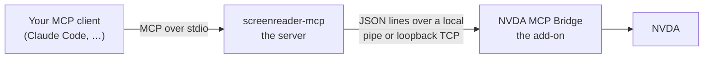

# screen-readers-mcp

An MCP server that gives an AI agent a **real screen reader**. The agent presses
keys, hears what the reader speaks, reads what it sends to a braille display,
and — when it gets stuck — asks the human sitting at the machine.

The first supported reader is **NVDA** on Windows. Others can join: the server
itself knows nothing about NVDA, and each reader ships its own bridge.

## Why you would want this

Testing whether something is usable with a screen reader has always meant a
person doing it: install the build, press the keys, listen to what is said,
decide whether that is right. That loop cannot be automated by inspecting the
accessibility tree, because the tree is not what a user experiences. A control
can be perfectly exposed to the platform API and still be announced as nothing
at all.

This project hands the same loop to an agent, unchanged in kind: it presses the
keys and it listens. So an agent can

- **test an NVDA add-on** the way its users will meet it — the original reason
  this exists;
- **check an application** for how it actually sounds while you tab through it;
- **reproduce a bug report** that only shows up under a screen reader;
- **help a blind developer** drive a reader and report back what it heard.

The agent works on your machine, with your reader, in your session. Nothing is
simulated.

## How the pieces fit

Three links, each talking only to the next:



1. **Your MCP client** — Claude Code, or any MCP client — launches the server
   and calls its tools.
2. **`screenreader-mcp`**, a single Windows executable, translates those tool
   calls into commands for one connected reader. It never connects on its own:
   the agent asks it to.
3. **NVDA MCP Bridge**, an NVDA add-on, does the work inside NVDA — captures
   speech and braille, presses gestures, answers questions about focus.

The two halves are separate programs on purpose. Restarting NVDA is itself
something a test may want to do, and the server has to survive it.

Everything stays on your machine. The bridge listens on a Windows named pipe, or
on loopback TCP — never on a routable address.

## Getting started

There are no published downloads yet; you build both halves from a checkout. You
need [Go](https://go.dev/dl/) 1.25+, [uv](https://docs.astral.sh/uv/), and NVDA
2026.1 or later installed.

### 1. Build the server

```sh
uv run poe build-server
```

You get `server/screenreader-mcp.exe` — one statically linked file with no
runtime to install.

### 2. Build and install the add-on

```sh
uv run poe build-addon
```

Open the resulting `nvdaMcpBridge-<version>.nvda-addon` with NVDA and restart
when prompted.

### 3. Start the bridge

Nothing listens until you say so. Open **NVDA menu (NVDA+n) → Tools → NVDA MCP
Bridge…**, and press **Start**. Tick **Start bridge automatically when NVDA
loads** if you would rather not do this again after every restart.

The same dialog chooses the connection mode — named pipe (the default) or
loopback TCP — and shows what the bridge is doing right now.

### 4. Register the server with your MCP client

For Claude Code:

```sh
claude mcp add --scope user screenreader -- C:\path\to\screen-readers-mcp\server\screenreader-mcp.exe
```

No arguments are needed: the binary ships knowing where our bridges listen.

Then ask your agent to list the readers it can reach, and to connect to one.

## A session, end to end

Ask an agent to check something, and this is the shape of what it does:

1. **`list_readers`** — which readers do I know, and is one listening?
2. **`connect_reader`** with `reader: "nvda"` and a capture mode. The session
   opens, and the tools for everything NVDA announced it can do appear.
3. **`press_gesture`** `["NVDA+control+f"]` — press the keys a user would press.
4. **`wait_for_speech_to_finish`** — let NVDA say whatever it is going to say.
5. **`get_speech`** — read it back, and decide whether it is right.
6. Repeat 3–5. **`disconnect_reader`** at the end; NVDA gets its speech back.

Step 4 is not optional politeness. `press_gesture` returns when NVDA has
**accepted** the keystroke; NVDA then does the work on its own thread. At the
moment the call returns, the dialog has not opened and focus has not moved.
Agents that skip the settle step read the previous screen and conclude the wrong
thing.

**Getting the application you are testing in front is not one of these steps**,
and there is no tool for it. Focusing a window is the desktop's job, not the
screen reader's — so the agent switches to it the way a user would, then settles
and listens for the window title to confirm it arrived.

One wrinkle shapes how that is done: a gesture is a **discrete press and
release**, so a modifier cannot be held down across several keys. Holding alt and
tabbing repeatedly to reach the fourth window back is not expressible — sent
twice, `alt+tab` returns you where you started.

**On Windows**, the two routes that survive that are naming the application
(Start menu, `type_text` its name, Enter) and a switcher that stays up once the
keys are released — `control+alt+tab` for the window switcher, or `windows+tab`
for task view. The `screenreader://guidance` resource states the *property* to
look for rather than these keys, because it is static and reader-agnostic: it
cannot know which reader is connected, and the reader is what fixes the platform.

Launching the application in the first place is setup: do that with whatever
tooling you already use, outside this server.

The server tells the agent all of this itself — see
[What the agent can read](#what-the-agent-can-read) below.

## The tools

Four tools exist before you connect. The rest appear **only once a session is
open**, and only the ones the connected reader said it can serve — so an agent
never sees a tool that would fail. Disconnecting withdraws them again.

### Finding and connecting

| Tool | What it does |
|---|---|
| `list_readers` | The readers this server can reach, their endpoints in the order they will be tried, and whether something is listening. |
| `connect_reader` | Opens the session. Takes the reader name, a **capture mode**, and optionally a log level. |
| `disconnect_reader` | Ends the session. The reader restores everything it changed. |
| `status` | The connection right now — and with a session live it makes a real round trip, so the answer is proof rather than a cached guess. |

**Capture mode** is chosen at connect time and fixed for the session:

- **`silent`** — NVDA's speech is captured and suppressed. The human hears
  nothing, capture is deterministic, and nothing waits on audio. This is what an
  automated run wants.
- **`live`** — NVDA speaks normally and is captured by observation. This is what
  you want when you are sitting there listening to the agent work.

Silent mode captures speech **in full**: the bridge copies every utterance
before suppressing it, so nothing an agent reads back is lost, and each
utterance still carries the log position it was captured at.

It costs one specific thing. NVDA logs the text it is about to speak *after* the
point where the bridge hands back an empty sequence, so those "Speaking …"
entries are missing from a silent session. That only shows up if you asked for
the `debug` or `io` log level, which is the only level they appear at anyway;
everything else NVDA logs — events, focus changes, script execution, errors — is
identical either way.

### Acting

| Tool | What it does |
|---|---|
| `press_gesture` | Presses one or more gestures, in order. |
| `type_text` | Types literal text into whatever holds focus — layout-independent Unicode, so accented characters and punctuation land correctly. It does not interpret Enter or newlines and submits nothing; compose that with `press_gesture`. |

**On NVDA**, gestures are written the way NVDA's own User Guide writes them:
`NVDA+f7`, `control+home`, `downArrow`, `alt+tab`. Not internal identifiers —
the notation you would read in the documentation or type into Input Gestures.

Both tools report **delivery, not consequence**. See the settle step above.

### Listening

| Tool | What it does |
|---|---|
| `wait_for_speech_to_finish` | Waits until the reader has stopped speaking. The settle step after **any** action — never sleep instead. |
| `get_speech` | Everything spoken since an index, one entry per utterance, plus the range it covers so the next call continues exactly where this one stopped. |
| `get_last_speech` | Just the most recent utterance. |
| `get_next_speech_index` | A bookmark for "now": take it before acting, then read from it afterwards to see only what your action caused. |
| `wait_for_speech` | Blocks until something containing a given text is spoken. Not finding it is a normal answer, not an error — which is how you assert something was **not** announced. |
| `get_braille` | What the reader sent to the braille display, on its own indices. What is brailled is often abbreviated differently from what is spoken, which is exactly why it is worth checking both. |

### Asking the reader about itself

| Tool | What it does |
|---|---|
| `get_focus_info` | The focused object: name, role, states, value, owning application. |
| `get_state` | Mode state — browse/focus mode, speech mode, sleep mode, input help. |
| `get_config` | Reads one setting from the reader's own configuration, by key path. |
| `set_config` | Writes one. This changes a live setting on a real person's screen reader: read it first, and put it back. |

**On NVDA**, roles, states and key paths are NVDA's own vocabulary —
`["speech", "symbolLevel"]`, `["braille", "translationTable"]`.

These four are for **asserting** and for **surveying**, not for finding out
where you are. A user finds that out by pressing the reader's report-focus
command and listening; an agent that orients by reading the object model is
testing the platform's accessibility API rather than the screen reader. They
also earn their keep when NVDA answers with a beep rather than words — toggling
browse mode, for one — where there is no speech to assert on.

### Following the reader's own log

| Tool | What it does |
|---|---|
| `get_log_position` | Marks the log at this instant and returns the mark. The cheap "note where I am" call, for when you are about to watch rather than act. |
| `get_log` | A filtered slice of the reader's diagnostic log — from a mark, from N seconds ago, or by the command that was running. |
| `wait_for_log` | Blocks until a matching record appears, or the timeout elapses. How you catch an intermittent fault, and how you assert nothing went wrong. |
| `set_log_level` | Raises verbosity for the rest of the session. |

A log level **cannot be raised retroactively**: if the reader was at `info` when
something ran, the debug records were never created and no filter can recover
them. Raise the level, re-run the thing you are debugging, then read.

Speech entries carry the log position they were captured at, so an agent can
jump from "it said the wrong thing" straight to what the reader was doing
internally at that moment.

### Talking to the human at the machine

This matters more than it sounds. In a silent session the person at that
computer **cannot hear their screen reader and cannot read your chat window**.
They are, for the duration, dependent on these two tools.

| Tool | What it does |
|---|---|
| `announce` | Speaks a message out loud, audible even in silent mode. It only tells — there is no way to reply. Use it when you genuinely need someone's attention, not to narrate progress. |
| `ask_user` | Asks a question or requests an action, and returns immediately with a ticket. Speech is handed back while the question is open. |
| `wait_for_user_reply` | Polls that ticket until the human answers or the window expires. |

**On NVDA**, `ask_user` plays two low beeps — deliberately different from the
announce cue, so the person can tell a question from a hint before the words
start — then speaks the question and the key that answers it:
**NVDA+control+shift+a**.

And whatever else is happening, **NVDA+control+shift+b** stops the bridge dead:
the session is torn down, speech comes back, and NVDA says so. It does not
depend on the agent, the server, or the connection being healthy. That is the
entire point of it.

## What the agent can read

Besides tools, the server publishes three documents an MCP client can fetch:

| Resource | What it holds |
|---|---|
| `screenreader://guidance` | **How to drive a screen reader** — the stance, the act-settle-listen-orient loop, what a successful result does and does not mean. Static, so an agent can read it *before* connecting, which is when it needs it. Worth reading yourself. |
| `screenreader://info` | Which reader is connected, its version, the capture mode, what it can do. |
| `screenreader://session-record` | What this session has done so far, from the server's own traffic. |

## Safety

The failure that matters here is a screen reader that has gone silent on a blind
user. Two properties exist to prevent it:

- **Nothing listens until you start it.** Auto-start is off by default, and even
  a listening bridge installs nothing with a side effect until a session
  connects. The add-on is safe to leave permanently installed.
- **Your synthesizer is never swapped.** Silent mode does not replace your synth
  with a spy driver — the synth you configured stays loaded and valid the whole
  time, so ending a session restores speech instantly, with no reload that could
  itself fail.

On top of that, speech is restored on **every** teardown path: `bye`,
disconnect, error, timeout, NVDA shutdown, add-on unload, and the panic gesture.
Because NVDA holds speech filters by weak reference, even an add-on that dies
outright lifts its own suppression.

One session at a time, in either transport. A second client waits.

This is a development tool. It injects keystrokes and reads back what the reader
says, and it is not designed for — and should not be relied on in — secure
screens. Where NVDA's GUI is unavailable, the Tools menu item is simply not
added.

## More reading

- [server/README.md](server/README.md) — the server: configuration, endpoints,
  and what to do when the tools do not appear.
- [bridges/nvda/README.md](bridges/nvda/README.md) — the NVDA add-on, feature by
  feature.
- [CONTRIBUTING.md](CONTRIBUTING.md) — building, testing and developing this
  project, including how it is developed with an agent.

## License

GPL v2. See [LICENSE](LICENSE) / COPYING.txt.
