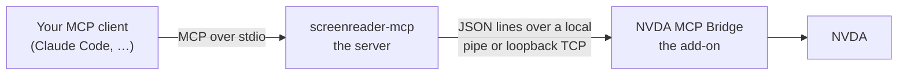

# screen-readers-mcp

An MCP server that gives an AI agent a **real screen reader**. The agent presses
keys, hears what the reader speaks, reads what it sends to a braille display,
and — when it gets stuck — asks the human sitting at the machine.

The first supported reader is **NVDA** on Windows. Others can join: the server
itself knows nothing about NVDA, and each reader ships its own bridge.

## Why you would want this

Testing whether something is usable with a screen reader has always meant a
person doing it: install the build, press the keys, listen to what is said,
decide whether that is right. That loop cannot be automated by inspecting the
accessibility tree, because the tree is not what a user experiences. A control
can be perfectly exposed to the platform API and still be announced as nothing
at all.

This project hands the same loop to an agent, unchanged in kind: it presses the
keys and it listens. So an agent can

- **test an NVDA add-on** the way its users will meet it — the original reason
  this exists;
- **check an application** for how it actually sounds while you tab through it;
- **reproduce a bug report** that only shows up under a screen reader;
- **help a blind developer** drive a reader and report back what it heard.

The agent works on your machine, with your reader, in your session. Nothing is
simulated.

## How the pieces fit

Three links, each talking only to the next:



1. **Your MCP client** — Claude Code, or any MCP client — launches the server
   and calls its tools.
2. **`screenreader-mcp`**, a single Windows executable, translates those tool
   calls into commands for one connected reader. It never connects on its own:
   the agent asks it to.
3. **NVDA MCP Bridge**, an NVDA add-on, does the work inside NVDA — captures
   speech and braille, presses gestures, answers questions about focus.

The two halves are separate programs on purpose. Restarting NVDA is itself
something a test may want to do, and the server has to survive it.

Everything stays on your machine. The bridge listens on a Windows named pipe, or
on loopback TCP — never on a routable address.

## Getting started

There are no published downloads yet; you build both halves from a checkout. You
need [Go](https://go.dev/dl/) 1.25+, [uv](https://docs.astral.sh/uv/), and NVDA
2026.1 or later installed.

### 1. Build the server

```sh
uv run poe build-server
```

You get `server/screenreader-mcp` — `server/screenreader-mcp.exe` on Windows —
one statically linked file with no runtime to install.

### 2. Build and install the add-on

```sh
uv run poe build-bridge
```

Open the resulting `nvdaMcpBridge-<version>.nvda-addon` with NVDA and restart
when prompted.

### 3. Start the bridge

Nothing listens until you say so. Open **NVDA menu (NVDA+n) → Tools → NVDA MCP
Bridge…**, and press **Start**. Tick **Start bridge automatically when NVDA
loads** if you would rather not do this again after every restart.

The same dialog chooses the connection mode — named pipe (the default) or
loopback TCP — sets what happens when an agent keeps you silent for too long,
and shows what the bridge is doing right now.

### 4. Register the server with your MCP client

For Claude Code:

```sh
# Windows
claude mcp add --scope user screenreader -- C:\path\to\screen-readers-mcp\server\screenreader-mcp.exe
# macOS / Linux
claude mcp add --scope user screenreader -- /path/to/screen-readers-mcp/server/screenreader-mcp
```

No arguments are needed: the binary ships knowing where our bridges listen.

Then ask your agent to list the readers it can reach, and to connect to one.

## A session, end to end

Ask an agent to check something, and this is the shape of what it does:

1. **`list_readers`** — which readers do I know, and is one listening?
2. **`connect_reader`** with `reader: "nvda"`, a **capture mode** and a
   **persona**. The session opens; the reader answers with what it can do, the
   stance that persona puts the agent under, and what this machine does about
   long silences.
3. Read **`screenreader://reader-guidance`** — the connected reader's own list
   of the commands that stance may use, resolved out of the running reader
   rather than transcribed, so it is right even where you rebound something.
4. **`press_gesture`** `["NVDA+control+f"]` — press the keys a user would press,
   **and read back what the reader said in the same answer**.
5. Decide whether that is right, and press the next thing.
6. **`disconnect_reader`** at the end; NVDA gets its speech back.

**Step 4 is one call, not three.** After each key the reader waits a short grace
window (`grace_ms`, 100 by default) and returns the speech that arrived, so
`press_gesture` and `type_text` hand you their own bookmarks and the window
between them. You do not follow them with `wait_for_speech_to_finish` and
`get_speech`.

What that grace window cannot do is wait out something slow. **An empty `speech`
means nothing had arrived by that instant — not that nothing happened.** A
window opening or a page loading legitimately takes longer: read again from
`speech_to`, or `wait_for_speech` for a phrase you expect. Never re-press a key
because the first result looked quiet; that presses it twice.

**Getting the application you are testing in front is not one of these steps**,
and there is no tool for it. Focusing a window is the desktop's job, not the
screen reader's — so the agent switches to it the way a user would, then listens
for the window title to confirm it arrived.

One wrinkle shapes how that is done: a gesture is a **discrete press and
release**, so a modifier cannot be held down across several keys. Holding alt and
tabbing repeatedly to reach the fourth window back is not expressible — sent
twice, `alt+tab` returns you where you started.

**On Windows**, the two routes that survive that are naming the application
(Start menu, `type_text` its name, Enter) and a switcher that stays up once the
keys are released — `control+alt+tab` for the window switcher, or `windows+tab`
for task view. The `screenreader://guidance` resource states the *property* to
look for rather than these keys, because it is static and reader-agnostic: it
cannot know which reader is connected, and the reader is what fixes the platform.

Launching the application in the first place is setup: do that with whatever
tooling you already use, outside this server.

The server tells the agent all of this itself — see
[What the agent can read](#what-the-agent-can-read) below.

## Who the agent connects as

`connect_reader` will not open a session until the agent says **who it is
standing in for**. That is not bookkeeping: it decides what a finding from the
session means, and it is fixed for the session, because a stance cannot be
retrofitted onto a run that already happened.

| Persona | What it stands in for |
|---|---|
| `user` | An ordinary, non-expert screen reader user. The vocabulary is bounded to what the platform's accessibility contract assumes of such a user, plus the reader's ordinary reading commands. If a task needs anything that reaches past focus — object navigation, a review cursor, a simulated click — **the task has failed** rather than being worked around. |
| `validator` | The same driving vocabulary and the same limits, so that "reachable" means the same thing in the agent's report as in a user's, plus introspection to characterise what it finds. It may step outside the vocabulary only to describe a failure it has **already** found, never to get past one, and it says so when it does. |
| `expert` | Nothing is off limits — the reader's own log, configuration and internals are the instruments it came for — because it is working out how the thing behaves rather than returning a verdict. |

The server states the **rule**; the connected reader states the **instances**.
Which of NVDA's own commands fall inside an ordinary user's vocabulary is
something only the NVDA bridge can answer, and it answers it by asking NVDA —
`inputCore.manager.getAllGestureMappings()`, the same question the Input Gestures
dialog asks — so a rebound key is described as it actually is on that machine,
not as the manual says it should be.

## The tools

Twenty-six tools, and **every one of them is advertised from the moment the
server starts**. Four work with no session at all; the rest are *gated* — they
exist, they are listed, and they refuse with a precondition until a reader is
connected **and** has announced the capability that tool needs. Connecting does
not add tools and disconnecting does not withdraw them; what changes is what
they can do.

### Finding and connecting

| Tool | What it does |
|---|---|
| `list_readers` | The readers this server can reach, their endpoints in the order they will be tried, and whether something is listening. Liveness is `listening` or `not listening` for a named pipe, and `unknown` for TCP, which cannot be tested without connecting. |
| `connect_reader` | Opens the session. Takes the reader name, a **capture mode** and a **persona** — all three required — and optionally `normalize` and a reader log level. |
| `disconnect_reader` | Ends the session. The reader restores everything it changed. |
| `status` | The connection right now — and with a session live it makes a real round trip, so the answer is proof rather than a cached guess. |

**Capture mode** is chosen at connect time and fixed for the session:

- **`silent`** — NVDA's speech is captured and suppressed. The human hears
  nothing, capture is deterministic, and nothing waits on audio. This is what an
  automated run wants, and it is the right choice for almost every session.
- **`live`** — NVDA speaks normally and is captured by observation. Choose it
  when a human needs to hear the run as it happens, or when how something
  *sounds* is itself what you are testing.

A live session is paced by **audio**: anything the reader reads aloud takes as
long to produce as it takes to say, where a silent one has no sound to wait for
and can answer far faster. So a timeout tuned in one mode may be badly wrong in
the other.

Silent mode captures speech **in full**: the bridge copies every utterance
before suppressing it, so nothing an agent reads back is lost, and each
utterance still carries the log position it was captured at.

It costs one specific thing. NVDA logs the text it is about to speak *after* the
point where the bridge hands back an empty sequence, so those "Speaking …"
entries are missing from a silent session. That only shows up if you asked for
the `debug` or `io` log level, which is the only level they appear at anyway;
everything else NVDA logs — events, focus changes, script execution, errors — is
identical either way.

**`normalize`** is the other connect-time choice, and most agents should leave
it alone. Some of what a reader tells you is a **sound** rather than words — the
tone NVDA plays when you land in focus mode is the standing example, and it is
information a silent session cannot capture at all. `normalize` asks the reader
to move those signals into speech where it offers the same information both
ways. The default differs by capture mode and is the right one in each: a silent
session normalises, because the human hears nothing anyway and so loses nothing;
a live session does not, because the person at the reader would hear words in
place of the sound they chose, and that is theirs to decide. Whatever was
actually changed comes back in the result, and every key is restored when the
session ends.

### Acting

| Tool | What it does |
|---|---|
| `press_gesture` | Presses one or more gestures, in order, **and returns what the reader said**. Each entry carries its own `speech_from`/`speech_to`, so in a batch you can see which key spoke and which said nothing. `state` reports the modes you cannot hear, sampled when the last window closed. |
| `type_text` | Types literal text into whatever holds focus — layout-independent Unicode, so accented characters and punctuation land correctly — and returns the speech the same way. It does not interpret Enter or newlines and submits nothing; compose that with `press_gesture`. |
| `run_sequence` | Several intentions in **one** call: up to 32 steps and about 30 seconds, dispatched back to back, answered with one merged speech window and a bookmark per step. |
| `set_state` | Puts the reader **into** a mode, rather than toggling it and hoping. |

**On NVDA**, gestures are written the way NVDA's own User Guide writes them:
`NVDA+f7`, `control+home`, `downArrow`, `alt+tab`. Not internal identifiers —
the notation you would read in the documentation or type into Input Gestures.
Do not copy a combination from memory of a different reader; ask
`screenreader://reader-guidance`, which reads them out of the running NVDA.

**`run_sequence` has six kinds of step**: `press_gesture`, `type_text`, `delay`
(a fixed wait, for the *application's* known timing), `settle` (wait for the
*reader* to stop talking, for its unknown latency), `wait_for_speech` (block
until an utterance contains your text, then carry straight on) and `read`
(orient afterwards). Steps reach the reader a fraction of a millisecond apart,
so timing that is impossible across separate calls — interrupting a command that
finishes in a second and a half — is expressible here. The whole plan is checked
against what this reader announced **before the first keystroke**, so a plan
naming something it cannot do is refused entire, naming the step. A plan aborts
on the first failure and nothing is undone: keystrokes cannot be un-pressed. And
a plan is a bet placed in advance — its steps cannot react to what they hear,
only stop — so if what you do second depends on what you heard first, that is
two calls and should be.

**`set_state` exists because a toggle is not a way to arrive anywhere.** Browse
mode and focus mode are reached with the same key, so pressing it is a coin flip
whenever the page may have changed the mode itself — and a wrong guess sends
every keystroke after it somewhere else. `set_state` says where you want to be:
already there does nothing at all, no sound and no announcement, and the result
says both the state afterwards and whether this call moved anything. Press the
gesture instead when the toggle itself is what you are testing.

### Listening

`press_gesture` and `type_text` already return the speech their own action
caused, so these are for what they do not cover: watching something you did not
trigger, reading on after a slow effect, and asserting.

| Tool | What it does |
|---|---|
| `get_speech` | Everything spoken since an index, one entry per utterance — each with its text, its index, and the `logPosition` it was captured at — plus the half-open range `[fromIndex, toIndex)` it covers, so `toIndex` is exactly the `since_index` to pass next. |
| `get_last_speech` | Just the most recent utterance, and the index it occupies. |
| `get_next_speech_index` | A bookmark for "now". You do **not** need this when you are the one acting — `press_gesture` and `type_text` take their own. It is for marking a moment when something *else* is about to speak. |
| `wait_for_speech` | Blocks until an utterance containing a given text is spoken. `after_index` is an **inclusive** left edge, like every other index here, so a bookmark taken before acting matches the very first utterance the action caused. Not finding it is a normal answer, not an error — which is how you assert something was **not** announced. |
| `wait_for_speech_to_finish` | Waits until the reader has stopped speaking. **Not** the step after every action; it is for a long deliberate announcement, or the reader reading a whole document aloud. It can never prove the reader is finished, only that it stopped answering. |
| `get_braille` | What the reader sent to the braille display, on its own indices. What is brailled is often abbreviated differently from what is spoken, which is exactly why it is worth checking both. |

### Reading the whole document

| Tool | What it does |
|---|---|
| `get_document_snapshot` | The whole document the reader is showing, as the flat lines a user arrows through — headings with their level, links, radio buttons with their state, in the reader's own words. One call instead of one round trip per line. |

This is not a structural read of an object model. It is the same text the person
at the reader reads, which is what makes it evidence about the reader rather
than about the platform API underneath it.

It is a **still frame**. `capturedAt` says when it was taken; a live region
updating afterwards, content still loading, an infinite scroll — none of that is
in it, and nothing in the answer can tell you it happened. To see change, take
another snapshot and compare. Call it with no parameters for the whole document,
which is the ordinary use; `fromLine`, `maxLines` and `maxChars` exist for the
page you already know is enormous, and two bounded calls are **two moments**, so
only the unbounded call returns a coherent picture.

`hasDocument: false` means the focus is not in a document at all — a dialog, a
native application, the desktop. That is an answer, not a failure; there the only
way to read is still the reader's own navigation commands.

### Asking the reader about itself

| Tool | What it does |
|---|---|
| `get_focus_info` | The focused object: name, role, states, value, owning application. |
| `get_state` | Mode state — browse/focus mode, speech mode, sleep mode, input help. |
| `get_config` | Reads one setting from the reader's own configuration, by key path. |
| `set_config` | Writes one. This changes a live setting on a real person's screen reader: read it first, and put it back. |

**On NVDA**, roles, states and key paths are NVDA's own vocabulary —
`["speech", "symbolLevel"]`, `["braille", "translationTable"]`.

These are for **asserting** and for **surveying**, not for finding out where you
are. A user finds that out by pressing the reader's report-focus command and
listening; an agent that orients by reading the object model is testing the
platform's accessibility API rather than the screen reader. They also earn their
keep when NVDA answers with a beep rather than words — toggling browse mode, for
one — where there is no speech to assert on.

### Following the reader's own log

| Tool | What it does |
|---|---|
| `get_log_position` | Marks the log at this instant and returns the mark, plus the wall-clock time, for lining it up against a session transcript or a human's account of when something happened. Returns no records. |
| `get_log` | A filtered slice of the reader's diagnostic log. Three mutually exclusive ways to say which records you want — from a mark, from N seconds ago, or by the command that was running — and supplying more than one is an error. |
| `wait_for_log` | Blocks until a matching record appears, or the timeout elapses. How you catch an intermittent fault, and how you assert nothing went wrong. |
| `set_log_level` | Raises verbosity for the rest of the session. |

A log level **cannot be raised retroactively**: Python's logging decides at the
*logger* whether a record exists at all, so if NVDA's root logger was at `info`
when something ran, the debug records were never created and no filter can
recover them. Raise the level, re-run the thing you are debugging, then read.

Speech entries carry the log position they were captured at, so an agent can
jump from "it said the wrong thing" straight to what the reader was doing
internally at that moment.

### Talking to the human at the machine

This matters more than it sounds. In a silent session the person at that
computer **cannot hear their screen reader and cannot read your chat window**.
They are, for the duration, dependent on these tools.

| Tool | What it does |
|---|---|
| `announce` | Speaks a message out loud, audible even in silent mode. It only tells — there is no way to reply. Use it when you genuinely need someone's attention, not to narrate progress. `press_gesture` and `run_sequence` take an `announce` of their own, spoken before anything is pressed and costing no extra round trip. |
| `ask_user` | Asks a question or requests an action, and returns immediately with a ticket. Speech is handed back while the question is open, so the human can actually do what was asked. |
| `wait_for_user_reply` | Polls that ticket until the human answers or the window expires. |

What comes back confirms a message was **said**, never that it was heard.

**On NVDA**, `ask_user` plays two low beeps — deliberately different from the
announce cue, so the person can tell a question from a hint before the words
start — then speaks the question and the key that answers it:
**NVDA+control+shift+a**.

And whatever else is happening, **NVDA+control+shift+b** stops the bridge dead:
the session is torn down, speech comes back, and NVDA says so. It does not
depend on the agent, the server, or the connection being healthy. That is the
entire point of it.

## What the agent can read

Besides tools, the server publishes five documents an MCP client can fetch:

| Resource | What it holds |
|---|---|
| `screenreader://guidance` | **How to drive a screen reader** — what a screen reader is, who you can connect *as* and the full profile of each persona, the act-and-listen loop, what a successful result does and does not mean. Static, so an agent can read it *before* connecting, which is when it needs it. Worth reading yourself. |
| `screenreader://reader-guidance` | **The connected reader's own account of the stance you declared** — which of *its* commands make up the ordinary vocabulary, which of them reach past focus and are therefore out of bounds, and what that reader cannot do for you at all. Readable only once a session exists, because the reader is what fixes the platform. |
| `screenreader://tools` | **Every tool this build has**, with the capability that gates it and the shape of what it takes and returns. Served live and never cached, so it describes the server that is actually running — which is what makes it the answer when a client is holding a tool list from an older build. |
| `screenreader://info` | Which reader is connected, its version, the capture mode, the persona, what it can do — **and whether a human is expected at that machine**. Re-readable at any time: an agent that has lost its context recovers these facts here instead of throwing the session away to ask for them again. |
| `screenreader://session-record` | What this session has done so far, from the server's own traffic. |

The split between the first two is deliberate and is the whole of spec 0029: the
server states the **rule** — *a command that re-reads what is already there is
available to everyone; a command that reaches what focus cannot is not* — and the
bridge states the **instances**, because they are keystrokes on NVDA and touch
gestures on a phone, and the server does not learn which reader it is driving
until the handshake answers.

## Safety

The failure that matters here is a screen reader that has gone silent on a blind
user. Four properties exist to prevent it:

- **Nothing listens until you start it.** Auto-start is off by default, and even
  a listening bridge installs nothing with a side effect until a session
  connects. The add-on is safe to leave permanently installed.
- **Your synthesizer is never swapped.** Silent mode does not replace your synth
  with a spy driver — the synth you configured stays loaded and valid the whole
  time, so ending a session restores speech instantly, with no reload that could
  itself fail.
- **A silence has a ceiling.** On an attended machine the bridge warns you after
  45 seconds of unbroken silence and gives your speech back after 90 — both
  adjustable in its own dialog, and both a property of *your* machine that no
  tool in this server can change. An agent that could raise its own ceiling does
  not have one. Capture is unaffected when it lifts: the agent keeps every
  entry, every index and every timestamp; what changes is that the words also
  reach the speakers.
- **The agent is told whether anybody is there.** `connect_reader` and
  `screenreader://info` both carry it, so a well-behaved agent narrates before a
  long stretch of work on an attended machine — which resets the clock, so a
  narrating agent never meets the cap at all — and does not spend round trips
  talking to an empty room on an unattended one.

On top of that, speech is restored on **every** teardown path: `bye`,
disconnect, error, timeout, NVDA shutdown, add-on unload, and the panic gesture.
Because NVDA holds speech filters by weak reference, even an add-on that dies
outright lifts its own suppression.

One session at a time, in either transport. A second client waits.

This is a development tool. It injects keystrokes and reads back what the reader
says, and it is not designed for — and should not be relied on in — secure
screens. Where NVDA's GUI is unavailable, the Tools menu item is simply not
added.

## More reading

- [server/README.md](server/README.md) — the server: configuration, endpoints,
  and what to do when something does not work.
- [bridges/nvda/README.md](bridges/nvda/README.md) — the NVDA add-on, feature by
  feature.
- [CONTRIBUTING.md](CONTRIBUTING.md) — building, testing and developing this
  project, including how it is developed with an agent.

## License

GPL v2. See [LICENSE](LICENSE) / COPYING.txt.
