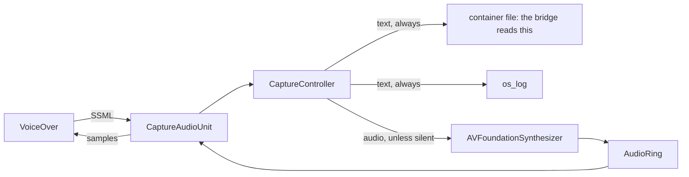

# The VoiceOver bridge

The macOS half of `screen-readers-mcp`: one Swift `.app` that will hold the
speech provider, the bridge session, the input path and the control dialog
([spec 0043](../../specs/0043-the-voiceover-bridge-is-one-swift-bundle.md),
Decided). Its class-by-class layout is
[spec 0046](../../specs/0046-the-voiceover-bridge-class-by-class.md); the board
entries are lane 3 in [`ROADMAP.md`](../../ROADMAP.md).

**What exists today is the capture voice** — board entry 13.2. The session, the
wire binding and the dialog arrive in 13.3, 13.4 and 13.10; until then this
directory builds a speech provider and a probe, and nothing dials or listens.

This is not a sketch that grew. It is the spike from
[spec 0041](../../specs/0041-can-voiceover-say-what-it-said.md) — a working
`AVSpeechSynthesisProviderAudioUnit` that VoiceOver spoke through for an hour —
decomposed into its own small hexagon so that the six fixes it carries, each of
which cost a live round against a real screen reader, are assertions instead of
comments.

## Why a speech provider at all

VoiceOver has no plugin API and no published extension point for speech. What it
does have is the system's own voice mechanism: a **speech synthesis provider**,
an app extension hosting an audio unit, which macOS hands every utterance as
SSML *before any audio exists*. Point VoiceOver at our voice and we see
everything it says — role words, state words, hint text, and the prosody it
means to say them with.

The route costs one thing and it is stated up front: **the user must select the
capture voice in VoiceOver Utility**, and **updating the provider means
restarting VoiceOver**, every time. A dead provider is safe — VoiceOver falls
back to a working voice rather than to silence — but only a reader restart
re-binds ours.

## What is here

| Path | What it is |
|---|---|
| `Package.swift` | The module graph, which is the architecture test: a domain file that imports the adapters does not compile. |
| `build.sh` | Assembles the `.app`, the `.appex` and the framework. SwiftPM cannot emit bundles, so this is the build. |
| `Sources/CaptureVoice/` | The capture voice, as its own hexagon: `Domain/Ports`, `Domain/Entities`, `Domain/Controllers`, `Adapters`. |
| `Sources/CaptureVoiceExtension/` | The `.appex` executable — a stub, because the audio unit must live in a framework. |
| `Sources/CaptureProbe/` | A diagnostic client that answers "is the capture voice published?" without VoiceOver. |
| `Sources/VoiceOverBridgeApp/` | The container app. An extension cannot be installed on its own. |
| `Tests/CaptureVoiceTests/` | Mirrors `Sources/` file for file, with the port fakes under `Fakes/`. |
| `VoiceOver.sdef` | VoiceOver's AppleScript dictionary, dumped on macOS 15.0. The reference this repo otherwise does not have. |



## Building and testing

From the repo root, through the dispatcher that knows which bridges run on this
host:

```sh
uv run poe bridges        # what this bridge declares, and what runs here
uv run poe bridge         # its headless tests -- no VoiceOver, no audio device
uv run poe build-bridge   # its shippable artifact
```

Or directly, standing anywhere:

```sh
swift test --package-path bridges/voiceover
bash bridges/voiceover/build.sh
```

The tests run in well under a second and need no reader, no audio device and no
registration. That is the point of the decomposition.

## Registering the capture voice

**Registration is two steps, and the first alone is not enough.** From this
directory, after `build.sh`:

```sh
/System/Library/Frameworks/CoreServices.framework/Frameworks/LaunchServices.framework/Support/lsregister -f "$PWD/build/VoiceOverCaptureSpike.app"
pluginkit -a "$PWD/build/VoiceOverCaptureSpike.app/Contents/PlugIns/CaptureVoice.appex"
```

The system then re-reads voices on its own schedule — roughly every 30 seconds —
so the voice appears a little after the command returns, not immediately.
`./build/probe list` says whether it is published; `./build/probe refresh` asks
the system to look again now.

Then select **Capture Spike** in VoiceOver Utility → Speech, and **restart
VoiceOver**.

### The bundle identity is frozen on purpose

The app is still called `VoiceOverCaptureSpike.app` and its bundle id still says
`spike`. That is deliberate, and it is the one wart this entry ships knowingly.

The voice identifier VoiceOver stores when a user selects our voice is derived
from the extension's bundle id. Renaming any of it makes the selected voice
**vanish from VoiceOver's list** — VoiceOver falls back to a working voice, and
the user has to go and choose ours again. Entry 13.2 promotes code; entry 13.11
owns packaging and identifiers, and is where that one-time cost is worth paying
once rather than twice.

Everything that does *not* affect the published identifier has been renamed:
the Swift module is `CaptureVoice`, matching its SwiftPM target.

### Removing it

```sh
pluginkit -r "$PWD/build/VoiceOverCaptureSpike.app/Contents/PlugIns/CaptureVoice.appex"
rm -rf build
```

If VoiceOver has been pointed at this voice, **change the voice back in
VoiceOver Utility first**. Removing a voice that is in use is how a machine ends
up sounding wrong with no explanation.

## The flags exist to reproduce failures

`build.sh` produces the working configuration with no flags: sandboxed, **no**
network entitlement, **no** `AudioComponentBundle`. Each of those was found by a
silent failure, so each has a flag that reproduces it — a negative result that
cannot be re-run is not a result.

| Flag | What it adds | What happens |
|---|---|---|
| `--network` | `com.apple.security.network.client` | The extension registers and launches, and the system never asks it for its voices: `Skipping network entitled extension`. **This is why the bridge reads a file and not a socket.** |
| `--in-process` | `AudioComponentBundle` | The voice stops working entirely — not even enumeration survives. |

The sandbox is no longer a flag: an unsandboxed provider is not rejected with an
error, it simply never appears, and the reason is only in `pkd`'s log.

## Watching what the extension sees

Two routes, both live, because the sandbox makes one of them the question:

```sh
log stream --predicate 'subsystem == "org.screen-readers-mcp.voiceover"' --style compact
tail -f ~/Library/Containers/org.screen-readers-mcp.spike.capture.voice/Data/voiceover-capture.jsonl
```

The file is the one the bridge will read (entry 13.5). Silence is opt-in and is
requested by a marker file beside it:

```sh
touch ~/Library/Containers/org.screen-readers-mcp.spike.capture.voice/Data/voiceover-capture-silent
```

**Delete it to restore speech.** The default must never be the setting that
mutes a screen reader.

When diagnosing why a voice does not appear, the useful log is not ours:

```sh
log show --last 5m --predicate 'category == "AXTTSCommon"' --style compact
log show --last 5m --predicate 'process == "pkd"' --style compact
```

Both silent rejections found so far were visible only there.
