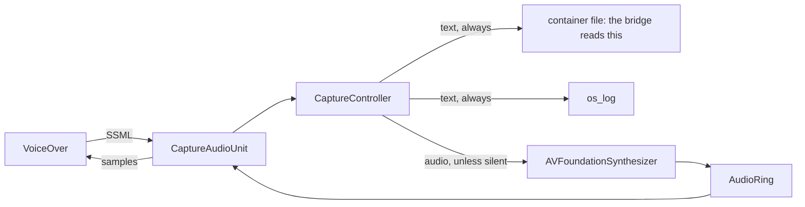

# The VoiceOver bridge

The macOS half of `screen-readers-mcp`: one Swift `.app` that will hold the
speech provider, the bridge session, the input path and the control dialog
([spec 0043](../../specs/0043-the-voiceover-bridge-is-one-swift-bundle.md),
Decided). Its class-by-class layout is
[spec 0046](../../specs/0046-the-voiceover-bridge-class-by-class.md); the board
entries are lane 3 in [`ROADMAP.md`](../../ROADMAP.md).

**What exists today is the capture voice, the wire binding, the session, the
capture feed, capture mode and the gesture channel** — board entries 13.2 through
13.7. The bridge **listens**: a
server dials the local endpoint, completes a handshake and exchanges commands.
It also **hears**: it tails the file the capture voice appends to and answers
`getSpeech`, `getLastSpeech`, `getNextSpeechIndex`, `waitForSpeech` and
`waitForSpeechToFinish`. **Since 13.6 it can also make the reader quiet**,
and it selects the capture voice itself at the handshake and puts the user's own
voice back at teardown, so nobody has to visit VoiceOver Utility to start or
finish a session. **Since 13.7 it can drive the reader**: `pressGesture` sends
VoiceOver's own English command names — `go to desktop` — through the reader's
own dispatcher, which is why a session that presses only those asks for no
Accessibility grant. **Since 13.8 it can type** into whatever holds focus, and
**since 13.17 it can press a chord** — `command+l`, which is how anybody opens a
location bar — through the same `pressGesture`, written as a keystroke. Those two
are the halves of input that do cost the Accessibility grant, asked for on the
first of each in a session and nowhere else. **Since 13.9 it can say where the
focus is**. **Since 13.10 it can talk to you**: `announce` speaks with
the bridge's own synthesizer, outside VoiceOver entirely, so you hear it even
while a silent session is holding your reader quiet, and `askUser` puts a
question on your screen and collects your answer whenever you give it. So `hello`
announces `speech`, `gestures`, `typing`, `focus` and `interact`. The dialog that
starts and stops it is entry 13.14 — held until the bridge can drive VoiceOver
over its own window, so that it can be checked the way everything else here is —
and until then it is started from a test, from code, or from
`swift build --product BridgeListener`.

This is not a sketch that grew. It is the spike from
[spec 0041](../../specs/0041-can-voiceover-say-what-it-said.md) — a working
`AVSpeechSynthesisProviderAudioUnit` that VoiceOver spoke through for an hour —
decomposed into its own small hexagon so that the six fixes it carries, each of
which cost a live round against a real screen reader, are assertions instead of
comments.

## Why a speech provider at all

VoiceOver has no plugin API and no published extension point for speech. What it
does have is the system's own voice mechanism: a **speech synthesis provider**,
an app extension hosting an audio unit, which macOS hands every utterance as
SSML *before any audio exists*. Point VoiceOver at our voice and we see
everything it says — role words, state words, hint text, and the prosody it
means to say them with.

The route costs one thing and it is stated up front: **updating the provider
means restarting VoiceOver**, every time. A dead provider is safe — VoiceOver
falls back to a working voice rather than to silence — but only a reader restart
re-binds ours.

Selecting the voice is no longer part of that cost. It used to read *"the user
must select the capture voice in VoiceOver Utility"*, and
[spec 0047](../../specs/0047-selecting-the-capture-voice-without-a-human.md)
findings 16 and 17 retired that: the reader's chosen voice is a preference in the
**system speech** domain, settable live in both directions with no restart, no UI
and no Accessibility grant. Since 13.6 the bridge reads the user's own voice at
the handshake, points the reader at the capture voice, and writes theirs back on
every teardown path. Selecting it by hand still works and is still what the
install steps below describe — it is just no longer required per session.

## What is here

| Path | What it is |
|---|---|
| `Package.swift` | The module graph, which is the architecture test: a domain file that imports the adapters does not compile. |
| `build.sh` | Assembles the `.app`, the `.appex` and the framework. SwiftPM cannot emit bundles, so this is the build. |
| `Sources/CaptureVoice/` | The capture voice, as its own hexagon: `Domain/Ports`, `Domain/Entities`, `Domain/Controllers`, `Adapters`. |
| `Sources/VoiceOverBridgeDomain/` | The bridge session's pure core: ports, the `Session` controller, the command handlers, the entities. No frameworks, no sockets, no JSON framing. |
| `Sources/VoiceOverBridgeAdapters/` | The IO edge: the two listeners and their leaves, the JSON-lines channel, the transcript, the event bus, and `Wiring.swift`, the composition root. |
| `Sources/ScreenReaderWire/` | The wire contract's Swift binding — value types and validation, hand-written against [`specs/wire/v1/schema.json`](../../specs/wire/v1/schema.json) and gated against it by `scripts/drift.py`. Depends on nothing. |
| `Sources/CaptureVoiceExtension/` | The `.appex` executable — a stub, because the audio unit must live in a framework. |
| `Sources/CaptureProbe/` | A diagnostic client that answers "is the capture voice published?" without VoiceOver. |
| `Sources/BridgeListener/` | A launcher that starts the bridge listening from a terminal. Not shipped in the `.app`; see "Making it listen". |
| `Sources/VoiceOverBridgeApp/` | The container app. An extension cannot be installed on its own. |
| `Tests/CaptureVoiceTests/` | Mirrors `Sources/` file for file, with the port fakes under `Fakes/`. |
| `Tests/ScreenReaderWireTests/` | Mirrors `Sources/ScreenReaderWire/` file for file. No fakes: value types are tested with values, from the JSON a peer would send. |
| `Tests/VoiceOverBridgeDomainTests/`, `Tests/VoiceOverBridgeAdaptersTests/` | Mirror their sources file for file. |
| `Tests/Fakes/` | The port doubles the domain's, the adapters' and the integration tests all share, plus `Support/` for scaffolding that stands in for no port. |
| `Tests/Integration/` | Headless scenarios: the whole session stack over a loopback transport, and over a **real** Unix socket and a real loopback socket dialled by a client built from the raw socket API. |
| `VoiceOver.sdef` | VoiceOver's AppleScript dictionary, dumped on macOS 15.0. The reference this repo otherwise does not have. |



## Building and testing

From the repo root, through the dispatcher that knows which bridges run on this
host:

```sh
uv run poe bridges        # what this bridge declares, and what runs here
uv run poe bridge         # its headless tests -- no VoiceOver, no audio device
uv run poe build-bridge   # its shippable artifact
```

Or directly, standing anywhere:

```sh
swift test --package-path bridges/voiceover
bash bridges/voiceover/build.sh
```

The tests run in well under a second and need no reader, no audio device and no
registration. That is the point of the decomposition. The integration scenarios
bind real sockets, in a home directory they invent under `/tmp`, so they never
touch the endpoint a developer's own bridge listens on.

## Making it listen

Until the control dialog lands (entry 13.14), the bridge is started by a small
launcher, kept in the repo because anything a check depends on is versioned
rather than improvised:

```sh
swift build --package-path bridges/voiceover --product BridgeListener
./bridges/voiceover/.build/debug/BridgeListener            # the local endpoint
./bridges/voiceover/.build/debug/BridgeListener --tcp 8765 # loopback instead
./bridges/voiceover/.build/debug/BridgeListener --print-cues  # no tones, just text
```

It prints the endpoint it bound and every state change, and stops on `^C`,
unlinking the socket. It is **not** part of the shipped `.app`: `build.sh` does
not copy it.

**It starts from the settings this machine has stored, and a flag overrides them
for one run without writing anything.** The stored values are the endpoint kind,
its name, the loopback port, whether a human is expected at the machine, and
whether the audible session cues play; the dialog will be the first thing that
edits them, and until then `defaults` does:

```sh
defaults write org.screen-readers-mcp.spike.capture bridge.endpointName someOtherName
defaults read  org.screen-readers-mcp.spike.capture
```

**It also says what the machine can do before anything is pressed**: the capture
voice's state with its recovery, whether AppleScript control of VoiceOver is
switched on (VoiceOver Utility → General — no API can set it, so this is a thing
only you can fix), and which permissions this process holds. None of that asks
you for anything; reading a permission shows no dialog.

**The session cues are audible now**, unless you pass `--print-cues` or turn them
off in the settings: two ascending tones and the persona when a session takes
your reader, two descending when it gives it back. They are played outside
VoiceOver, so you hear them even while a silent session is holding the reader
quiet.

With it running, the real MCP server connects:

```sh
./server/screenreader-mcp --reader voiceover=local:voiceoverMcpBridge
```

## The endpoint the bridge listens on

The server dials; the bridge listens (`specs/wire/v1/protocol.md` §1). By
default that is the **local endpoint**, addressed by the bare name
`voiceoverMcpBridge`, which on macOS resolves to
`$XDG_RUNTIME_DIR/screenreader-mcp/voiceoverMcpBridge.sock` when that variable is
set and to `~/.screenreader-mcp/voiceoverMcpBridge.sock` otherwise. The directory
is created mode `0700`, and that permission is the whole of the endpoint's "only
this user" property. Loopback TCP is the alternative; remote TCP is not offered
at all.

The derivation is computed in `Entities/LocalSocketPath.swift`, deliberately
mirroring the server's own `server/domain/entities/local_socket.go`: both halves
must derive the same path from the same published rule or they never meet, and
the failure mode is a refused connection on a machine where the bridge is plainly
running.

## Registering the capture voice

**Registration is two steps, and the first alone is not enough.** From this
directory, after `build.sh`:

```sh
/System/Library/Frameworks/CoreServices.framework/Frameworks/LaunchServices.framework/Support/lsregister -f "$PWD/build/VoiceOverCaptureSpike.app"
pluginkit -a "$PWD/build/VoiceOverCaptureSpike.app/Contents/PlugIns/CaptureVoice.appex"
```

The system then re-reads voices on its own schedule — roughly every 30 seconds —
so the voice appears a little after the command returns, not immediately.
`./build/probe list` says whether it is published; `./build/probe refresh` asks
the system to look again now.

Then select **Capture Spike** in VoiceOver Utility → Speech, and **restart
VoiceOver**.

### The bundle identity is frozen on purpose

The app is still called `VoiceOverCaptureSpike.app` and its bundle id still says
`spike`. That is deliberate, and it is the one wart this entry ships knowingly.

The voice identifier VoiceOver stores when a user selects our voice is derived
from the extension's bundle id. Renaming any of it makes the selected voice
**vanish from VoiceOver's list** — VoiceOver falls back to a working voice, and
the user has to go and choose ours again. Entry 13.2 promotes code; entry 13.11
owns packaging and identifiers, and is where that one-time cost is worth paying
once rather than twice.

Everything that does *not* affect the published identifier has been renamed:
the Swift module is `CaptureVoice`, matching its SwiftPM target.

### Removing it

```sh
pluginkit -r "$PWD/build/VoiceOverCaptureSpike.app/Contents/PlugIns/CaptureVoice.appex"
rm -rf build
```

If VoiceOver has been pointed at this voice, **change the voice back in
VoiceOver Utility first**. Removing a voice that is in use is how a machine ends
up sounding wrong with no explanation.

## The flags exist to reproduce failures

`build.sh` produces the working configuration with no flags: sandboxed, **no**
network entitlement, **no** `AudioComponentBundle`. Each of those was found by a
silent failure, so each has a flag that reproduces it — a negative result that
cannot be re-run is not a result.

| Flag | What it adds | What happens |
|---|---|---|
| `--network` | `com.apple.security.network.client` | The extension registers and launches, and the system never asks it for its voices: `Skipping network entitled extension`. **This is why the bridge reads a file and not a socket.** |
| `--in-process` | `AudioComponentBundle` | The voice stops working entirely — not even enumeration survives. |

The sandbox is no longer a flag: an unsandboxed provider is not rejected with an
error, it simply never appears, and the reason is only in `pkd`'s log.

## Watching what the extension sees

Two routes, both live, because the sandbox makes one of them the question:

```sh
log stream --predicate 'subsystem == "org.screen-readers-mcp.voiceover"' --style compact
tail -f ~/Library/Containers/org.screen-readers-mcp.spike.capture.voice/Data/voiceover-capture.jsonl
```

The file is the one the bridge reads (entry 13.5): `BridgeListener` prints the
path it is watching when it starts, and `VOCAPTURE_LOG` overrides it on both
halves — set it for a `build.sh`-installed extension and for the bridge and the
two meet on a file of your choosing, which is how the feed is exercised without a
reader. Capture mode is asked for by a marker file beside it, which
`BridgeListener` also prints and `VOCAPTURE_MARKER` overrides on both halves:

```sh
cat ~/Library/Containers/org.screen-readers-mcp.spike.capture.voice/Data/voiceover-capture-silent
{"silent":true,"voice":"com.apple.eloquence.pt-BR.Reed"}
```

`silent` is whether the human is being kept from hearing this utterance, and
`voice` is the one the user chose for themselves, so pass-through re-speaks in it
rather than in a substitute they did not ask for.

**SILENCE IS A LEASE, AND THAT IS THE POINT.** The bridge rewrites this file
while a session lives; the extension treats a marker **older than 30 seconds** as
pass-through. So a bridge that is killed, panics or loses power un-mutes the
machine by doing nothing at all — no teardown path has to run, and no code has to
survive the crash. Deleting the file still restores speech immediately, and that
is the only thing deleting it buys: the guarantee is the expiry.

**The default must never be the setting that mutes a screen reader**, so absence,
an unreadable date and contents that do not parse are all "speak".

When diagnosing why a voice does not appear, the useful log is not ours:

```sh
log show --last 5m --predicate 'category == "AXTTSCommon"' --style compact
log show --last 5m --predicate 'process == "pkd"' --style compact
```

Both silent rejections found so far were visible only there.
