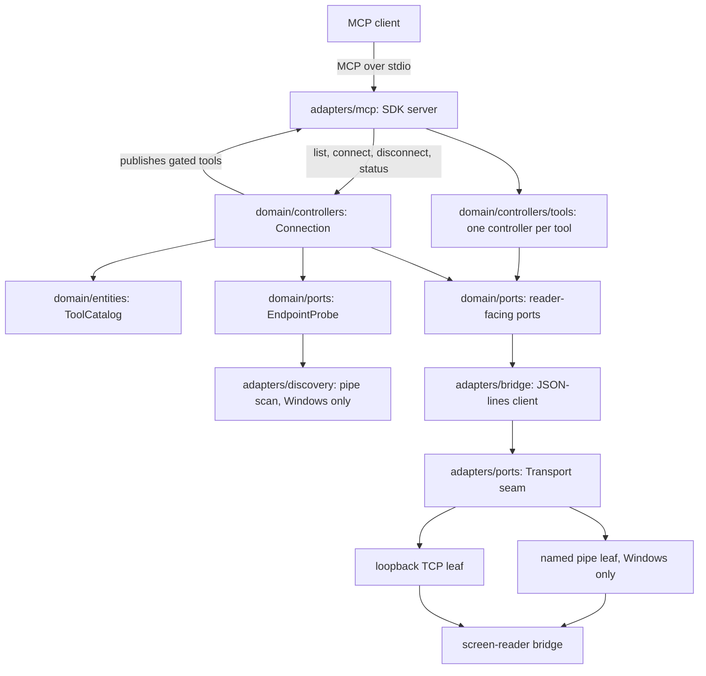

# Spec 0013 — server: the MCP chassis, in Go (entry 10)

Implementation contract for ROADMAP lane 2, entry 10 (session D). Authored on
the entry's branch per process; the spec rides in the first implementing PR
(10a) and is amended in place if delivery forces a change.

This spec **amends two Decided items** in [spec 0005](0005-multi-reader-direction.md)
— see "Amendments to spec 0005" at the end. Nothing else in 0005 changes.

## Goal

Lane 1 is complete: an NVDA bridge listens on a named pipe (or loopback TCP),
answers `hello` with its reader identity and capabilities, and serves the
commands in [the wire contract](wire/v1/protocol.md). Nothing dials it yet
except test scaffolding.

This entry delivers the other half — the MCP server an AI agent actually talks
to. It is a **reader-agnostic chassis** (0005): it dials one bridge, learns from
`hello` which screen reader answered and what that reader can do, and publishes
a matching set of MCP tools over stdio. It contains no NVDA knowledge, no JAWS
knowledge, and no `if reader == …` anywhere.

Three properties define it:

1. **One live bridge session at a time.** Endpoints come from the composition
   root; `hello` reports which reader actually answered. Tools never take a
   target parameter.
2. **The advertised tool set is a function of the announced capabilities.** A
   reader without braille never shows a braille tool. The gate is keyed on
   capability strings, never on reader names.
3. **The agent opens the session.** The server never dials on its own: it
   publishes discovery and connect tools, and the agent asks what readers are
   available and connects to one when it wants. The capability-gated tools
   appear on connect and are retracted on disconnect.

## Decided

Everything in this section was agreed in conversation on 2026-07-22 and is
settled per invariant 6.

### The server is written in Go

Reversing 0005's "the v1 server is Python", which parked a Go port for session
F. The reasons the earlier decision gave have expired or flipped:

- **The same-bytes drift guarantee is replaced, not lost.** 0005 kept Python so
  server and bridge could import the identical `protocol.py`. That guarantee now
  has a language-neutral successor already in the repo: `specs/wire/v1/schema.json`
  with its CI drift gate. This entry makes it load-bearing by **generating** the
  Go wire types from it (see below), which also makes the server the
  second-implementation stress test 0005 hoped a Go port would provide.
- **The published contract exists.** 0005 required it before a language switch;
  entry 8 delivered it.
- **The distribution problem it was deferring is now the deciding factor.** A
  statically linked binary removes the PyInstaller warts 0005 itself listed
  (artifact size, startup, antivirus false positives), and makes an `.mcpb`
  bundle and an umbrella installer trivial.
- **The official Go SDK is past 1.0** (`github.com/modelcontextprotocol/go-sdk`,
  v1.x, maintained with Google), with a published spec-version compatibility
  table. Rust's `rmcp` was considered and rejected: this server is a router —
  dial a pipe, pump JSON lines, fan out to MCP — which is goroutine-and-channel
  shaped, and Rust's ownership work buys guarantees this process does not need.
- **Toolchain accessibility.** `rustc` diagnostics are multi-line ASCII art
  (carets, underlines, gutters), which is hostile under a screen reader.
  `go build` emits one line per error. Compiler output is read thousands of
  times over a project's life; this is a real cost, not a preference.

The NVDA bridge stays Python forever regardless — it runs inside NVDA.

### Each implementation owns its wire binding

The server's wire types are generated from `specs/wire/v1/schema.json` into
`server/adapters/wire/`, a package **private to the server**, regenerated by a
CI drift gate that mirrors the existing schema gate: regenerate, diff, fail on
mismatch.

There is no shared Go binding, and no `wire/go` module (agreed 2026-07-22, after
drafting one). **What is shared is the contract, not the code:**
`specs/wire/v1/` — schema plus prose — is the artifact both sides implement, and
each implementation binds it in its own language, on its own schedule, as its
own business. This is the LSP model: nobody ships a shared library, everyone
implements the published spec, and interop is proven by conformance rather than
guaranteed by linking.

`shared/` exists only because both halves used to be Python, where identical
bytes were a free drift guarantee. That guarantee is exactly what the schema and
the 10c conformance job replace, so recreating `shared/` in Go would rebuild
something this entry has decided it does not need. And a binding shared between
components becomes a coordination problem the moment one of them wants a
different version of it.

If two Go components ever exist — a Go bridge, a standalone conformance harness
— extracting a small library at that point is a directory move. Until then it
would be all cost and no consumer, the same test spec 0005 applied to the repo
split and to schema-first codegen.

Placing the package under `adapters/` rather than at the server's root makes
"the domain never speaks wire types" structural: the domain importing it would
be an adapter import from the domain, which review catches on sight.

### The domain never speaks wire types

The generated types are an **adapter** concern. The domain has its own
vocabulary, and adapters map between them.

This is the load-bearing rule for protocol evolution. Compatibility today is
exact `protocolVersion` equality ([protocol.md §8](wire/v1/protocol.md)), which
couples every bridge to every other bridge *through* the server: NVDA cannot
move to wire v2 until the server does, and when it does, every other bridge must
follow. The alternative — the server accepting a set of versions and negotiating
per session — decouples the bridges but makes the server a compatibility hub
that accretes codecs forever.

We are **not choosing between those yet**; one bridge exists and v1 is
pre-release. We are keeping the choice cheap:

- The supported set is a **set in code** (`SupportedVersions = []int{1}`)
  consulted by the handshake, not a constant compared with `==` at one call
  site.
- The domain imports nothing from `adapters/wire`. If it did, adding v2 would rewrite
  the domain and the decision would already be made for us.

Three version axes stay separate, and conflating them is the failure mode this
guards against:

| Axis | Who compares it | Where it lives |
|---|---|---|
| Wire `protocolVersion` | the handshake, for compatibility | `specs/wire/vN/` |
| Component versions (add-on, server) | nobody, ever — [spec 0012](0012-packaging-and-release.md) | each component's own manifest |
| Capabilities | the tool gate, for reader variation | `hello`'s `capabilities` |

**A reader difference is never a protocol version.** JAWS having no braille is a
capability, not a fork of the contract.

### One live session at a time, and the agent opens it

The server knows about **one or more readers** — from its shipped defaults, a
config file, or flags — and holds at most **one live bridge session**. Tools therefore take no target parameter, and
the capability gate stays exact — it describes the one reader currently
connected.

```json
"mcpServers": {
  "screenreader": { "command": "screenreader-mcp.exe" }
}
```

No arguments: the embedded defaults already know where our bridges listen (see
below). Flags exist for overrides, and for running one process per reader when
the readers live on different hosts.

Running one process per reader remains equally valid, and is the natural shape
when the readers live on different hosts. The two arrangements differ only in
where the list lives, not in the session model.

Rejected for v1: **N concurrent sessions** with a target parameter on every
tool. It collapses the capability-gated tool list into a union with per-call
errors, and makes indices, state and teardown per-target — real cost for a
capability that is mostly wanted across *hosts* anyway (NVDA on the desktop,
TalkBack on a phone), where two processes serve it natively.

What one-at-a-time gives up is **only server-side coordination** — a
synchronized start across readers, one transcript spanning both, a "compare
these two readers" tool. It does *not* give up cross-reader work in a single
agent conversation: the agent can connect, work, disconnect, and connect to the
next reader, or the host can run two processes and expose both tool sets at
once.

Two ATs live on one Windows machine is hostile regardless — both hook the
keyboard, both speak, and `pressGesture` lands wherever focus is.

Two ATs on one Windows machine is hostile anyway — both hook the keyboard, both
speak, and `pressGesture` lands wherever focus is. Real multi-reader work is
multi-**host** (NVDA on the desktop, TalkBack on a phone over `adb`), which
process-per-bridge serves natively.

**Constraint that keeps concurrency reachable:** one `Session` value owning one
bridge connection, built by the composition root, with **zero package-level
state** — no global "current reader", no singleton buffer, no `init()` side
effects. Then N sessions later is a map plus a routing parameter, which is the
"the only code is a lookup" 0005 promised.

### Capability handling: gate the list, surface the identity, error as a backstop

Three mechanisms, in order of how the agent meets them:

1. **Gate the tool list.** Only tools whose capability is in the announced set
   are advertised. Publication is driven by `hello`, and the list changes as the
   bridge connects and disconnects.
2. **Surface the reader.** A `screenreader://info` resource carries reader name
   and version, capabilities, capture mode, synth, protocol version, and both
   session log paths. The agent already knows NVDA's browse/focus mode and
   JAWS's forms mode from training — 0005 principle 2 says hand it the name and
   let it use that knowledge.
3. **Error as a backstop.** A capability can vanish mid-session when the bridge
   dies between `tools/list` and a call, so every tool still checks and returns
   a structured "this reader does not support `<capability>`" error.

`initialize.instructions` was considered for identity and rejected: it is frozen
at handshake time, and the bridge usually connects later.

### Connection is agent-initiated — no auto-connect, no backoff

The server **never dials on its own**. It starts, serves MCP, and waits. The
agent discovers what is available and opens a session when it wants one:

1. Start, serve MCP immediately, advertise only the ungated tools:
   `list_readers`, `connect_reader`, `disconnect_reader`, `status`.
2. `list_readers` reports the configured endpoints and, where it can be known
   without connecting, whether a bridge is listening on each (see "The endpoint
   set is deterministic" below).
3. `connect_reader` dials the chosen endpoint and performs the handshake. On a
   successful `hello` the server verifies the protocol version, records identity
   and capabilities, and publishes the gated tools (the SDK emits
   `tools/list_changed`).
4. `disconnect_reader` sends `bye` and retracts the gated tools. So does an
   observed connection loss — the tools go away, and the agent is free to
   connect again when it chooses.
5. **Never exit** on a bridge problem, and never retry behind the agent's back.
   Only stdin EOF (the host closing the server) ends the process.

This is what makes the session's own parameters agent-owned. The wire contract
fixes the **capture mode** at `hello` for the whole session ([protocol.md
§4](wire/v1/protocol.md)), and `logLevel` with it. Under auto-connect they would
have to be CLI flags chosen by whoever wrote the host config, before anyone knew
what the session was for; as `connect_reader` parameters they are chosen per
session by the party that knows what it is about to do.

A background retry loop was considered and rejected. It buys "the tools are
there when you look" at the price of connection state changing under the agent
mid-task, a reconnect racing a teardown, and a policy (backoff, ceiling, give-up)
nobody asked for. Explicit connection is also legible in the transcript, which
matters when the transcript is the artifact you debug an add-on with.

Protocol mismatch is a *reported* failure, not a crash: `connect_reader` returns
an error naming both versions, `status` keeps saying so, and the process stays
up — restarting the add-on then connecting again fixes it without restarting the
MCP host.

`connect_reader` while a session is already live is an **error** telling the
agent to disconnect first, rather than a silent switch that would pull the
session out from under a multi-step task.

### The endpoint set is deterministic: shipped defaults, user-overridable

**We author both sides, so the server ships knowing where our bridges listen.**
The endpoint set is data, resolved in three layers, lowest precedence first:

1. **Embedded defaults** (`go:embed`) — one entry per reader we ship a bridge
   for, each naming *every* place that bridge is known to listen, in order.
   Today: `nvda` → `pipe:nvdaMcpBridge`, then `tcp:127.0.0.1:8765`. A `jaws`
   entry appears when that bridge does.
2. **A user config file** — `--config <path>`, replacing or extending the
   defaults, for a bridge on a non-standard endpoint.
3. **`--reader name=spec` flags** — highest precedence, for one-off overrides
   and tests.

Two endpoints per reader is not redundancy: [spec 0011](0011-bridge-control-ui.md)'s
dialog lets the user switch the NVDA bridge between named pipe and loopback TCP,
so a single default would be wrong whenever they had. `connect_reader` takes a
**reader**, tries that reader's endpoints in declared order, and reports which
one answered — the agent's model stays "connect to NVDA" rather than "pick a
transport", and the user's toggle needs no configuration from anyone.

The defaults are **embedded rather than shipped as a sidecar file**: the point
of a statically linked binary is one artifact, an MCP host launches the server
with an unspecified working directory (so an on-disk default would have to be
resolved against the executable path — a classic works-in-my-shell failure), and
`.mcpb` bundling stays trivial with a single file. Discoverability is preserved
by `--print-default-config`, which emits the same JSON for the user to redirect
and edit.

Every entry `list_readers` can ever return is therefore known before the process
starts. Nothing is invented at runtime.

The pipe scan serves exactly one purpose: saying whether a **known** endpoint is
live. On Windows the named-pipe namespace can be enumerated by reading the
`\\.\pipe\` directory, so the server matches each configured pipe name against
that listing and reports listening or not listening — without dialing, which
matters because the bridge accepts one session at a time and a connecting probe
would occupy that slot. A TCP endpoint cannot be tested without connecting, so
it reports liveness unknown.

**A pipe that is listening but not configured is not reported and cannot be
connected to** (agreed 2026-07-22, reversing the draft). Inferring an endpoint
from a name found in the namespace would make the server's reader set depend on
what happens to be running, and the name itself on a string any same-user
process can choose. The determinism matters on its own, and it matters more
given where this is heading: **server and bridge are expected to exchange a
shared secret** in a later entry, at which point a bridge is something you
*provision*, not something you stumble upon. Building a zero-configuration
discovery path now would be building the exact thing that security model has to
take away.

The zero-configuration install still works, because the default endpoint is a
constant in the server, not an inference: install the add-on, run the server
with no arguments, and `list_readers` reports the NVDA bridge and whether it is
listening.

The published **pipe naming convention** — `<reader>McpBridge`, which the NVDA
bridge's `\\.\pipe\nvdaMcpBridge` already satisfies — is therefore not a
discovery mechanism but a predictability one: it is what lets a server ship a
sane default for a reader and lets a user guess the name when writing a
`--reader` flag by hand. It is added to the wire contract's prose; see
"Amendment to the wire protocol prose".

### stdout belongs to JSON-RPC

Every diagnostic goes to stderr or a file. A single stray `fmt.Println` corrupts
the MCP stream. The `Log` port exists so the domain cannot reach `os.Stdout` by
accident.

### The pipe leaf is Windows-only, by build tag

`Transport` is a seam in `adapters/ports/`; the TCP leaf is portable, the named
pipe leaf is `//go:build windows` with a non-Windows stub that fails endpoint
construction with a clear message. The module builds and unit-tests on Linux;
only the conformance job needs Windows. This is not CI convenience — a future
VoiceOver or TalkBack bridge implies a non-Windows server host, and 0005 already
frames the endpoint as composition-root config.

### Repo layout: `server/` beside `bridges/`

The asymmetry is meaningful: `bridges/` is plural because readers are many,
`server/` is singular because 0005 makes it one chassis. It also matches the
`server-v*` tag namespace [spec 0012](0012-packaging-and-release.md) already
reserved.

**No `internal/` segment.** `server/` is a command, not a published library, and
nothing imports it — the contract other components need is `specs/wire/v1/`,
which is a document, not a package. `internal/` would therefore enforce a
boundary nothing is pushing against, while the extra path segment breaks the
parallel with the
bridge that AGENTS.md's "same shape, learn it once" depends on
(`nvdaMcpBridge/domain/ports/clock.py` ↔ `server/domain/ports/clock.go`). If a
Go bridge or harness in this repo later makes "do not import the server's guts"
worth enforcing, promoting packages into `internal/` is a directory rename plus
an import rewrite inside a single unpublished module.

The Python `mcpServer/` scaffold (a `pyproject.toml`, an empty package, a smoke
test) is **deleted** in 10a. `shared/` keeps its name: with the server in Go it
is no longer shared between the halves, but a bridge's language is open — a JAWS
bridge could well be Python — so it remains the Python binding of the wire
contract rather than becoming NVDA-specific. Whether it eventually moves under
`bridges/` — since by the principle above a binding is its implementation's own
business, and the only implementations that can consume it are Python bridges —
is a **deferred cleanup**, not part of this entry; it touches the sconstruct,
`sync_shared.py`, the uv workspace and the `shared` CI job for zero behaviour
change.

### Version source for the `server-v*` tag

[Spec 0012](0012-packaging-and-release.md) requires the version to live in the
component's own manifest and nowhere else, verified against the tag. Go has no
`buildVars.py`, so the equivalent is a single `const Version` in
`server/version/version.go`, surfaced by `--version`. The release
workflow builds the binary and runs `--version` to compare against the tag,
which also proves the artifact runs before it is published.

### The module path may need a rename later

`module github.com/marlon-sousa/screen-readers-mcp/server` is written today.
0005 lists the repo name as Open; a rename is `go mod edit -module` plus a
mechanical import rewrite, nothing imports us externally, and GitHub redirects
keep `go get` working. Not a reason to block this entry.

## Architecture



### The four roles, rendered in Go

AGENTS.md's vocabulary (port / controller / entity / adapter) holds unchanged;
only the mechanics differ:

| Rule (Python) | Go rendering |
|---|---|
| Ports are `abc.ABC` with `@abstractmethod` | Ports are interfaces in `domain/ports/`, one per file. An incomplete adapter is caught at compile time by a `var _ ports.X = (*Impl)(nil)` assertion in the adapter's file — required, not optional. |
| One class per file, no re-export facades | One interface/type per file; packages export directly, no facade packages. |
| `tests/unit/` mirrors the source tree | Go's own convention *is* the mirror: `session.go` ↔ `session_test.go` beside it, one test file per source file. A parallel tree is not merely awkward but counterproductive — a Go test sees unexported identifiers only from inside its package's directory, so the layout would force every collaborator public to satisfy a directory. The rule's intent (the path answers "which test covers this?", and a test file covering its neighbours is visible on sight) survives intact. |
| *(new — Go only)* | **Tests are `package foo_test` by default**, exercising the package through the surface production code uses; white-box `package foo` is allowed where an unexported helper genuinely deserves direct coverage, and the file header says why. A test that needs internals is first evidence that the decomposition is wrong. |
| `tests/integration/` named after the use case | `server/tests/integration/` and `server/tests/conformance/`, still named after the use case, each behind a build tag (`//go:build integration`, `//go:build conformance`) so `go test ./...` stays fast and the Windows-only conformance run opts in explicitly. |
| Fakes in `tests/fakes/`, one per port, subclassing the ABC | `fakes/`, one file per port, each with the compile-time assertion. Imported only by tests. |
| Builders in `tests/support/` | `testsupport/`. |
| `wiring.py` is the composition root | `wiring/wiring.go`, read top to bottom. No DI library, same reasoning. |
| Time is injected, never patched | A `Clock` port with a fake whose `Sleep` is an instant advance. Real code uses the port; tests never use `time.Sleep`. |
| Enumerations are `enum` | Typed string constants with a `String()` method; the generated wire enums stay in `adapters/wire`. |

House style: `gofmt` (tabs, by definition), `go vet` clean, and `staticcheck` in
CI. Every file header states its **role and its relationships** — which port it
implements, what it depends on, who builds it, who calls it — exactly as
AGENTS.md requires of the bridge.

## Testing — **Decided**

Agreed in conversation 2026-07-22, before code, because the alternative is
discovering it in review.

### Doubles are hand-written fakes, never mock frameworks

The bridge's rule carries over, and every reason for it is *stronger* in Go. No
`gomock`, no `testify/mock`.

- Contract drift is caught by the **compiler**. AGENTS.md justified rejecting
  `Mock` partly because ABCs plus pyright already covered drift; in Go a
  `var _ ports.SpeechReader = (*FakeSpeech)(nil)` assertion means a fake that
  falls behind its port fails the build. `gomock`'s headline feature —
  generated, compile-safe doubles — is redundant against an interface the
  compiler enforces.
- A hand-written fake here is 15–30 lines of struct and methods, so the cost
  that makes mock frameworks tempting elsewhere barely exists.
- Expectation-style mocks couple tests to call sequences, which is wrong for
  code driven by protocols — wait loops, index arithmetic, state transitions —
  where the assertion belongs on resulting behaviour, not on the call log.

**Fakes may record calls.** A few assertions genuinely are about interaction:
that the heartbeat sent `ping` on schedule, that `disconnect_reader` sent `bye`,
that a refused first endpoint led to the second being dialed. Recording those in
a slice inside a hand-written fake is a spy, not a mock framework, and stays
within the rule. Default to asserting behaviour; reach for the recording only
when the interaction *is* the requirement.

The one test-only dependency worth taking is **`google/go-cmp`** for struct
diffs — comparing a `ReaderListing` by hand produces unreadable failures.

### The integration surface is the MCP boundary

Integration tests assert **what an MCP client sees** — `tools/list`,
`tools/call` results, resource reads — never internal state. The Go SDK's
in-memory transports let a real client drive the real server in one process,
with no stdio and no sockets, which is the server's equivalent of the bridge's
`LoopbackTransport` wire-level scenario (7b).

Four tiers, each catching what the tier below cannot:

| Tier | What is real | What is faked | Runs |
|---|---|---|---|
| Unit | one package | its ports | everywhere |
| **Headless integration** | the whole server: MCP client ↔ SDK server ↔ tools ↔ domain ↔ JSON-lines client | the bridge — a Go fake speaking real wire frames over `net.Pipe()` | CI, all platforms |
| Real-transport | the pipe and TCP leaves against a real listener | the bridge's logic | CI, Windows |
| Conformance (10c) | both implementations, real transport | nothing | CI, `windows-latest` |

The headless tier carries most of the weight, and owns the scenarios that cross
every layer:

1. Connect → the gated tools appear → call one → disconnect → they retract.
2. A fake bridge announcing **no braille**: the braille tool is never
   advertised, and calling it anyway returns a structured capability error.
3. A protocol-version mismatch: `connect_reader` errors naming both versions,
   the process stays alive, `status` keeps saying why.
4. The connection dying mid-call: the in-flight call fails cleanly, the tools
   retract, and a later `connect_reader` opens a fresh session.
5. A reader whose first endpoint refuses: the second is dialed and the result
   reports which one answered.

**What this tier structurally cannot catch, and why 10c exists:** a Go fake
bridge encodes frames with the same `adapters/wire` package the server decodes
with, so a bug *in the binding itself* is invisible — both sides would be wrong
together, in agreement. Only the real Python bridge can catch that. It is the
same argument AGENTS.md makes about unit fakes never proving a real adapter
behaves like its fake, one level up.

## Delivery — three sequential PRs

Delivered as three PRs on one spec, per the short-PR principle and the 9a/9b/9c
precedent. Lane 2 keeps at most one open PR at a time.

- **10a** — the module, the generated wire types, and the bridge client: it can
  dial a bridge and complete a handshake, proven headlessly. No MCP surface.
  **Itself delivered as five sequential PRs** (amended 2026-07-22, after the
  first cut came to ~6,000 lines): (1) the module, the generated wire binding and
  the Go CI job; (2) the `mcpServer/` deletion, which must follow (1) because the
  `server` job has to be repointed at Go before the directory it names
  disappears; (3) the domain — ports, entities and their fakes; (4) the bridge
  client and its transport leaves; (5) discovery, config, wiring and the entry
  point. Each is green on its own; the deliverables below are unchanged.
- **10b** — the MCP surface: the discovery and connect tools, the capability
  gate, the per-capability tools, the info resource, the agent-driven
  connection lifecycle.
- **10c** — cross-language conformance in CI against the real Python bridge,
  plus release plumbing; flips the board entry.

## Deliverables — 10a: module, wire types, bridge client

### 1. `server/adapters/wire/` — the generated wire binding

One Go module for the server (`module
github.com/marlon-sousa/screen-readers-mcp/server`), no workspace. Within it,
this package is generated from `specs/wire/v1/schema.json`, committed, with
`go:generate` and a CI drift gate (regenerate, `git diff --exit-code`). Contains
envelope types (`Request`, `Response`), per-command params/result structs, the
command and capability string constants, and `SupportedVersions`. **No
behaviour** beyond marshal/unmarshal — the server's binding of the contract,
nothing else, imported only by `adapters/bridge/`.

### 2. `server/domain/ports/` — the reader-facing ports

One interface per file, all in domain vocabulary. Their DTOs live beside them
(AGENTS.md's rule that a port's own types live in its file):

| File | Role | Notes |
|---|---|---|
| `session_dialer.go` | port — dial a bridge and complete the handshake | Returns a `ReaderSession` value (identity, capabilities, mode, synth, log paths) or an error. Owns `ProtocolMismatchError`. |
| `speech_reader.go` | port — speech capability | `SpeechSince`, `LastSpeech`, `NextSpeechIndex`, `WaitForSpeech`, `WaitForSpeechToFinish`. |
| `braille_reader.go` | port — braille capability | `BrailleSince`. |
| `gesture_sender.go` | port — gestures capability | `PressGestures([]string)`; ids are opaque. |
| `focus_inspector.go` | port — focus capability | `FocusInfo()`. |
| `state_inspector.go` | port — state capability | `State()`. |
| `config_accessor.go` | port — config capability | `GetConfig(keyPath)`, `SetConfig(keyPath, value)`. |
| `endpoint_source.go` | port — where the reader set comes from | `Readers() []ConfiguredReader`. One implementation now (embedded defaults + config file + flags, layered in wiring); a bridge-published source can be added later without touching the domain. |
| `endpoint_probe.go` | port — liveness of known endpoints | `Live() []Endpoint` — which configured endpoints have a bridge listening, as far as can be known without connecting. Implemented by the pipe scanner. |
| `clock.go` | port — time | `Now`, `Sleep`, injected everywhere; never `time.Sleep`. |
| `log.go` | port — diagnostics | Keeps the domain away from `os.Stdout`. |

Splitting by capability group rather than one fat `BridgeClient` (agreed
2026-07-22) **amends ROADMAP entry 10's scope sketch**, which names a singular
`BridgeClient` port; the wording is corrected in 10a. One adapter implements all
seven. Three reasons, in increasing weight:

1. It mirrors the bridge's own port set (`speech_source.py`,
   `braille_source.py`, `gesture_sender.py`) — same shape, learn it once.
2. Each tool controller declares exactly what it needs: `get_braille` takes a
   `BrailleReader` and cannot reach gestures or config, so "which tools touch
   config?" is answerable from the type signatures.
3. **It makes the capability gate structural, not advisory.** A reader without
   braille is expressible as a missing collaborator. With one fat port,
   `BrailleSince` exists on the interface for every reader alive and the absence
   survives only as a runtime check.

The cost is accepted: seven fakes instead of one, and an interface set that a Go
reviewer could call speculative given the single implementation.

### 3. `server/domain/entities/` — the pure model

| File | Role | Notes |
|---|---|---|
| `reader_session.go` | entity — what `hello` established | Reader name/version, capability set, mode, synth, `logPath`, `nvdaLogPath`, bridge protocol version. Immutable value. |
| `capability.go` | entity — the capability vocabulary | Typed constants for the six groups, plus `Set` with `Has`. Unknown strings are retained and ignored, per protocol.md §4. |
| `connection_state.go` | entity — the lifecycle state machine | `Disconnected` / `Connecting` / `Connected` / `Incompatible`, with the reason string `status` reports. No `Retrying`: the agent owns connection. |
| `endpoint.go` | entity — one place a bridge may listen | Transport kind and address. Immutable value; parsed from `pipe:<name>` / `tcp:<host>:<port>`. |
| `configured_reader.go` | entity — one reader we know how to reach | Name plus its endpoints **in declared order** (NVDA: pipe, then loopback TCP). Built by wiring from the layered sources, never by the scanner. |
| `reader_listing.go` | entity — what `list_readers` answers | Readers and their endpoints joined with liveness: listening / not listening / unknown (TCP). Pure; the join lives here, not in the tool. |

### 4. `server/adapters/ports/transport.go` — the adapter seam

The byte-level seam between the JSON-lines client and the OS. `Read`, `Write`,
`Close`, with a `Dial`-side `Endpoint` type. The domain never sees it.

### 5. `server/adapters/bridge/` — the JSON-lines client

| File | Role | Notes |
|---|---|---|
| `json_lines_client.go` | adapter — implements every port in §2 | Holds all the decisions: correlation ids, request/response matching, framing, timeouts, and the **wire↔domain mapping**. Unit-tested against a fake `Transport`. |
| `handshake.go` | adapter — `hello` exchange | Sends the server's `protocolVersion` and capture mode, validates the reply against `SupportedVersions`, builds a `ReaderSession`. Raises `ProtocolMismatchError` on disagreement. |
| `endpoint.go` | adapter — endpoint parsing | `pipe:<name>` and `tcp:<host>:<port>` into a `Transport` factory; rejects non-loopback TCP hosts. |
| `tcp_transport.go` | adapter **leaf** — real socket | No decisions; nothing to unit-test. |
| `pipe_transport_windows.go` | adapter **leaf** — real named pipe | `//go:build windows`, via `go-winio` (pure Go, keeps `CGO_ENABLED=0`). |
| `pipe_transport_other.go` | adapter **leaf** — stub | `//go:build !windows`; returns "named pipes are Windows-only". |

The upper/leaf split is AGENTS.md's rule applied unchanged: every decision lives
in `json_lines_client.go`, tested against a fake seam; the leaves do nothing but
call the OS.

### 6. `server/adapters/discovery/` — the pipe scan

The layered rule again: the naming-convention decision sits one level above the
OS call.

| File | Role | Notes |
|---|---|---|
| `ports/pipe_directory.go` | adapter seam | `Names() []string` — the raw pipe namespace. |
| `pipe_probe.go` | adapter — implements `EndpointProbe` | Holds the decision: match each **configured** pipe name against the namespace listing and report listening / not listening. Never invents an endpoint from a name it finds. Unit-tested against a fake directory. |
| `pipe_directory_windows.go` | adapter **leaf** | `//go:build windows`; reads `\\.\pipe\`. No decisions. |
| `pipe_directory_other.go` | adapter **leaf** stub | `//go:build !windows`; returns an empty list, so every endpoint reports liveness unknown. |

### 7. `server/adapters/` — the remaining edges

`system_clock.go` (leaf) and `stderr_log.go` (leaf).

### 8. `server/version/version.go`

`const Version` — the single version source 12a's tagging scheme reads.

### 9. `server/config/` — the shipped defaults and their loader

| File | Role | Notes |
|---|---|---|
| `defaults.json` | data | The readers we ship a bridge for and every endpoint each is known to listen on, in order. Embedded with `go:embed`; also reproduced in `server/README.md`. |
| `loader.go` | adapter — implements `EndpointSource` | Layers embedded defaults, an optional `--config` file, and `--reader` flags, highest precedence last. Pure decisions over an injected file reader, so it is unit-tested without touching disk. |

### 10. `server/cmd/screenreader-mcp/main.go`

Entry point **only**: parse flags and hand them to wiring. No logic.

| Flag | Meaning |
|---|---|
| `--reader name=spec` | Repeatable, highest precedence. One endpoint for a reader, e.g. `nvda=pipe:nvdaMcpBridge` or `talkback=tcp:127.0.0.1:9010`. Repeating a name adds an endpoint to that reader, in order. |
| `--config <path>` | A JSON file replacing or extending the embedded defaults. |
| `--print-default-config` | Emits the embedded defaults for the user to redirect and edit, then exits. |
| `--version` | Prints `version.Version` and exits. |

There is deliberately **no** `--capture-mode` and no `--reader-log-level`: both
are `connect_reader` parameters (see deliverable 15).

### 11. `server/wiring/wiring.go`

Composition root. In 10a it builds the transport, the client, and returns a
handshake-capable object; 10b extends it with the MCP server and controllers.

### 12. `fakes/` and `testsupport/`

A fake per port and a fake `Transport` (scriptable: queued responses, injected
errors, EOF), plus builders. Each fake carries its compile-time assertion.

### 13. CI and repo changes

- Delete `mcpServer/` and drop it from the uv workspace.
- Replace the Python `server` job with a Go one — **the job name stays
  `server`**, because branch protection matches required checks by literal job
  name (AGENTS.md gotcha). Steps: `go build ./...`, `go test ./...`, `go vet`,
  `staticcheck`, and the `adapters/wire` drift gate.
- Update AGENTS.md's Layout table and Dev commands, and amend its Testing
  section with the Go rendering of the mirror rule: tests beside their source,
  `package foo_test` by default, `server/tests/<usecase>/` behind build tags for
  the integration and conformance tiers.

## Deliverables — 10b: the MCP surface

### 14. `server/domain/ports/tool_publisher.go`

Port — how the domain publishes and retracts the advertised tool set. Keeps the
SDK out of the domain; implemented by the MCP adapter.

### 15. `server/domain/entities/tool_catalog.go`

Entity — pure decision table: capability set in, tool names out. This *is* the
gate. No reader names appear in it, only capability strings.

### 16. `server/domain/controllers/tools/` — one controller per tool

A `Tool` interface (`Name`, `Capability`, `Description`, `InputSchema`,
`Execute`) with one implementation per file, mirroring the bridge's
one-handler-per-command decomposition (agreed 2026-07-22). Fifteen small files
beat a table of struct literals because a tool file's real content is not its
three-line body but its **description and parameter schema** — the agent-facing
contract, and where this server's usability mostly lives.

**`Execute` takes erased params and each tool declares its own JSON schema**
— *not* typed input structs with SDK-generated schemas. Go's generic SDK path
would derive schemas from per-tool structs, but a uniform domain `Tool`
interface must erase those types, which would force a line of per-tool binding
code into the MCP adapter and leave the tool list existing in two places, free
to drift. With erased params the adapter has **zero per-tool code**, the
registry is the single list, and the gate is a filter over it. The price is
hand-written schemas, which are agent-facing text we would be hand-tuning
anyway.

Each is stateless; per-call state arrives in a `ToolContext`
parameter object (the ports it may use, the current `ReaderSession`, the clock)
— the direct analogue of the bridge's `SessionContext`.

| Tool | Capability | Wire command |
|---|---|---|
| `get_speech` | speech | `getSpeech` |
| `get_last_speech` | speech | `getLastSpeech` |
| `get_next_speech_index` | speech | `getNextSpeechIndex` |
| `wait_for_speech` | speech | `waitForSpeech` |
| `wait_for_speech_to_finish` | speech | `waitForSpeechToFinish` |
| `get_braille` | braille | `getBraille` |
| `press_gesture` | gestures | `pressGesture` |
| `get_focus_info` | focus | `getFocusInfo` |
| `get_state` | state | `getState` |
| `get_config` | config | `getConfig` |
| `set_config` | config | `setConfig` |

The four **ungated** tools are always advertised, before and after a session
exists, and live in the same directory:

| Tool | Params | What it does |
|---|---|---|
| `list_readers` | — | The `ReaderListing`: every known reader with its endpoints and their liveness where knowable. |
| `connect_reader` | `reader` (**required**), `mode`, `log_level?` | Tries that reader's endpoints **in declared order**, handshakes, publishes the gated tools, and reports which endpoint answered. Errors if a session is already live; an unknown `reader` errors with the known names listed. |
| `disconnect_reader` | — | Sends `bye`, retracts the gated tools. |
| `status` | — | Connection state, reason, and the current `ReaderSession` if any. When a session is live it **also makes a real `ping` round trip** and reports the outcome, so the answer is proof rather than possibly-stale local state. |

**`reader` is required, never defaulted** (agreed 2026-07-22). Defaulting to the
single *live* reader would make one call mean different things minute to minute;
defaulting to the single *known* reader is deterministic only until the JAWS
bridge ships, at which point every agent habit built on the omitted argument
starts failing with an ambiguity error caused by a release the agent knows
nothing about. The convenience saved at most one `list_readers` call on a
once-per-session tool, and the required argument makes every transcript
self-describing. The unknown-reader error lists the known names, so an agent
that guesses wrong self-corrects in the same turn.

`mode` and `log_level` are tool parameters and not CLI flags precisely because
the wire contract fixes them at `hello` for the session's lifetime: the agent
opening the session is the party that knows what the session is for.

**`ping`, `echo` and `bye` are not tools** (agreed 2026-07-22). `bye` is what
`disconnect_reader` sends, and a second path to the same effect would only let
the agent end a session without the server updating its own state. `ping` is the
heartbeat the connection controller sends; what an agent actually wants from it
is "is this connection real right now?", which `status`' round trip answers
directly. `echo` proves framing, correlation and dispatch end to end — a
developer's question, asked by the 10c conformance tests, not by an agent. Every
advertised tool is tokens in every agent request, so a tool that answers nobody's
question is a real cost; a diagnostic tool can be added later if hand-debugging a
live install ever needs one.

### An idle agent loses its session — by design

The bridge runs two watchdogs ([protocol.md §6](wire/v1/protocol.md)): the
heartbeat, which any message resets, and command inactivity, which **only a real
command** resets — `ping` deliberately does not, so a keepalive cannot mask an
abandoned session. The server's heartbeat therefore keeps the connection honest
without keeping an idle session alive.

The consequence, which implementers and agents both need to know: a long agent
pause ends the session. The server observes the loss, retracts the gated tools,
and the next `connect_reader` opens a **fresh** session — new transcript, new
NVDA log capture, indices starting over. That is the contract working as
intended, not a defect, and it is a second reason `status` reports what the wire
says rather than what the server remembers.

`registry.go` is an explicit hand-written map, read top to bottom — same
reasoning as the bridge's registry and `wiring.go`: no decorator
auto-registration, no container.

### 17. `server/domain/controllers/connection.go`

Controller — owns the lifecycle in "Connection is agent-initiated" above, driven
entirely by the four ungated tools: `List` (endpoints joined with probe
results), `Connect` (dial, handshake, publish via `ToolPublisher`), `Disconnect`
(`bye`, retract), and loss detection (retract, record why). It sends the
heartbeat `ping` on the `Clock` while a session is live. **No retry policy and
no backoff** — a failed connect returns an error to the agent and leaves the
state `Disconnected`.

Holds the `ConnectionState` and the current `ReaderSession`; `status` reads
them. **The only stateful thing in the process**, and it is an ordinary value
owned by wiring — not a package global.

### 18. `server/adapters/mcp/`

| File | Role |
|---|---|
| `sdk_server.go` | adapter — the go-sdk stdio server; implements `ToolPublisher` by adding/removing tools (the SDK emits `tools/list_changed`) |
| `tool_binding.go` | adapter — maps a domain `Tool` to the SDK's tool registration, including input schema and structured results |
| `info_resource.go` | adapter — serves `screenreader://info` from the current `ReaderSession` |

The exact SDK call shapes are settled during implementation against the v1.x
API; the adapter boundary exists precisely so that churn cannot reach the
domain.

## Deliverables — 10c: conformance and release plumbing

### 19. Cross-language conformance job

`server/tests/conformance/`, behind `//go:build conformance`, run by a
`conformance` CI job on `windows-latest` that sets up both Go and Python, builds
the server, starts the **real Python bridge** headlessly over a real named pipe,
and drives it with the real server: handshake, a capability-gated tool list, one
command per capability group, and a clean teardown. Repeated over loopback TCP.

This is the guarantee that replaces same-bytes sharing, and it is exactly the
second-implementation check 0005 wanted from a Go port: two independent
implementations of `specs/wire/v1/` proving they agree.

### 20. Release plumbing

`--version` wired to `version`, the `server-v*` half of 12a's tagging
scheme, and a `server/README.md`.

### 21. Board and docs

Flip ROADMAP entry 10 to Done; AGENTS.md's server paragraph updated to describe
the Go structure.

## Delivery amendments — 10a

The layout above is the reviewed one; these are the changes delivery forced,
recorded here in the PR that makes them, each with its one-line why (workflow
rule, "if the layout changes while coding, the amendment rides in the PR").

1. **`SessionDialer.Dial` returns a `ReaderConnection`, not a bare
   `ReaderSession`** — the caller also needs the live collaborators to serve
   tool calls with, and a way to end the session. `ReaderConnection` carries the
   session, the endpoint that answered, the six capability ports, and a
   `SessionLifecycle` (`Ping` / `Bye` / `Close`). The capability ports being
   **fields that are nil when unannounced** is what makes the gate structural,
   which was the reason for splitting the ports in the first place.
   `SessionLifecycle`, `SessionOptions` and `ReaderConnection` live in
   `session_dialer.go` as the port's own signalling types, not in files of their
   own.
2. **Two entity files were added: `capture_mode.go` and `reader_log_level.go`** —
   `connect_reader`'s two session parameters need domain types, because the
   domain may not use the generated wire enums.
3. **`tools/wiregen/` holds the generator** — under `tools/` rather than `cmd/`
   so `cmd/` stays exactly the binaries we release. It emits one
   `adapters/wire/wire.gen.go`; the hand-written `adapters/wire/doc.go` carries
   the package's role header and the `go:generate` directive. Enum type names
   are an explicit table in the generator (the schema spells its enums inline),
   and an unnamed enum is a hard error rather than a silent fall-back to
   `string`.
4. **`SupportedVersions` is a function, not a `var`** — a package-level slice
   variable would be package-level mutable state, which acceptance criterion 11
   forbids. It is still a set in code, consulted by the handshake.
5. **`tests/architecture/imports_test.go` is untagged** — it is acceptance
   criterion 12's import-boundary test, and a boundary checked only when someone
   remembers `-tags` is not checked. The tagged tiers are tagged because they are
   slow or platform-bound; this one parses a few dozen files.
6. **10a already carries a real-transport tier**, `tests/integration/`, behind
   `//go:build integration`: the loopback-TCP scenarios everywhere, the
   named-pipe ones additionally behind `windows`. The CI `server` job runs it,
   so the leaves are exercised from this PR rather than from 10c.
7. **`main.go` gained `--verbose`** (debug logging to stderr). Still no
   `--capture-mode` and no `--reader-log-level`, for the reason the flag table
   gives.

## Class/file layout summary

| File | Role | Built by | Collaborators |
|---|---|---|---|
| `adapters/wire/*` | generated contract binding | `go:generate` | `adapters/bridge/` only |
| `domain/ports/session_dialer.go` | port | — | implemented by `bridge/handshake.go` |
| `domain/ports/{speech,braille,gesture,focus,state,config}_*.go` | ports | — | implemented by `json_lines_client.go`, used by tools |
| `domain/ports/endpoint_source.go` | port | — | implemented in `wiring`, used by `connection.go` |
| `domain/ports/endpoint_probe.go` | port | — | implemented by `discovery/pipe_probe.go`, used by `connection.go` |
| `domain/ports/clock.go`, `log.go` | ports | — | used by everything |
| `domain/ports/tool_publisher.go` | port | — | implemented by `mcp/sdk_server.go`, used by `connection.go` |
| `domain/entities/reader_session.go` | entity | handshake | read by tools, `status`, info resource |
| `domain/entities/capability.go` | entity | handshake | read by `tool_catalog.go` |
| `domain/entities/connection_state.go` | entity | `connection.go` | read by `status` |
| `domain/entities/tool_catalog.go` | entity (pure gate) | `connection.go` | capabilities in, tool names out |
| `domain/entities/endpoint.go` | entity | wiring | read by `connection.go`, the probe |
| `domain/entities/configured_reader.go` | entity | wiring | read by `connection.go`, `list_readers` |
| `domain/entities/reader_listing.go` | entity | `connection.go` | readers and endpoints joined with liveness |
| `domain/controllers/connection.go` | controller | wiring | dialer, probe, publisher, clock, log, catalog, endpoints |
| `domain/controllers/tools/*.go` | controllers (one per tool) | `registry.go` | one port each, via `ToolContext` |
| `domain/controllers/tools/tool_context.go` | parameter object | per call | ports + `ReaderSession` + clock |
| `domain/controllers/tools/registry.go` | explicit map | wiring | the tool controllers |
| `adapters/ports/transport.go` | adapter seam | — | implemented by the leaves |
| `adapters/bridge/json_lines_client.go` | adapter (all decisions) | wiring | `Transport`, `adapters/wire` |
| `adapters/bridge/handshake.go` | adapter | wiring | `Transport`, `adapters/wire` |
| `adapters/bridge/endpoint.go` | adapter | wiring | leaf factories |
| `adapters/bridge/{tcp,pipe_*}_transport*.go` | adapter leaves | `endpoint.go` | the OS |
| `adapters/mcp/sdk_server.go` | adapter (`ToolPublisher`) | wiring | go-sdk, registry |
| `adapters/mcp/tool_binding.go` | adapter | `sdk_server.go` | domain `Tool` |
| `adapters/mcp/info_resource.go` | adapter | wiring | `ReaderSession` |
| `adapters/discovery/ports/pipe_directory.go` | adapter seam | — | implemented by the leaves |
| `adapters/discovery/pipe_probe.go` | adapter (`EndpointProbe`, all decisions) | wiring | `PipeDirectory`, the configured endpoints |
| `adapters/discovery/pipe_directory_*.go` | adapter leaves | `pipe_probe.go` | the OS |
| `adapters/system_clock.go`, `stderr_log.go` | adapter leaves | wiring | the OS |
| `version/version.go` | constant | — | `--version`, release workflow |
| `wiring/wiring.go` | composition root | `main.go` | everything above |
| `cmd/screenreader-mcp/main.go` | entry point | — | flags → wiring |

## Acceptance criteria

1. `go build ./...` and `go test ./...` pass on Linux and Windows; the pipe leaf
   compiles out cleanly on Linux.
2. The binary is statically linked (`CGO_ENABLED=0`) and runs with no runtime
   installed.
3. A freshly started server **with no arguments** advertises exactly the four
   ungated tools, has **not** dialed anything, `status` reports `Disconnected`,
   and `list_readers` reports the shipped readers from the embedded defaults.
4. With the bridge listening, `list_readers` reports that endpoint as live; with
   the bridge stopped, it reports not listening. A listening pipe belonging to no
   known reader is **not** reported and cannot be connected to.
4a. Switching the NVDA bridge from pipe to loopback TCP in its dialog needs no
   server configuration: `connect_reader nvda` tries the endpoints in declared
   order and reports which one answered.
4b. `--reader`, `--config` and the embedded defaults compose with flags winning,
   and `--print-default-config` emits exactly the embedded JSON.
5. `connect_reader` publishes the gated tools without restarting the server, and
   `screenreader://info` reports the reader's name, version and capabilities.
   The `mode` passed to `connect_reader` is the mode `hello` established.
6. `disconnect_reader`, and an observed connection loss, both retract the gated
   tools; the server keeps running and `status` says why. A later
   `connect_reader` republishes them.
7. `connect_reader` while connected returns an error and leaves the live session
   untouched.
8. A bridge announcing an unsupported `protocolVersion` fails `connect_reader`
   with an error naming both versions, leaves state `Incompatible`, and neither
   crashes nor exits.
9. No connection attempt is ever made that the agent did not ask for.
10. A tool whose capability is absent is **not advertised**, and calling it
    directly (a stale list) returns a structured capability error.
11. No package-level mutable state anywhere in `server/`, enforced by review.
12. Nothing under `domain/` imports `adapters/wire` or the MCP SDK, enforced by review
    and by an import-boundary test.
13. `adapters/wire` regenerates from `schema.json` with no diff.
14. The conformance job drives the real Python bridge over both a named pipe and
    loopback TCP.
15. `--version` prints the constant that the `server-v*` tag is checked against.
16. Nothing is written to stdout but MCP frames.

## Out of scope

- **Concurrent sessions / cross-reader tools** — deferred; the no-global-state
  constraint keeps them a map plus a lookup.
- **Serving the session logs over the wire** — `hello` returns `logPath` and
  `nvdaLogPath`, and `screenreader://info` reports both **paths**, but their
  *contents* are not exposed as MCP resources in v1. Agreed 2026-07-22 that
  reading a session's transcript and NVDA log through the agent is worth having
  and needs its own conversation first: what is exposed (whole file, tail, since
  an index), how it interacts with spec 0009's per-session capture, and whether
  it stays sound once a bridge is not on the same machine as the server.
- **Automatic connection or reconnection** — rejected, not deferred: the agent
  owns the connection. See "Connection is agent-initiated".
- **Multi-version protocol negotiation** — the hub-versus-lockstep decision is
  deliberately left open; only its cost is kept low.
- **Remote TCP** — deferred on the bridge side behind its own security spec, so
  the server dials local endpoints only.
- **`.mcpb` bundle, umbrella installer, `uvx`-style distribution** — [entry
  12b](../ROADMAP.md).
- **Relocating `shared/` under `bridges/`** — deferred cleanup.
- **Live-NVDA end-to-end runs** — that is entry 11 (session E), which is what
  finally proves the whole chain against a real reader.

## Definition of done

10a, 10b and 10c merged; CI green including the conformance job; ROADMAP entry
10 marked Done with its PR numbers; AGENTS.md describing the Go server; spec
0005 amended as below, and the wire prose amended with the pipe naming convention.

## Amendments to spec 0005

Two Decided items in [0005](0005-multi-reader-direction.md), "Server language
and distribution", are amended by this spec (the amendment lands in 10a, in the
same PR that acts on it, per invariant 6):

1. **"The v1 server is Python"** → the v1 server is Go. The reasoning is in
   "The server is written in Go" above; the same-bytes drift guarantee that
   justified Python is replaced by generation from the published schema plus the
   cross-language conformance job.
2. **"A Go port is the packaging-era option, decided at session F"** → decided
   now, at session D. Session F (entry 12b) keeps the remaining distribution
   questions — `.mcpb`, umbrella installer, channels — but the language question
   is closed and PyInstaller is off the table.

## Amendment to the wire protocol prose

[`specs/wire/v1/protocol.md`](wire/v1/protocol.md) §1 gains a **pipe naming
convention**, so a reader's endpoint is predictable rather than arbitrary:

> A bridge offering a named pipe SHOULD name it `<reader>McpBridge`, where
> `<reader>` is the same value the bridge sends as `hello`'s `reader.name`. The
> convention exists so that a server can ship a sane default endpoint for a
> reader, and a user can predict the name when configuring one by hand. It is a
> naming rule only: it confers no trust, a server never infers an endpoint from
> the namespace, and `hello` remains the sole authority on which reader actually
> answered.

This is prose only — `schema.json` is untouched, no field changes, no version
bump. The NVDA bridge already satisfies it
(`\\.\pipe\nvdaMcpBridge`, `reader.name = "nvda"`), so the amendment describes
existing behaviour rather than requiring a bridge change. It lands in 10b, the
PR that implements the scan.

Everything else in 0005 stands unchanged, including the four chassis principles,
which this spec implements rather than revises.
