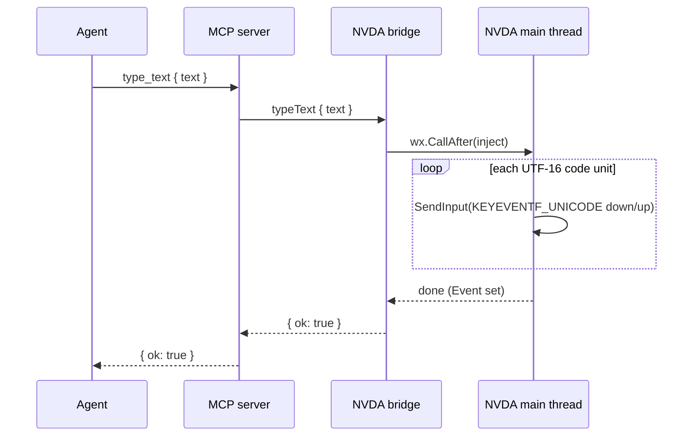

# Spec 0019 — the `type` primitive: literal text entry (entry E.3)

Status: **agreed 2026-07-25; ready to implement.** No code written yet. Promotes
and supersedes [spec 0018](0018-input-vocabulary.md) Part B, which sketched this
and now points here. Lane 1 + lane 2. Prioritised in lane 1 so the live tests can
enter text (URLs, search phrases) instead of spelling them one gesture at a time.

Agreed in conversation: the Unicode injection via NVDA's own `winBindings.user32`
`SendInput` bindings (below), and the transcript logging length only (below).

## Goal

Let the agent enter **literal text** into whatever holds focus — a URL, a search
phrase, a form field — with one call carrying the string, distinct from pressing
a key or chord. This is the second half of "how an agent gives input to a
reader"; [spec 0018](0018-input-vocabulary.md) settled the first (gestures are
the reader's command notation).

## Why it is its own primitive, not `pressGesture`

Typing via `pressGesture`, one call per character, is wrong three ways:

1. **It is not text.** A URL is content, not a sequence of commands. The
   vocabularies are different in kind — `pressGesture` speaks the reader's
   *command* notation ([0018](0018-input-vocabulary.md)); text is just a string.
2. **It breaks on layout.** A single-character gesture resolves through
   `KeyboardInputGesture.fromName` → `VkKeyScanEx`, which maps a character to a
   keystroke **on the current keyboard layout** and fails (returns `-1`) for any
   character not reachable there — `@`, punctuation, accented letters. A
   Brazilian layout typing an English string, or vice versa, silently loses
   characters.
3. **It is verbose and slow.** `www.blindtec.com.br` is ~19 round trips, each a
   model turn plus a pipe hop, versus one.

The precedent is universal: Playwright's `press` vs `fill`/`type`, Selenium's
chord vs `sendKeys`. This adopts the same split.

## Decided

### A new command `typeText`, a new capability `typing`

```
typeText { text: string } → { ok: true }
```

`text` is opaque literal content; the server routes it without interpreting it,
exactly as it routes a gesture id. Typing is a **separate capability** —
`typing` — announced in `hello`, so a reader that cannot type simply does not
advertise it and the tool is never offered. This is the same capability gate that
already governs `gestures`, `speech`, `braille` and `announce`.

### It types into the focused control — the agent focuses first

Same contract as `pressGesture`: the text lands wherever system focus is. The
agent composes the interaction — focus the field (`pressGesture ["control+l"]`),
type (`typeText`), submit (`pressGesture ["enter"]`). `typeText` does **not**
interpret control characters or submit on its own; it inserts the literal string
and returns. Newlines and Enter are the agent's job, via `pressGesture`, so the
primitive stays one unambiguous thing.

### The bridge injects Unicode with NVDA's own bindings, not raw ctypes

**NVDA has no `typeString`.** It is a screen reader, not an automation harness —
there is no high-level "type this text" API to call. But it *does* ship the exact
primitive we need: **NVDA Remote** injects input on the controlled machine
through `_remoteClient/input.sendKey`, which drives
**`winBindings.user32.SendInput`** with NVDA's `INPUT` / `KEYEVENTF` bindings —
including `KEYEVENTF.UNICODE`. So the adapter reuses *NVDA's* bindings (already on
pyright's ignore list), not a hand-rolled `ctypes` layer; it is the Remote code
path, looped over the string instead of one key.

For each UTF-16 code unit of the text, send a key-down then key-up `INPUT` with
`KEYEVENTF.UNICODE` set and the code unit in `wScan` (`wVk = 0`). This is
**layout-independent** — the code unit *is* the character, not a scan code to be
re-mapped — and covers the full range `VkKeyScanEx` cannot, including characters
outside the BMP (a surrogate pair is two consecutive Unicode events, which
`SendInput` accepts).

**Typing bypasses NVDA on purpose — the opposite of a gesture.** `pressGesture`
goes through `inputCore.manager.emulateGesture`, so NVDA *processes* it
(`NVDA+f7` runs NVDA's own command). `typeText` must instead reach the **focused
application**, so it uses raw `SendInput` exactly as Remote does, never
`emulateGesture` — the characters are content for the app, not commands for NVDA.

Injection runs on **NVDA's main thread** and blocks until done, mirroring
`NvdaGestureSender`'s `wx.CallAfter` + `threading.Event` marshaling with the same
generous timeout, so "the call returned" means "the text reached the control." A
`SendInput` that inserts fewer events than requested (e.g. another thread holds
the input desktop) surfaces as a `TypeError`-style per-command failure the Session
reports, not a session death.



### `typeText` mutates the machine — observe-only withholds it

`typeText` moves the user's machine as surely as `pressGesture` does. Its handler
is `mutates_reader = True` (the property [spec 0017](0017-observe-only-control.md)
added), so an `observe` session refuses it and the server withholds the `typing`
port, never advertising `type_text`. No new gate — it rides the one 0017 builds.

### Decided — the transcript logs length only

The transcript (spec 0003) records session events. `typeText` is **exactly how a
password or other secret would be entered** (it is the mechanism
[spec 0016](0016-human-in-the-loop.md) will lean on), and logging it verbatim
would write the secret to disk. So the transcript records that a `typeText` of
*n* characters occurred — **the length, never the content.**

The cost is reproducibility: a replay sees *that* text was typed and *how much*,
not *what*. That is the right default — an attended tester who needs the literal
string has it in the PR's own notes, and [spec 0016](0016-human-in-the-loop.md)
will add an explicit, redacted-by-construction "type this secret" path if a
verbatim channel is ever wanted. The handler therefore logs `("type", len(text))`,
not the text.

## Wire contract changes

| Addition | Shape |
|---|---|
| `Capability.TYPING` StrEnum member | `"typing"` |
| `typeText` command | params `{ text: string }`, result `{ ok: true }` |
| `TypeParams` | `text: str` |

Regenerates `schema.json`; the generated binding is regenerated and diffed both
sides (the drift gate); prose added to `protocol.md` §5 (commands) and the
capability table in §4.

## Class/file layout

### Shared

1. **`shared/screenreader_wire/protocol.py`** — `Capability.TYPING`;
   `TypeParams` (`text: str`); its entry in `COMMAND_SHAPES` mapping
   `typeText` → params/`AckResult`.

### Bridge (lane 1)

2. **`domain/ports/text_typer.py`** — the `TextTyper` port
   (`type_text(text: str) -> None`) and a `TypeError` failure, beside
   `gesture_sender.py`.
3. **`domain/controllers/commands/type_text.py`** — `TypeTextHandler`: decode
   `TypeParams`, call the port, record the transcript entry (length only, per the
   decision above), return `AckResult`; class attribute `mutates_reader = True`.
4. **`domain/controllers/commands/registry.py`** — register the handler; advertise
   `Capability.TYPING` in `NVDA_CAPABILITIES` when the typer port is present.
5. **`adapters/nvda_text_typer.py`** — `NvdaTextTyper`: the per-code-unit
   `KEYEVENTF.UNICODE` injection on the main thread, using NVDA's
   **`winBindings.user32`** `SendInput`/`INPUT`/`KEYEVENTF` bindings (the same
   ones `_remoteClient/input.sendKey` uses), **not** raw `ctypes`; on pyright's
   ignore list, validated by the live checklist.
6. **`adapters/nvda_adapter_factory.py`** — build `NvdaTextTyper` and hand it to
   the session alongside the gesture sender.
7. *(no `session.py` dispatch change — the 0017 observe gate already refuses a
   `mutates_reader` handler, and a normal session dispatches by handler name.)*

### Server (lane 2)

8. **`domain/entities/capability.go`** — a `CapabilityTyping` constant and its
   `hello` string mapping, beside `CapabilityGestures`.
9. **`domain/ports/…` + `ToolContext.Text()`** — a `TextTyper` port
   (`TypeText(text string) error`) handed over only when the reader announced
   `typing`.
10. **`adapters/bridge/json_lines_client.go`** — a `TypeText(text)` method sending
    the `typeText` command.
11. **`adapters/bridge/handshake.go`** — map the `typing` capability to handing
    over the `TextTyper` port (and withhold it under `observe`, per 0017's
    handshake change if that has landed; otherwise this is where it slots in).
12. **`domain/controllers/tools/type_text.go`** — the `type_text` tool: gated on
    `CapabilityTyping`, description saying it enters **literal text** into the
    focused control and pointing at `press_gesture` for keys and submission.
13. **`domain/controllers/tools/registry.go`** — the registry line.

### Wire binding

14. Regenerated both sides from `schema.json`; committed; the drift gate diffs it.

### Fakes

15. **Bridge** `tests/fakes/text_typer.py` — records typed strings, optionally
    fails a configured input, beside the fake gesture sender.
16. **Server** `fakes/text_typer.go` — the same, for the server's port.

## Tests

- **Bridge unit** — `TypeTextHandler` types the string through the fake typer and
  logs a length-only transcript entry; the handler-enumeration test (0017) asserts
  its `mutates_reader` is `True`.
- **Wire scenario** — a session typing text end to end over the fake bridge.
- **Server** — `type_text` advertised only when `typing` is announced; withheld on
  an `observe` echo; the tool routes `text` unchanged.
- **Conformance** — the real Python bridge types a known string (including a
  non-ASCII character) into a focused control, read back through `getFocusInfo` /
  `getSpeech` — the tier that proves layout-independence for real.

## Live-NVDA checklist (this entry's PR body)

1. Focus a text field, `type_text "hello world"`, read it back — matches exactly.
2. Focus Chrome's address bar (`press_gesture ["control+l"]`), `type_text
   "www.blindtec.com.br"`, `press_gesture ["enter"]` — the page loads. *(The test
   that motivated this primitive.)*
3. A string with punctuation and an accented character (`"café — 50%"`) types
   correctly **regardless of the active keyboard layout**.
4. On an `observe` session, `type_text` is absent from the tool list and refused
   if called by name anyway — **no character reaches the machine** (text field
   focused, stays empty).
5. The transcript shows a `type` event of the right length and **does not** contain
   the literal text.

## Out of scope

- Clipboard paste, IME/dead-key composition, and per-keystroke timing — `typeText`
  is atomic literal insertion of a Unicode string.
- Submitting, newlines, or mixed text-and-chord sequences in one call; compose
  them from `type_text` + `press_gesture`.
- The redaction path for secrets — sketched here, delivered with
  [spec 0016](0016-human-in-the-loop.md).

## Definition of done

The files above; headless suites both sides, pyright strict, ruff, the schema
drift gate and the conformance job green; the live-NVDA checklist run with the
tester at the keyboard, results in the PR body. Marks entry **E.3** Done.
