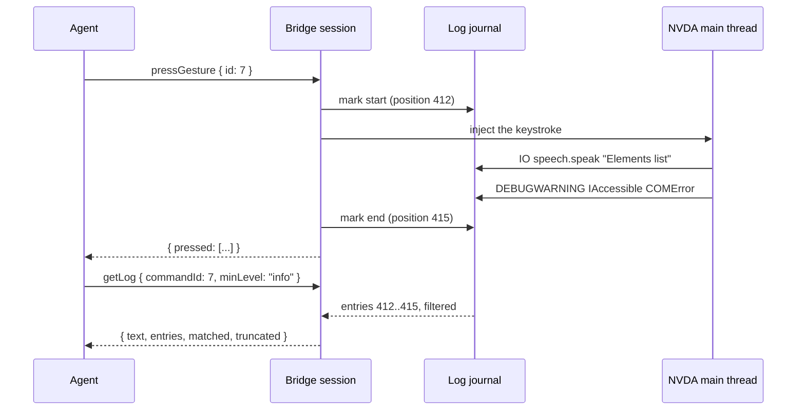

# 0020 — log slices on demand

Status: **agreed 2026-07-30**. Board entry **11.4**, scheduled next.

This finishes what [0009](0009-nvda-log-capture.md) started. That entry set out to
automate the debugging ritual — *"place a marker in NVDA's log, run the repro,
place another marker, copy the slice out"* — and it narrowed the haystack from
"everything since NVDA started" to "this session". Then it stopped: what the agent
receives is a **path**, at `hello`, and reading it means reading the whole file.

This entry narrows it one step further, to **one command's window**, and lets the
agent filter that window before it crosses the wire.

## Goal

An agent that has just pressed a key, or just had a command fail, can ask what
NVDA logged *while that command ran* — and can say "at info level, but without
the speech output, because I already know what was spoken".

## The problem, stated exactly

Three facts, each verified on 2026-07-30:

- `LogCapture` is `path` / `start` / `stop`. There is no way to read the capture
  back through the bridge at all, and no command in the contract returns log
  content: only `logPath` and `nvdaLogPath` (strings) ever cross the wire.
- So an agent reads the file itself. During the 11.2 review session that meant
  three separate `nvda.log` reads of 40–130 KB, each one truncated by the
  harness, to answer one question ("why did the listener stop?"). The answer was
  in a handful of lines.
- Reading the file also assumes the agent and the reader share a filesystem.
  Nothing else in this project assumes that: the bridge exists precisely because
  the reader's environment is reachable only through it.

The cost is not the transport. Measured on the real pipe, a command round trip is
**0.2–0.5 ms**; what is slow is moving tens of thousands of tokens of log into a
model's context to find four lines.

## Decided

### The unit is one command's window, bracketed by the dispatch loop

The Session already knows exactly when a command starts and finishes — it is the
one place that dispatches. So it records the journal position either side of
`_dispatch()`, giving every request an exact `[start, end)` window, and keeps the
last **50** of them.



Windows are disjoint by construction, so "the log for command 7" is never
contaminated by command 8.

### Slices are anchored by request id, not by "N commands back"

The obvious ergonomic shape is `HEAD~2`, and it is a trap: it is *relative*, so it
means something different the moment another command runs. An agent that presses a
key, reads focus, then asks for `HEAD~2` gets the keypress window only by luck,
and a debugging loop is exactly where extra commands appear between the failure
and the question.

The agent already knows the id it sent. So:

- `commandId` — the anchor. Defaults to the most recently marked command.
- `windows` — how many command windows to include, counting **back** from the
  anchor. `windows: 3` is the `HEAD~2` idea with an absolute anchor.

Trimming `windows` from a first cut was considered and **rejected** (agreed
2026-07-30): nothing is in production yet, so there is no migration to earn by
shipping less, and the multi-window case is the ordinary one — a failure is
usually explained by the command *before* the one that failed.

### The journal holds structured records, not formatted bytes

Byte offsets into the capture file were the first sketch and are worse in three
ways: the end offset races the handler's flush; filtering by level or module means
re-parsing text the logger had already structured; and the file is formatted, so
nothing else can be recovered.

The tee is a `logging` handler on `log.root`, so it sees `LogRecord` objects
**before** formatting — level, module, thread, message, timestamp, all exact. It
therefore keeps a bounded in-memory journal of records alongside the file, and
formats only what a `getLog` actually returns.

Costs, stated rather than discovered later:

- **Memory.** Bounded ring, **10 000 records** or **4 MB**, whichever comes first.
  Larger than first drafted because, with 0009's file gone (below), this is the
  only copy the bridge keeps; still bounded, because an unbounded journal inside a
  screen reader is a memory leak in a screen reader.
- **Slices expire.** A window whose records have aged out returns what survives
  plus `truncated: true`. At `io` on a busy session that can be a minute or two.
  The fallback is not lost data: NVDA's own `nvda.log` has the same records (see
  below), and the session transcript's timestamps bracket the window in it.

### 0009's parallel FILE goes away — the journal is what it was for

Marlon's question on review: is the parallel file still needed? It is not, and the
evidence is stronger than the intuition.

**It has no unique content.** 0009 raises the level with `log.root.setLevel(...)`,
which is global, and NVDA's own handler is added to `log.root`
(`logHandler.py:627`) with no handler-level of its own. So every record our tee
receives, NVDA's `nvda.log` receives too. The tee was never *more* detailed — only
*scoped*.

**Nobody read it.** Across the whole 11.2 review session, including a genuine
post-mortem of the bridge silently stopping, what got read was NVDA's own
`nvda.log` and the bridge's session transcript. The 0009 capture file was never
opened once. A duplicate that goes unread while its original is right there is
not a safety net, it is upkeep — it needed its own pruning machinery to stop it
accumulating on the user's disk.

**It costs the wrong thing at the wrong moment.** A second handler means a second
format-and-write per record, inside a screen reader, at exactly the moment the
agent has raised verbosity to `io`.

What replaces the one thing it did well — finding the session's window after the
fact — is already built: the transcript records session open and close with
timestamps, and those bracket the window inside `nvda.log`. Content plus scoping,
both durable, no third copy.

So **0020 supersedes that half of 0009**. The journal handler replaces the file
handler; `nvdaLogPath` leaves `HelloResult` and the server's session info with it.
0009's other decisions — the temporary level change and its restore-on-teardown —
stand, and this entry only moves their trigger.

### Filters compose, and both directions matter

Three filters and one projection, evaluated in this order, all optional:

| Filter | Meaning |
|---|---|
| `minLevel` | drop records below this level (the `LogLevel` enum, extended with `warning` and `error`) |
| `contains` | keep only records whose message matches any of these substrings |
| `exclude` | drop records whose **module or message** matches any of these |
| `fields` | which fields of each record to render, defaulting to all four |

`fields` is what structured records buy beyond exact filtering, and it is a
bigger saving than it looks: dropping the timestamp and thread from 200 records
removes more characters than most `exclude` patterns do. `["level", "message"]`
is the compact form worth reaching for; the default stays `["time", "level",
"module", "message"]` so a slice pasted into an issue still reads like
`nvda.log`.

It also enables a cheap survey: `fields: ["module"]` with a high `maxEntries`
answers "what is flooding this window?" in a few hundred bytes, so the next call
can `exclude` precisely instead of guessing.

Marlon's case — *"level info, but not output speech, because that I already
know"* — is expressible two ways, and both should work:

- `minLevel: "info"` alone, because NVDA logs speech at `IO`, which is below
  `INFO`; or
- `minLevel: "debug"` with `exclude: ["speech.speech.speak"]`, when the IO-level
  detail is wanted for everything *except* speech.

`exclude` matches the module name as well as the message precisely so the second
form is exact rather than a guess at message wording.

### The level is the agent's to change, mid-session — and only forwards

`hello` fixing the capture level for the whole session was the wrong shape once
the bridge can be on another machine: the agent, not the connect call, is what
knows which level a given question needs. But there is a hard constraint that
decides the design:

**A level cannot be raised retroactively.** Python's logging decides at the
*logger* whether a record exists at all; a handler only ever sees what was
emitted. If NVDA's root is at `INFO`, `DEBUG` records were never created, so no
journal holds them and no filter recovers them. Of the two options considered —
"return what was captured" or "raise the level" — raising is the useful one, and
it is useful **forwards only**. The loop is: raise, re-run the command, read the
slice. That is the same loop as the F1 ritual, which also cannot see the past.

Downwards is free: the journal holds more than asked for and the filter shows
less.

So, three levels rather than one, which is the "parallel journal" idea made
explicit:

| | Set by | Purpose |
|---|---|---|
| NVDA's **logger** floor | `hello`, then `setLogLevel` | what NVDA emits at all — the only one that cannot be undone after the fact, and the one the human's own `nvda.log` sees too |
| the **journal** handler's level | `setLogLevel` | what slices can see |

`hello` keeps its `logLevel` parameter: without it the *first* commands — the
handshake itself, whatever failed immediately — are unreachable, and those are
often the ones being debugged. It becomes the starting value rather than the
session's fixed one.

`setLogLevel` restores NVDA's own level at teardown, exactly as 0009's
hello-scoped change already does; the machinery is the same, only its trigger
moves.

Two costs, stated because a screen reader's user pays them:

- **NVDA at `debug`/`io` is slower for the human**, not just for us. Raising the
  floor is a real change to their reader, so it belongs in an explicit command
  they can see in the transcript, not as an implicit side effect of asking for a
  slice.
- **The ring fills faster**, so windows expire sooner. At `io` on a busy session
  that is seconds, and `truncated: true` is how the agent finds out.

`setLogLevel` sets `mutates_reader = True`, consistent with `setConfig`: it is a
temporary but real change to the reader. **Open question for 11.3** (observe-only)
— an observe-only session arguably still wants to raise its own log level, since
nothing about it moves the user's machine. Flagged rather than decided here.

### The payload is bounded, and says so when it truncates

`maxEntries` defaults to **200**. The result carries `entries` (how many are in
the text), `matched` (how many passed the filters before the cap), and
`truncated`. An agent that sees `matched: 4000, entries: 200` knows to filter
harder rather than to page blindly.

Returning **formatted text**, not structured records, is deliberate: it is what
the F1 ritual produces, what a human pastes into an issue, and by far the most
compact form. An agent that wants structure can filter more narrowly instead.

### `getLog` does not mark itself

Otherwise the default anchor is always the `getLog` that just ran, whose window is
empty. `CommandHandler` gains `marks_log: bool = True`, and `GetLogHandler` sets
it `False` — the same shape as `resets_inactivity`, which `ping` introduced for
the same class of reason.

### It is one new capability, `log`

A reader whose bridge cannot reach its diagnostic log never announces `log`, and
the `get_log` tool is never advertised — the structural gate braille and
`interact` already use. `PROTOCOL_VERSION` stays 1: this adds a command and a
capability, and an older bridge simply does not advertise it.

### What a slice contains, honestly

**Everything NVDA logged during the window**, not everything the command caused.
NVDA logs from its main thread while the bridge dispatches on the session thread,
so focus events, other add-ons, and unrelated chatter land in the same window.
That is usually what a debugger wants, and saying it here stops the first
surprising slice reading like a bug.

For the same reason a window can be *large* for a deliberately blocking command:
`waitForUserReply` with a 110 s poll brackets everything NVDA did for those two
minutes.

### Pull, not push — **rejected: attaching slices to error replies**

Stapling the slice onto every error reply is tempting and wrong: it makes every
error unbounded, for the majority of errors where nobody wants the log. The agent
asks when it wants it.

Also rejected: pushing log lines as they happen. Nothing in this protocol pushes,
and a log tail is the last thing that should be the first exception.

## Wire contract changes

```python
class Capability(StrEnum):
    LOG = "log"

class Command(StrEnum):
    GET_LOG = "getLog"
    SET_LOG_LEVEL = "setLogLevel"

@dataclass
class GetLogParams:
    commandId: int | None = None   # default: the most recently marked command
    windows: int = 1               # how many windows, counting back from the anchor
    minLevel: LogLevel | None = None
    contains: list[str] | None = None
    exclude: list[str] | None = None
    fields: list[str] | None = None   # default: time, level, module, message
    maxEntries: int = 200

@dataclass
class SetLogLevelParams:
    level: LogLevel                # raises NVDA's own floor; forwards only

@dataclass
class LogLevelResult:
    level: LogLevel                # now in force
    previous: LogLevel

@dataclass
class LogSliceResult:
    text: str          # formatted like nvda.log, newline-joined
    entries: int       # records in `text`
    matched: int       # records that passed the filters, before maxEntries
    truncated: bool    # matched > entries, or the window had aged out of the ring
    fromCommandId: int
    toCommandId: int
    capturedAtLevel: LogLevel  # the floor in force while this window was recorded
```

`HelloResult` **loses** `nvdaLogPath`, and the server's session info loses
`readerLogPath` with it: there is no file to point at. Removing a field is
tolerated by protocol.md §2 (absent fields are ignored), and pre-release nothing
external depends on it.

`LogLevel` gains `WARNING` and `ERROR` (it exists today to *request* a capture
level, where those are useless; as a filter they are the common case).
`COMMAND_SHAPES` gains two rows; the schema and the Go binding are regenerated.

`capturedAtLevel` earns its place: once the level is dynamic, an empty slice is
ambiguous between "nothing was logged" and "you were not capturing that", and the
agent cannot tell which without being told. Reporting the floor that was in force
turns a confusing retry loop into one obvious next call.

## Class/file layout

### Bridge — domain (strict-checked)

1. **`domain/entities/log_journal.py`** — the bounded ring of records and the
   window marks. Pure: takes records as `(level, module, message, timestamp)`
   tuples, knows nothing about `logging`. Owns the caps and the formatting.
2. **`domain/ports/log_capture.py`** — gains `position() -> int` and
   `slice(start, end, *, min_level, contains, exclude, max_entries)`.
3. **`domain/controllers/commands/get_log.py`** — `GetLogHandler`, `marks_log =
   False`, resolves the anchor and the window count, delegates filtering to the
   journal.
4. **`domain/controllers/session.py`** — records the journal position either side
   of `_dispatch()` for handlers whose `marks_log` is True, keeping the last 50.
5. **`domain/controllers/commands/command_handler.py`** — the `marks_log` flag.
6. **`registry.py`** — the handler, plus `Capability.LOG` in `NVDA_CAPABILITIES`.

### Bridge — adapters (NVDA edge, pyright-ignored)

7. **`adapters/nvda_log_capture.py`** — the `FileHandler` is **replaced** by a
   journal handler on `log.root`: same attach/detach and same level
   save-and-restore as 0009, writing records into the journal entity instead of a
   file. `path` leaves the port. The logs directory keeps only
   `session-*.log` (the transcript), so 0009's two-prefix pruning simplifies to
   one.

### Server

8. **`domain/ports/log_reader.go`** — the `log` capability port.
9. **`domain/controllers/tools/get_log.go`** — the `get_log` tool, gated on `log`,
   with the level/filter parameters and the "capture level is fixed at connect"
   warning in its description.
10. **`fakes/log_reader.go`**, `testsupport/connection.go` — the double and its
    wiring.

### Tests

11. Journal unit tests: window bracketing, the ring aging out, each filter, the
    filters composed, the cap and `truncated`.
12. `GetLogHandler` tests: default anchor, `windows` > 1, an unknown id, and that
    `getLog` does not become its own anchor.
13. Go tool tests: gating, parameter pass-through, bounds.
14. Conformance: `exerciseGetLog` — a real slice over a real bridge.
15. Live: that a gesture's window really contains NVDA's own records, and that
    excluding `speech.speech.speak` at `debug` removes speech and keeps the rest.
16. Removals: every assertion on `nvdaLogPath` / `readerLogPath` across the bridge
    unit tests, the wire roundtrip, the conformance expectations and the Go
    session-info tests. The `hello` handler stops starting a file.

## Live-NVDA checklist

1. Press a gesture, then `get_log` for that command: the slice contains NVDA's own
   lines for it and nothing from before it.
2. `minLevel: "info"` on a session captured at `debug` drops the speech records.
3. `exclude: ["speech.speech.speak"]` at `debug` drops speech and keeps the
   IAccessible/UIA chatter.
4. `windows: 3` returns three commands' worth, in order.
5. On a session captured at `info`, `minLevel: "debug"` returns nothing and says
   `capturedAtLevel: "info"`; then `set_log_level("debug")`, re-run the command,
   and the same slice request has the debug records. Raising is forwards only, and
   this is the check that says so out loud.
6. A slice from a busy session reports `truncated: true` rather than returning
   megabytes. Use **`debug`**, not `io`: at 12, `io` excludes the DEBUG records
   that actually flood (see amendment 6). Verified 2026-07-30 — twenty seconds of
   browsing at `debug` gave `matched: 1368, entries: 200, truncated: true`, an
   8.8 KB payload against 62.8 KB uncapped.
7. `set_log_level` restores NVDA's own level at teardown — verify in NVDA's
   General settings that it reads what it did before the session.

## Out of scope

- Reading the log of a *previous* session, or one whose records have aged out of
  the ring. The journal is session-scoped, like the speech buffer. The answer for
  post-mortems is NVDA's own `nvda.log`, whose window the transcript's timestamps
  bracket — not a third copy maintained by us.
- Regular expressions. Substrings cover the cases and cannot hang the reader.
- Structured records on the wire (see above).
- Pushing or tailing.
- Any change to the `logPath` file from 0009.

## Amendments during implementation (2026-07-30, PR #46 review)

Six things the spec left open or got wrong about NVDA, settled while building it.
Recorded here rather than edited into the text above, so the agreed shape and what
the code actually does stay separately readable.

1. **`warning`/`error` are refused by `setLogLevel` and by `hello`.** The spec
   introduces them as filter-only but never says what happens if one is *set*.
   Setting NVDA's floor to `error` silences warnings in the human's own nvda.log
   for the session, which nothing here asks for. The settable set is the four the
   server's `ParseReaderLogLevel` already enforced: `debug`, `io`, `debugwarning`,
   `info`.
2. **A failed command still gets a window.** The Goal says "or just had a command
   fail"; the first implementation recorded the window only on the success path,
   so the one command an agent most wants a slice for was the one it could not
   ask about. The mark is now closed in a `finally`.
3. **Multi-window slices stay one span, gaps included — and a window is much
   narrower than the spec assumes.** Concatenating the windows and dropping the
   gaps was implemented first, on the reasoning that `windows: 3` should mean
   three commands' worth and not the idle time between them. Live NVDA refuted
   it. A window closes the moment the handler returns, but NVDA does the work
   the command *caused* just after that, on its own thread:

   ```
   IO - inputCore.executeGesture (18:47:56.033)   <- inside the window
   IO - speech.speech.speak      (18:47:56.034)   <- one millisecond later
   ```

   So the gap is where most of the interesting log lives, and excluding it
   excludes what the feature exists to show. **This also means the spec's
   "everything NVDA logged during the window" is optimistic**: for a gesture, a
   single window reliably contains only NVDA's own `executeGesture` line. Item 1
   of the live checklist passes in that narrow sense; items 2, 3 and 6 — the
   speech-filtering cases — need `windows` > 1 to have any speech records to
   filter at all. Whether the window should instead be held open until NVDA
   settles is a real design question this entry does not answer, and is flagged
   for a follow-up rather than decided here.
4. **`capturedAtLevel` over several windows is the oldest window's floor.** The
   conservative end: it can under-report what a later window captured, but never
   over-report. Visible in the conformance run, which asserts both directions.
5. **The journal's "module" is NVDA's `codepath`, not `record.name`.** NVDA has a
   single logger, so `record.name` is the constant `"NVDA"`; the thing that reads
   `speech.speech.speak` is the `codepath` attribute NVDA attaches per record
   (`logHandler.py`). The spec's own worked example — `exclude:
   ["speech.speech.speak"]` — matches nothing without this.
6. **NVDA's `IO` is 12, above `DEBUG`'s 10** (`logHandler.py`: `IO = 12`,
   `DEBUGWARNING = 15`), and its timestamps are local time-only (`09:17:40.724`),
   produced by a `formatTime` that deliberately avoids `time.localtime`. Both are
   borrowed from NVDA rather than restated, so a slice lines up with the log a
   human would diff it against.

   One consequence is worth stating plainly, because this entry's own checklist
   assumed the opposite: **an `io` floor is NARROWER than a `debug` one.** At 12
   it excludes every DEBUG record — `evtTracker`'s per-event flood included — so
   `debug` is the verbose level and `io` is the selective one. Measured on
   2026-07-30 over twenty seconds of real browsing: `debug` produced 1368
   records, `io` 64, and **silent** mode 39, since suppressing speech at the
   `speak()` filter means NVDA never logs `speech.speech.speak` at all.

An unknown `fields` entry or `minLevel` is also now an error rather than a silent
omission: a typo'd projection otherwise returns plausible text with a column
quietly missing, which is worse than a refusal.

## Definition of done

The bridge advertises `log`; `get_log` appears only when it does; a command's
window is exact and disjoint from its neighbours; filters compose in both
directions; payloads are bounded and honest about truncation; 0009's capture file
is gone along with `nvdaLogPath`, with no orphaned assertions left behind; every
gate green (`doctor`, `shared`, `bridge`, `types`, `gates`, `go`,
`conformance`); the live checklist run with the tester at the machine.
