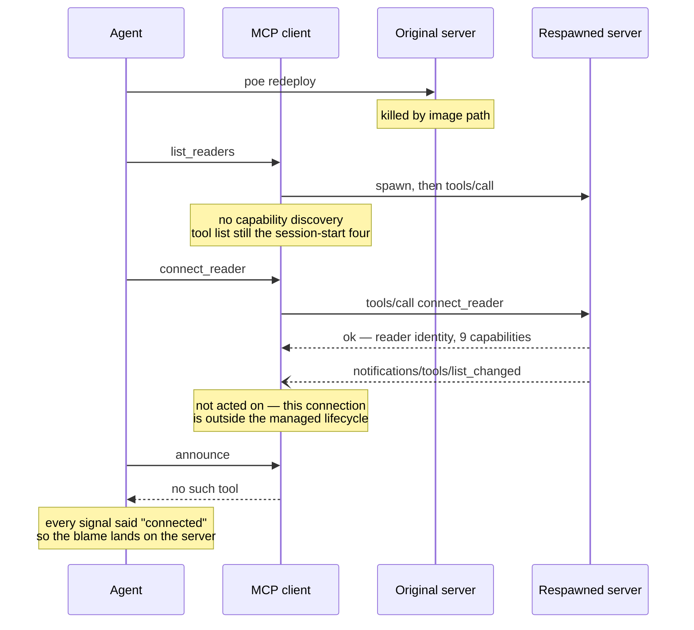
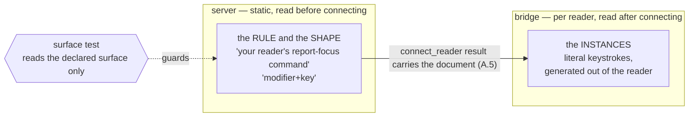

# 0022 — tool discovery an agent can rely on

Status: drafted 2026-08-01; **premise corrected 2026-08-02 after diagnosis**;
**agreed 2026-08-19 — option (c)**, see [the decision](#agreed-2026-08-19--option-c-and-the-two-facts-that-decided-it).
Board entry **11.6**, with **11.24(a)** folded in. Both lanes.

This is a *discovery* spec in both senses: its subject is how an agent discovers
the tool surface, and its own job was to argue options rather than arrive holding
a decision. It revisits something [0013](0013-mcp-server.md) decided on purpose,
so the burden here is to show what changed — not to relitigate.

**Everything above the decision section is the 2026-08-02 draft, unchanged.** It
is left standing because the decision is only legible against the options it
chose between, and because its diagnosis remains correct and load-bearing. What
changed is not the analysis but the facts: [0031](0031-the-tools-describe-themselves.md)
shipped, and a second external run failed the same way without a redeploy.

**Read the diagnosis first.** The first draft of this spec blamed the MCP client
for ignoring `tools/list_changed`. That was wrong, and the correction changes
which options are worth taking.

## What was measured

Measured on 2026-08-01, while running 11.5's live checklist in Claude Code —
the server's primary target client.

1. `connect_reader` was called. It **succeeded**, returning the reader identity
   and the full capability list: `speech`, `braille`, `gestures`, `typing`,
   `focus`, `state`, `config`, `interact`, `log`.
2. The server emitted `tools/list_changed`, as 0013 designed.
3. The client never re-listed. Every capability-gated tool — `announce`,
   `press_gesture`, `get_log`, all of them — stayed invisible for the rest of
   the session.
4. A direct call by name returned "No such tool available". Across a turn
   boundary too, so it was not a mid-turn caching artefact.

The checklist was driven through `scripts/live_test.py` instead, which calls
`tools/list` itself and therefore never meets the problem.

Every observation above is accurate. The conclusion drawn from them — *this
client does not support `tools/list_changed`* — was not.

## The diagnosis, 2026-08-02

**The client honours `tools/list_changed`. What broke it was our own
`poe redeploy`.**

Four independent lines of evidence:

**The server is correct.** [sdk_server.go](../server/adapters/mcp/sdk_server.go)
registers the ungated four at `Bind`, before any client connects. The go-sdk
computes server capabilities inside its `initialize` handler (`server.go:1476` →
`:557`), sees `tools.len() > 0`, and declares `tools: {listChanged: true}`.
Confirmed live: `live_test.py smoke`, an independent MCP client, passes *"gating:
the gated set appears after connect"* against the current binary.

**The client honours the notification, both ways.** In a clean session on the
same client build (2.1.220), `connect_reader` made all nineteen gated tools
appear; a dropped bridge made the same nineteen disappear; reconnecting brought
them back. Historically, **370 successful gated calls across five earlier
sessions**, from 2026-07-24 onward.

**The trigger is the redeploy.** `scripts/redeploy.py` kills every
`screenreader-mcp.exe` by image path — deliberately, and it says so — including
the one the client spawned. The client will still *spawn* a process to serve the
next call, but it never re-runs capability discovery, so the tool list it holds
stays frozen at whatever it was when the session began. Reproduced
deterministically on 2026-08-02: redeploy → `list_readers` works →
`connect_reader` succeeds with all nine capabilities → `announce` returns "No
such tool available". Disconnecting and reconnecting the reader does not help.

**Across every transcript in the project's history, no gated call has ever
succeeded after a redeploy killed the server in that session.** Every one of the
370 successes came before any kill. The session that produced this spec killed
the server 148 seconds before its first gated call.

This is documented client behaviour, not a defect to report:

> If an HTTP or SSE server disconnects mid-session, Claude Code automatically
> reconnects with exponential backoff… **Stdio servers are local processes and
> are not reconnected automatically.**
>
> — [Claude Code MCP documentation](https://code.claude.com/docs/en/mcp)



## The fix that already exists

**In the client, by the user, one command:**

```text
/mcp reconnect screen-reader-testing
```

Verified 2026-08-02 from the broken state: reconnect, then `connect_reader`, and
all nineteen gated tools returned with `announce` dispatching. No session
restart, no context lost.

Two details that cost a round each to find:

- **Name the server.** The no-argument form failed with *"MCP controls aren't
  available right now — the terminal is still starting up or is showing another
  view."* The usage is `/mcp [reconnect|enable|disable [<server>|all]]`.
- **The agent cannot issue it.** `/mcp` is a client UI command; the Skill tool
  refuses it in as many words (*"`mcp` is a UI command, not a skill. Ask the user
  to run `/mcp` themselves"*). The `claude mcp` CLI has no `reconnect` verb —
  `add`, `add-json`, `add-from-claude-desktop`, `get`, `list`, `login`, `logout`,
  `remove` — and runs in a separate process that could not reach this session's
  connection anyway. The toggle state in `~/.claude.json` is read at startup.
  There is no route. **The reconnect is the user's to press, always.**

So the standing rule, which belongs in `AGENTS.md` and in `redeploy.py`'s own
closing message:

> After `poe redeploy`, run `/mcp reconnect screen-reader-testing` before driving
> the reader through the MCP tools.

## Replacing the redeploy with a proxy

The rule above costs the user one command per rebuild. It also **cannot be
automated**, which matters for exactly one goal: an agent that rebuilds the
server and carries on live-testing without a human touching anything. If that
goal is wanted, a hot-reload proxy is the only door.

### What redeploy does today, and why it is the way it is

`redeploy.py`'s own header is the argument: with stdio MCP there is no single
server to ask nicely, because **each client spawns its own process**, so a
session with two agents attached has two copies holding the same locked image
and no shared endpoint to shut down. Killing by image path is the only thing
that reaches all of them. The cost is stated and accepted: every agent's
connection to the binary dies, not just the one asking.

### What a proxy would change

A hot-reload proxy inverts the ownership. The client spawns **the proxy**, once,
and never restarts it. The proxy owns the real server as a child, watches the
binary, and restarts the child when it changes. The client's connection is never
the thing that breaks — so the notification path stays alive, and the client
keeps honouring `tools/list_changed`, which the diagnosis proved it does.

`redeploy.py` then loses its reason to exist in its current form: no process
hunting, no killing other agents' sessions, no delete-before-build race. It
becomes `go build`.

### mcpmon — the candidate that fits

[mcpmon](https://github.com/neilopet/mcpmon) (*"hot reload for MCP servers. Like
nodemon, but for MCP"*). Node ≥ 18, deps `chokidar` + `commander`, npm 1.0.1
published 2026-01-26, repo last pushed 2025-07-10, 10 stars.

It is a **line-level transparent pipe**: `setupStdinForwarding` forwards every
stdin line to the child, `setupOutputForwarding` forwards every stdout line back,
and it parses lines only to *observe* (it captures `initialize` for replay).
Child notifications therefore pass through untouched — which is the single
property this server needs, since our entire gated surface travels that way. On
a child restart it re-initializes and emits its own `tools/list_changed` carrying
the fresh list.

Costs, none of them hidden:

- A Node dependency in a Go-and-Python repo, at 10 stars, with npm and the repo
  drifting apart (published Jan 2026, last pushed Jul 2025).
- **Windows is undocumented.** `package.json` sets no `os` restriction and
  `chokidar` is cross-platform, so it is plausible — and unverified. This must be
  proven on the maintainer's machine before anything is adopted.
- `redeploy.py` would need rework rather than deletion, and carefully: it
  currently *deletes* the binary before rebuilding precisely so a respawning
  client cannot load the old image, and a file-watching proxy would see that
  deletion and try to restart onto a missing file.

### reloaderoo — the candidate that would break us

[reloaderoo](https://github.com/cameroncooke/reloaderoo) (126 stars, last pushed
2026-02-04) is the better-maintained project and has exactly the feature this
entry wants: a `restart_server` tool **the agent itself can call**. It is
nevertheless disqualified, and the reason is worth recording so nobody
rediscovers it.

It is a request-forwarding proxy, not a pipe. `src/mcp-proxy.ts:325-359`
registers explicit handlers for `ListTools`, `CallTool`, `ListPrompts`,
`ListResources` and friends. It registers **no notification handlers at all** —
searching the repository for `setNotificationHandler` and
`fallbackNotificationHandler` returns zero hits. The only `tools/list_changed` it
ever emits is one it generates itself after its own restart
(`src/mcp-proxy.ts:296-316`).

So through reloaderoo, `connect_reader` publishes, our server emits
`tools/list_changed`, and **the proxy swallows it**. The capability gate would be
broken permanently rather than only after a redeploy. It would convert an
occasional hazard into the normal state.

The general lesson for any future candidate: **a proxy is only safe for this
server if it forwards child notifications**, and that has to be read out of the
source rather than taken from the README.

## What 0013 decided, and what is still right about it

0013 principle 2: *the advertised tool set is a function of the announced
capabilities.* A reader without braille never shows a braille tool; the gate is
keyed on capability strings, never on reader names.

That remains good, and this spec should not throw it away by reflex. It buys:

- an agent sees only tools its reader can actually serve, so it never wastes a
  turn discovering a capability gap by calling into one;
- the gate is exact, because there is exactly one live session (0013's
  one-at-a-time model);
- reader variation stays a capability question, never a protocol fork.

What 0013 did **not** weigh is that the mechanism carrying all of this is
optional at the far end — and, as the diagnosis shows, is also *fragile at the
near end*, because it can be severed by a development workflow the server knows
nothing about.

## Options

Cheapest first. None is chosen here.

### (a) Say so at the point of failure

`connect_reader`'s result names the tools that should now be present, and
`status` repeats it. The connect result already carries capabilities; this adds
the concrete tool names those capabilities imply, plus a sentence saying that if
they are not visible, the client did not act on `tools/list_changed` — and, now,
naming `/mcp reconnect` as the thing to try.

Fixes nothing. Makes it **diagnosable in one round trip**, by the agent itself,
without a human reading a spec. Costs a field and a paragraph. The diagnosis
raised its value: the failure it describes is real, recurring, and its actual
cause was misattributed for a full session by an agent that had read the specs.

### (b) One always-present dispatcher tool

A single ungated tool that forwards to a gated one by name — `reader_call
{ tool, arguments }`.

Works on **any** client, including one with no notification support at all, and
would survive a severed connection too. But it undercuts gating rather than
complementing it: the capability list becomes a runtime argument value instead of
a typed surface, the agent loses per-tool schemas and descriptions (the thing
that makes an MCP tool usable at all), and every gated tool now has two call
paths to keep in step.

### (c) Advertise everything, always; fail the gated ones with "connect first"

Client-independent and simple. Throws away the benefit above: an agent sees
braille tools for a reader that has no braille, and learns the truth only by
calling one.

**The diagnosis adds an argument the first draft could not make.** If the tool
list never changes, then a client holding a stale list is holding a *correct*
one — so the redeploy breakage stops affecting tool visibility altogether, with
no proxy, no reconnect and no discipline required. That is a concrete, measured
benefit, not insurance against a hypothetical client.

### (d) Keep the gate, add an opt-out

Default unchanged (gated). A server flag / config key — `--advertise-all`, or
`"toolGating": false` — makes it behave like (c) for the run. The user with a
limited client sets it once; every other user keeps 0013's surface.

Note that (d) only helps if the user **knows** to set it, which is exactly what
(a) tells them. The two are complementary, not alternatives, and (a) is
worthwhile on its own under any of the others. (d) also gives the development
loop an escape that production never pays for: a maintainer who redeploys ten
times an hour sets it, and the shipped default stays exact.

## The question the spec has to answer

The first draft asked: *is a client that ignores `tools/list_changed` a client
this server supports?* — and answered it under the belief that the client which
failed was the one most of this server's users will use. **That belief was
false.** Claude Code honours the notification; a user of the shipped server never
runs `poe redeploy` and never sees this.

So the question splits, and both halves are now arguable on their merits rather
than under the pressure of a live failure:

1. **Is a client that ignores `tools/list_changed` supported?** A real class,
   but no longer one we have met. If yes, gating cannot be the only path to the
   tool surface, and one of (b)/(c)/(d) is required. If no, (a) is the whole
   fix.
2. **Is the development loop allowed to sever the tool surface?** This one we
   *have* met, four times. It is answerable by discipline (the reconnect rule),
   by tooling (a proxy), or by design (c)/(d) — and the choice should be made
   knowing that only the proxy removes the human from the loop.

## Open questions

- ~~Verify the client-capability claim against the Go SDK and the current MCP
  revision.~~ **Answered 2026-08-02.** `ClientCapabilities` in go-sdk v1.6.1
  (`protocol.go:203`) carries `experimental`, `extensions`, `roots.listChanged`,
  `sampling` and `elicitation`. There is no client capability meaning "I act on
  `tools/list_changed`"; `tools.listChanged` is something the **server** declares
  about itself. So the server cannot branch on client support, option (a) cannot
  become an active warning at `initialize`, and any fix that depends on knowing
  is not available. The original claim was right.
- Does `screenreader://info` (0013's resource) have the same exposure? A client
  that ignores `resources/list_changed` has the same blind spot, and the
  resource is where reader identity lives. The redeploy failure certainly hits
  it too, by the same mechanism.
- If (d) is taken: does the flag belong to the server invocation, or should
  `connect_reader` take it as an argument so a single server can serve both
  kinds of client?
- How is any of this tested? A conformance test can assert the connect result
  names the tools; it cannot simulate a client that ignores notifications
  without a deliberately deaf test client. The *redeploy* failure, by contrast,
  is not testable in CI at all — it is a property of a particular client's
  process lifecycle.
- Is the autonomous rebuild-and-test loop actually wanted? The proxy work is
  only justified by that goal. If a human is going to be present for live runs
  anyway — and 0016 and 0023 both assume one is — then the reconnect rule may be
  the whole answer, and mcpmon belongs on the board as a separate entry that can
  be declined.

---

## Agreed 2026-08-19 — option (c), and the two facts that decided it

This spec deliberately arrived without a decision, and was passed over on
2026-08-18 in favour of [0031](0031-the-tools-describe-themselves.md) precisely
so that agreeing 0031 would not prejudge any of the four options. 0031 has now
shipped, and it settled this spec by changing the facts underneath it rather than
by argument.

**Option (c) is taken: every tool is advertised from startup, always.** Nothing
is gated on `tools/list`, nothing is retracted on disconnect, and
`tools/list_changed` is no longer emitted because nothing changes. Capability
enforcement is untouched — only the *list* changes.

Option (a) rides along, reduced to a sentence rather than a mechanism: see A.4.

### A.1 The gate was never what made an unusable call fail

This is the fact that decides the question, and it was available on 2026-08-02
without being noticed. **Advertisement and enforcement are already fully
separated in this server, and have been since 0013's 10b amendment.**

[`backstop.go`](../server/adapters/mcp/backstop.go) is receiving middleware on
`tools/call` that answers a call for a tool this server has but has not
published. It does not invent an answer. It runs the call through **the same
dispatcher an advertised tool would go through**, and the tool's own
`ToolContext` accessor produces the error — so there is exactly one place in the
server where *"this reader cannot do that"* is worded, and the two routes cannot
drift.

It was built for a narrower reason: a call for a *retracted* tool is an ordinary
race rather than a client bug. But its consequence is larger than its motive.
**The unadvertised path is already first-class, already tested, and already
correctly worded.** Making it the only path deletes a code path rather than
adding one.

So the gate on `tools/list` buys exactly one thing — a shorter list — and costs
the entire failure class this spec was opened for. The section "What 0013 decided,
and what is still right about it" lists three benefits of gating; re-read them
against the backstop and the first two survive only as *convenience*, not as
correctness. The third (reader variation stays a capability question) is
unaffected by this decision, because capabilities keep gating behaviour.

### A.2 Three of the four options answer a scarcity that no longer exists

Options (a), (b) and (d) were written for a world in which an agent **cannot find
out what exists**. That world ended when `screenreader://tools` shipped: the
surface is now published as a static, reader-agnostic, complete document — every
tool's name, gating capability, input schema and result shape — served on request,
with no notification to miss and no cached copy that can be wrong.

Measured against that:

- **(a) is now redundant as a mechanism.** Naming the tools in the connect result
  would point at information the agent can already read in full. Its *sentence*
  is still worth having (A.4); its field is not.
- **(b) argues against 0031 one entry after 0031 shipped.** A dispatcher trades
  away the per-tool schemas that 0031 existed to publish. The objection this spec
  already recorded — *"the agent loses per-tool schemas and descriptions, the
  thing that makes an MCP tool usable at all"* — got stronger, not weaker.
- **(d) preserves the failure for everyone who has not yet been bitten.** An
  opt-out only helps a user who knows to set it, and this spec already noted that
  knowing is what (a) was for. A default that is wrong until you have already lost
  a session is not a default.

**(c) is the only option under which a cached list is a correct list.** That is
the property that closes both failures at once, and it is why the cost in A.5 is
worth paying.

### A.3 The two questions, answered

This spec split its question in two. Both are now answerable.

**1. Is a client that ignores `tools/list_changed` supported?** **Yes** — and
under (c) the question dissolves rather than being answered, because there is
nothing to ignore. That matters more than it did on 2026-08-02, because the class
stopped being hypothetical: 0030's second external run, a non-Claude model in a
different client, hit the same *"I can call it but I cannot see it listed"* gap
**with no redeploy anywhere**. It connected cleanly and still had nothing in
front of it. That is a second failure wearing the same symptom, and every remedy
aimed at the redeploy mechanism is powerless against it.

**2. Is the development loop allowed to sever the tool surface?** Under (c),
**it no longer can** — for tool visibility. `poe redeploy` still kills the
client's server process and the client still respawns it silently; what changes
is that the list it holds afterwards is still right. The reconnect rule and
`redeploy.py`'s printed warning stay (they remain true for *resources*, see the
standing open question about `screenreader://info`), and mcpmon stays boardable
separately as the only route to an autonomous rebuild-and-test loop. Its urgency
drops; its value does not.

### A.4 What replaces the gate's signal

The gate communicated something real: *you cannot use this yet.* That information
does not disappear — it moves to where it is read **before** the call rather than
inferred from an absence.

- **Each gated tool's description states its precondition in its first
  sentence**: that it needs a connected session, and which capability the reader
  must announce. This is option (a)'s content, delivered where it is always in
  front of the agent instead of only in a connect result it may not re-read.
- **`screenreader://tools` already records the gating capability per tool**
  (0031 §2.5), with each capability's one-line meaning in the domain. No change.
- **`status` already reports the live session and its announced capabilities.**

The division is the point, and it is what the current shape gets wrong: **the
static list says what exists; the session says what works right now.** Today
those two answers are fused into one list, and fusing them is exactly what makes
the list capable of lying.

### A.5 The cost, and what pays it down

Two costs, and neither is free.

**Context.** Roughly twenty schemas sit in every agent's context from startup
rather than appearing after connect. For a session that never connects, that is
waste. It is bounded and paid once per session, but it is real, and it is the
strongest thing the gate had.

**The cost this spec already named:** *"an agent sees braille tools for a reader
that has no braille, and learns the truth only by calling one."* That is the
central objection to (c) and it deserves a real answer rather than acceptance.

**The answer is that the reader's own document should arrive at connect.**
`connect_reader` today returns `readerGuidance` — a *URI* pointing at the
document where the connected reader says which of its own commands the declared
persona may and may not use ([0029](0029-connecting-as-somebody.md) Part 4). The
field's own comment explains why it is named there: *"this is the earliest
instant it exists."* The reasoning is right and the delivery stops one step
short. A URI is an invitation to make a second, voluntary call, and **agents skip
optional follow-up reads.** 0027 records the first external run never reading
`screenreader://guidance` at all and dropping to PowerShell for something it
would have been told; 0030 records the second reading our Go source. Both had a
pointer. Neither followed it.

The `stance` field is already inlined for exactly this reason — *"a persona an
agent declares but never reads is a label rather than an instruction, and connect
is the one moment an agent is guaranteed to be reading."* The identical sentence
is true of the vocabulary, and the vocabulary is the half that says which keys to
press — and, under (c), the half that tells an agent which of the twenty
advertised tools this reader will actually serve.

**Scope amendment, stated explicitly.** This spec's "Not in scope" excluded
changes to `hello`. Returning the document in the handshake crosses that line, so
the line moves, for one field and one reason: it is the direct mitigation of
(c)'s central cost. An agent that can see every tool needs the reader's own
account of what it can do more than a gated agent ever did. Splitting it into its
own entry would ship (c) with its known cost unpaid for however long the second
PR took.

**It costs no round trip.** The obvious objection is
[0025](0025-one-round-trip-per-intention.md), and 0029 §4.4 made
`controllers.ReaderGuidance` lazy *on purpose* so *"a session that never asks
never pays."* Three facts already in place make the payload free:

1. **`persona` already travels in `HelloParams`** (0029), so the bridge knows
   which document is wanted when it answers the handshake.
2. **Unknown object fields are ignored in both directions** (protocol.md §2, §8),
   so an added response field degrades cleanly against an older server *and* an
   older bridge.
3. **`protocolVersion` 1 is pre-release and may be amended in place** until an
   external non-Python bridge depends on it (protocol.md §8) — no version bump,
   no `v2/` directory.

So `HelloResult` gains one optional field and the document arrives **inside the
handshake that was already happening**. Connect stays one round trip; 0025 is
untouched.

`ReaderGuidance` then gets *simpler*, not reversed. LAZY goes away along with the
reason it existed. CACHED-FOR-THE-SESSION is unchanged in effect and stronger in
mechanism — the cache was keyed on the live `*ReaderConnection` precisely so a
reconnect could not serve the previous session's text, and holding the document
*on* the connection makes that structural rather than careful. OPAQUE is
unchanged: the text is carried, never parsed. The degraded cases keep their
sentinels, and an absent field remains the honest *"this reader publishes none"*.
The `readerGuidance` URI stays alongside the text, because an agent re-reading
mid-session should not have to scroll its own transcript.

### A.6 The consequence: the server stops spelling reader syntax

**Decided: no text this server serves to an agent names any reader's gesture
syntax.** The server owns the **rule**; the reader's own document owns the
**instances**. This folds in board entry **11.24(a)**, which is a symptom of the
rule never having been written down anywhere it binds.

The rule already existed.
[`guidance_resource.go`](../server/adapters/mcp/guidance_resource.go) has stated
it since 0013: the guidance document is *"READER-AGNOSTIC. It says 'your reader's
report-focus command', never 'NVDA+Tab'. Spec 0005 principle 2 forbids this
server learning one reader's key map."* It was applied to one resource and to
nothing else, because nothing enforced it elsewhere — so it held where somebody
remembered it and drifted where nobody did.



**`press_gesture` is the first instance.**
[`press_gesture.go`](../server/domain/controllers/tools/press_gesture.go) breaks
the rule in the two places an agent actually reads: its description offers
`"NVDA+f7"`, `"downArrow"` and `"control+home"`, and its input schema offers
`["NVDA+control+f7"]`.

Both spellings in the 11.24(a) report are in fact legitimate, which is why this
is a rule violation rather than a typo. `nvda+tab` is **what NVDA itself stores**
— `inputCore.normalizeGestureIdentifier` lowercases and alphabetically sorts every
identifier, destructively enough that the bridge carries
[`press_order`](../bridges/nvda/addon/globalPlugins/nvdaMcpBridge/adapters/keyboard_gesture_name.py)
to undo it before pressing. `NVDA+f7` is the User Guide's human form. One is
generated, one is written; they cannot be merged, and the server should carry
neither.

**Option (c) sharpens this rather than dissolving it.** Once every tool is
advertised from startup, `press_gesture`'s description is read **before any
reader is chosen**. An NVDA-specific example there does not merely go stale — it
presumes a reader nobody has selected, in the always-visible surface, on a
session that may turn out to be JAWS or TalkBack. What replaces it is a
reader-agnostic *shape* plus a pointer to where instances live: the key
combination as the connected reader's own guidance spells it. That sentence is
correct for every reader, before and after connecting, which the example never
was.

**`mode` is the second instance** — the same disease one level up, easier to miss
because it names no keystroke. `connect_reader`'s `mode` enum carries roughly two
hundred words explaining how **NVDA's** silent capture works: that suppression
happens after copying, that the reader's own `speaking` log record is absent at
debug and io levels because the reader writes it after the empty sequence is
substituted. Every word is true of NVDA; none of it is knowable of a reader
nobody has written yet; and it is served to an agent that has not yet said which
reader it wants. The mode *values* are a wire concept and stay. What leaves is
the reader-specific mechanism, which belongs beside the vocabulary in the
reader's own document.

### A.7 How drift is actually prevented

A grep over `server/` cannot do this job, and the naive gate is the obvious
proposal, so it is worth being precise about why it fails.

1. **The blocklist cannot be completed.** Naming NVDA and JAWS catches today's
   drift and misses the TalkBack one — the *"allow-lists miss the file nobody
   thought of"* lesson the lint gate already learned, mirrored.
2. **"Reader syntax" is not lexically well-defined.** `control+home` is a Windows
   convention; `downArrow` is a key name.
3. **It would fail on the file that documents the rule.** `guidance_resource.go`
   contains the literal `"NVDA+Tab"` *inside the comment forbidding it*; so do
   `press_gesture.go`'s header and `gesture_sender.go`'s port doc. A source-text
   gate red-flags its own charter, and a gate that fires on correct code is a
   gate somebody turns off.

**The move is to police the declared surface, not the source** — every tool's
`Description()`, `InputSchema()` and `OutputSchema()`, plus the embedded
documents under `adapters/mcp/documents/`. That corpus is bounded,
machine-readable, and is *exactly the bytes an agent reads*; comments fall
outside it for free, which dissolves failure 3 completely. 0031 already built the
enumeration.

Over that corpus, two prongs, so neither has to be complete:

- **Reader names, taken from configuration.** The server knows every configured
  reader from `config/loader.go`. Fail if one appears in the declared surface.
  Self-maintaining: add TalkBack to the config and the check polices `talkback`
  for free — the future-reader problem solved without the source naming the
  future.
- **Key-combination shape.** Fail on a `token+token` pattern in the agent-facing
  text. Reader-*agnostic*, so it catches `control+home`, `nvda+tab` and an
  unwritten TalkBack spelling alike — including every instance that names no
  reader.

Plus one small **allowlist of deliberate placeholders** (`modifier+key`), bounded
and reviewable, which is what separates it from the blocklist rejected above.

**This is not a new mechanism.** It is a second instance of the one 0031 shipped:
[`output_schema_test.go`](../server/domain/controllers/tools/output_schema_test.go)
asserts a property over every tool in the registry and fails when a new tool does
not participate — *"a new tool that does not appear here fails that test, which is
the point at which somebody is asked what their tool returns."* "Every tool
declares its result shape" and "no tool's agent-facing text names a reader's
syntax" are the same test, one property apart. It belongs beside it as a Go test,
**not** in `scripts/drift.py`, whose gates exist to compare cross-language
generated artifacts.

This answers the standing open question *"how is any of this tested?"* for the
part that is testable. The redeploy failure remains untestable in CI, as that
question records — but under (c) it no longer affects tool visibility, so what
is left untested is no longer what this entry is about.

### A.8 Class and file layout

Per the repo rule, every file the PR touches, with its role.

**Domain — the surface**

| File | Change | Role |
| --- | --- | --- |
| `entities/tool_catalog.go` | `Ungated()`/`Allowed()`/`Gated()` collapse to `All()`; `CapabilityOf`/`Capabilities` unchanged | entity — still the record of what gates what, no longer the arbiter of what is published |
| `controllers/tools/press_gesture.go` | description + input schema lose NVDA syntax (A.6) | controller |
| `controllers/tools/connect_reader.go` | `mode` schema loses NVDA mechanism (A.6); `connectResult` gains the guidance text | controller |
| every gated tool's `Description()` | first sentence states the session/capability precondition (A.4) | controller |
| `controllers/reader_guidance.go` | lazy fetch removed; holds what the handshake returned (A.5) | controller |
| `ports/gesture_sender.go` | keeps its `kb:NVDA+f7` example — a comment, outside the declared surface | port |

**Adapter — the publication**

| File | Change | Role |
| --- | --- | --- |
| `adapters/mcp/sdk_server.go` | registers every tool once at `Bind`; the gate and the `list_changed` emission go | adapter |
| `adapters/mcp/backstop.go` | **stays** — now the only route for a call the session cannot serve (A.1) | adapter middleware |
| `adapters/mcp/tools_resource.go` | unchanged — already publishes the whole surface | adapter |
| `adapters/mcp/reader_guidance_resource.go` | unchanged — same document, now already in hand | adapter |
| `adapters/bridge/handshake.go` | reads the new optional guidance field off `HelloResult` | adapter |

**Wire**

| File | Change | Role |
| --- | --- | --- |
| `shared/screenreader_wire/protocol.py` | `HelloResult` gains `guidance: str = ""` | wire dataclass |
| `specs/wire/v1/schema.json`, `server/adapters/wire/wire.gen.go` | regenerated | generated artifacts |
| `specs/wire/v1/protocol.md` | §3 documents the field; §8 records the in-place amendment | contract |

**Bridge**

| File | Change | Role |
| --- | --- | --- |
| `domain/controllers/commands/hello.py` | returns the persona's guidance document in the handshake | controller |

**Tests**

| File | Role |
| --- | --- |
| `controllers/tools/surface_text_test.go` | **new** — the two-prong check of A.7, beside `output_schema_test.go` |
| `adapters/mcp/sdk_server_test.go` | the list is identical before connect, after connect, and after disconnect |
| `tests/integration/mcp_capability_gate_test.go` | **premise inverted** — the gated set no longer appears *on* connect; the backstop error is now the only observable difference |
| `tests/integration/mcp_connection_lifecycle_test.go` | the connect result carries the document text, not only the URI |
| `bridges/nvda/tests/unit/.../test_hello.py` | the handshake returns the persona's document |

### A.9 One PR

The wire field and the bridge change (A.5) are separable from the surface
decision. A defensible split is server-only first, both-lanes second.

**Proposed: one PR**, for the reason in A.6 — the surface decision is what makes
the NVDA example actively wrong rather than merely redundant, and the
reader-agnostic replacement text points at a document that a server-only PR would
still deliver as a pointer nobody follows. Splitting ships a description telling
an agent to read something it has no reliable way of reading, for however long the
second PR takes. The lane rule is satisfied either way; this is cohesion, not
process, and it is the argument 0031 Part 6 made.

Needs an add-on rebuild and a live checklist in the PR body.

### A.9a Amended while implementing, 2026-08-19

Five departures from A.8's layout, each riding in the implementing PR per the
repo rule. Four are simplifications the decision turned out to imply; one is a
finding.

**1. The backstop is DELETED, not kept.** A.1 and the layout both said
`backstop.go` "stays, now the only route for a call the session cannot serve."
That is exactly backwards, and the truth is better. The backstop answered calls
for tools this server HAS but has NOT PUBLISHED — and once every tool is
published, that case cannot arise. Every call now takes the ordinary SDK path.
Nothing is lost, because the backstop never worded the error: it ran the call
through the same dispatcher, and `ToolContext`'s accessor produced the answer.
The tests that proved it prove the same things unchanged, one route later. **The
change therefore deletes a code path rather than adding one**, which is the
strongest form A.1's argument could have taken and stronger than it made.

**2. `ports.ToolPublisher` is deleted, and the connection controller with it.**
Once nothing is published, the port abstracts nothing: `Publish`/`Retract` went,
`connection.go` lost its publisher, its `published` field and its catalog, and
`NewConnection` lost two parameters. `sdk_server.go` now holds no mutable state
at all — the dispatcher was stored so a later `Publish` could reach it, and there
is no later.

**3. The precondition sentence (A.4) is composed in the binding, not written into
nineteen descriptions.** `tool_binding.go`'s `declare` prepends it from
`tool.Capability()`. A tool's own `Description()` says what the tool DOES; whether
a session is required is the catalog's fact and is already recorded there. A new
gated tool gets the sentence for free, which is the same reason the catalog is
derived from the registry rather than maintained beside it — and it keeps reader
names out by construction, since a capability string is all it ever sees.
`screenreader://tools` deliberately does NOT prepend it: its own `gate()` line
already says it at more length, and both render the same catalog fact, so they
cannot drift despite being worded differently.

**4. The surface test found eleven reader names and six key combinations, not
one.** Board entry 11.24(a) reported a single disagreement in `press_gesture`.
The first run of A.7's check failed on `announce`, `ask_user`, `get_config`,
`set_config`, `get_log`, `set_log_level`, `type_text` and `connect_reader` as
well. **The drift was systemic and the entry had found one instance of it** —
which is the argument for a test rather than a correction, made by the test
before it had been agreed.

Two of those were worse than stale. `announce` and `ask_user` told the agent to
name the panic and acknowledgement gestures to the human — but the BRIDGE already
speaks that instruction itself, translated, built from the constant it binds the
script to (`nvda_user_prompter.py`). The server's copy could only ever have
agreed by luck, and would contradict a user who rebound it. Both descriptions now
say the reader tells the human, and that the agent should not guess.

**5. `mode` needed no `list_readers` change** (A.10 question 1, answered in the
implementing direction). The schema's reader-specific mechanism moved to the
reader's document; a bridge that cannot honour a mode refuses the handshake and
says so. `list_readers` is untouched, and the question can be reopened if a
second bridge makes it real rather than hypothetical.

### A.10 Questions for the spec conversation

1. **Unsupported capture modes.** **Settled: the bridge refuses at `hello`, and
   `list_readers` is untouched.** A mode is chosen before the handshake, so the
   server cannot validate it against an announcement the way capabilities are
   validated; a handshake failure names the problem at the only moment the answer
   is known. Reopen it if a second bridge makes the case real.
2. **Keep emitting `tools/list_changed` as a no-op?** **Settled: do not emit.**
   Announcing a change that did not happen is a small lie, and the tests now
   assert the silence — `AssertNoToolsChanged` in the harness, at both the
   adapter and integration tiers. A client with no notification handling at all
   must be no worse off, which is the half of 11.6 no client-side remedy reached.
3. **Does the surface test cover the guidance documents?** **Settled: yes**, all
   seven embedded documents. It cost nothing and the allowlist did not have to
   grow: one placeholder (`modifier+key`) covers the whole surface.
4. **Does `screenreader://info` get the same treatment?** **Still open, and now
   the only one.** The resource LIST here is already static — every resource is
   registered at `Bind` and none is ever added or removed — so a client ignoring
   `resources/list_changed` has nothing to miss. What is not proved is that no
   resource's CONTENT is cached across a session change by a client that assumes
   otherwise. Worth a look; not a blocker for this entry.

---

## Not in scope

Changing the one-session model, the capability vocabulary, or **what** `hello`
reports about capabilities. This entry is about **how the tool list reaches the
agent**, not about what is in it.

**Amended 2026-08-19** (see A.5): `hello`'s *response* gains one optional field
carrying the reader's guidance document, because that is the direct mitigation of
option (c)'s central cost. Nothing about capability announcement changes.

Also out: the `announce` acknowledgement (11.24(b) — its own conversation, and
what remains of 11.24 after (a) folds in here), the inactivity watchdog's
visibility (11.23), and `screenreader://tools`'s content (settled by 0031).
