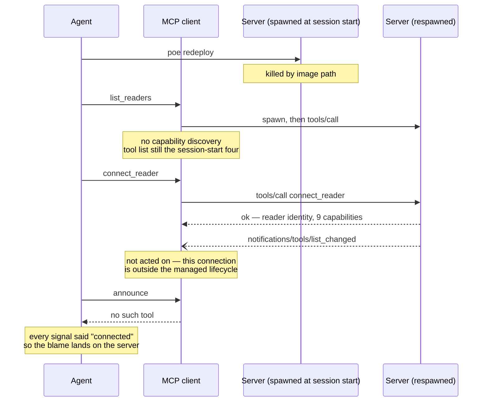

# 0022 — tool discovery an agent can rely on

Status: drafted 2026-08-01; **premise corrected 2026-08-02 after diagnosis**;
not agreed. Board entry **11.6**. This is a *discovery* spec in both senses: its
subject is how an agent discovers the tool surface, and its own job is to argue
options rather than arrive holding a decision. It revisits something
[0013](0013-mcp-server.md) decided on purpose, so the burden here is to show what
changed — not to relitigate.

**Read the diagnosis first.** The first draft of this spec blamed the MCP client
for ignoring `tools/list_changed`. That was wrong, and the correction changes
which options are worth taking.

## What was measured

Measured on 2026-08-01, while running 11.5's live checklist in Claude Code —
the server's primary target client.

1. `connect_reader` was called. It **succeeded**, returning the reader identity
   and the full capability list: `speech`, `braille`, `gestures`, `typing`,
   `focus`, `state`, `config`, `interact`, `log`.
2. The server emitted `tools/list_changed`, as 0013 designed.
3. The client never re-listed. Every capability-gated tool — `announce`,
   `press_gesture`, `get_log`, all of them — stayed invisible for the rest of
   the session.
4. A direct call by name returned "No such tool available". Across a turn
   boundary too, so it was not a mid-turn caching artefact.

The checklist was driven through `scripts/live_test.py` instead, which calls
`tools/list` itself and therefore never meets the problem.

Every observation above is accurate. The conclusion drawn from them — *this
client does not support `tools/list_changed`* — was not.

## The diagnosis, 2026-08-02

**The client honours `tools/list_changed`. What broke it was our own
`poe redeploy`.**

Four independent lines of evidence:

**The server is correct.** [sdk_server.go](../server/adapters/mcp/sdk_server.go)
registers the ungated four at `Bind`, before any client connects. The go-sdk
computes server capabilities inside its `initialize` handler (`server.go:1476` →
`:557`), sees `tools.len() > 0`, and declares `tools: {listChanged: true}`.
Confirmed live: `live_test.py smoke`, an independent MCP client, passes *"gating:
the gated set appears after connect"* against the current binary.

**The client honours the notification, both ways.** In a clean session on the
same client build (2.1.220), `connect_reader` made all nineteen gated tools
appear; a dropped bridge made the same nineteen disappear; reconnecting brought
them back. Historically, **370 successful gated calls across five earlier
sessions**, from 2026-07-24 onward.

**The trigger is the redeploy.** `scripts/redeploy.py` kills every
`screenreader-mcp.exe` by image path — deliberately, and it says so — including
the one the client spawned. The client will still *spawn* a process to serve the
next call, but it never re-runs capability discovery, so the tool list it holds
stays frozen at whatever it was when the session began. Reproduced
deterministically on 2026-08-02: redeploy → `list_readers` works →
`connect_reader` succeeds with all nine capabilities → `announce` returns "No
such tool available". Disconnecting and reconnecting the reader does not help.

**Across every transcript in the project's history, no gated call has ever
succeeded after a redeploy killed the server in that session.** Every one of the
370 successes came before any kill. The session that produced this spec killed
the server 148 seconds before its first gated call.

This is documented client behaviour, not a defect to report:

> If an HTTP or SSE server disconnects mid-session, Claude Code automatically
> reconnects with exponential backoff… **Stdio servers are local processes and
> are not reconnected automatically.**
>
> — [Claude Code MCP documentation](https://code.claude.com/docs/en/mcp)



## The fix that already exists

**In the client, by the user, one command:**

```text
/mcp reconnect screen-reader-testing
```

Verified 2026-08-02 from the broken state: reconnect, then `connect_reader`, and
all nineteen gated tools returned with `announce` dispatching. No session
restart, no context lost.

Two details that cost a round each to find:

- **Name the server.** The no-argument form failed with *"MCP controls aren't
  available right now — the terminal is still starting up or is showing another
  view."* The usage is `/mcp [reconnect|enable|disable [<server>|all]]`.
- **The agent cannot issue it.** `/mcp` is a client UI command; the Skill tool
  refuses it in as many words (*"`mcp` is a UI command, not a skill. Ask the user
  to run `/mcp` themselves"*). The `claude mcp` CLI has no `reconnect` verb —
  `add`, `add-json`, `add-from-claude-desktop`, `get`, `list`, `login`, `logout`,
  `remove` — and runs in a separate process that could not reach this session's
  connection anyway. The toggle state in `~/.claude.json` is read at startup.
  There is no route. **The reconnect is the user's to press, always.**

So the standing rule, which belongs in `AGENTS.md` and in `redeploy.py`'s own
closing message:

> After `poe redeploy`, run `/mcp reconnect screen-reader-testing` before driving
> the reader through the MCP tools.

## Replacing the redeploy with a proxy

The rule above costs the user one command per rebuild. It also **cannot be
automated**, which matters for exactly one goal: an agent that rebuilds the
server and carries on live-testing without a human touching anything. If that
goal is wanted, a hot-reload proxy is the only door.

### What redeploy does today, and why it is the way it is

`redeploy.py`'s own header is the argument: with stdio MCP there is no single
server to ask nicely, because **each client spawns its own process**, so a
session with two agents attached has two copies holding the same locked image
and no shared endpoint to shut down. Killing by image path is the only thing
that reaches all of them. The cost is stated and accepted: every agent's
connection to the binary dies, not just the one asking.

### What a proxy would change

A hot-reload proxy inverts the ownership. The client spawns **the proxy**, once,
and never restarts it. The proxy owns the real server as a child, watches the
binary, and restarts the child when it changes. The client's connection is never
the thing that breaks — so the notification path stays alive, and the client
keeps honouring `tools/list_changed`, which the diagnosis proved it does.

`redeploy.py` then loses its reason to exist in its current form: no process
hunting, no killing other agents' sessions, no delete-before-build race. It
becomes `go build`.

### mcpmon — the candidate that fits

[mcpmon](https://github.com/neilopet/mcpmon) (*"hot reload for MCP servers. Like
nodemon, but for MCP"*). Node ≥ 18, deps `chokidar` + `commander`, npm 1.0.1
published 2026-01-26, repo last pushed 2025-07-10, 10 stars.

It is a **line-level transparent pipe**: `setupStdinForwarding` forwards every
stdin line to the child, `setupOutputForwarding` forwards every stdout line back,
and it parses lines only to *observe* (it captures `initialize` for replay).
Child notifications therefore pass through untouched — which is the single
property this server needs, since our entire gated surface travels that way. On
a child restart it re-initializes and emits its own `tools/list_changed` carrying
the fresh list.

Costs, none of them hidden:

- A Node dependency in a Go-and-Python repo, at 10 stars, with npm and the repo
  drifting apart (published Jan 2026, last pushed Jul 2025).
- **Windows is undocumented.** `package.json` sets no `os` restriction and
  `chokidar` is cross-platform, so it is plausible — and unverified. This must be
  proven on the maintainer's machine before anything is adopted.
- `redeploy.py` would need rework rather than deletion, and carefully: it
  currently *deletes* the binary before rebuilding precisely so a respawning
  client cannot load the old image, and a file-watching proxy would see that
  deletion and try to restart onto a missing file.

### reloaderoo — the candidate that would break us

[reloaderoo](https://github.com/cameroncooke/reloaderoo) (126 stars, last pushed
2026-02-04) is the better-maintained project and has exactly the feature this
entry wants: a `restart_server` tool **the agent itself can call**. It is
nevertheless disqualified, and the reason is worth recording so nobody
rediscovers it.

It is a request-forwarding proxy, not a pipe. `src/mcp-proxy.ts:325-359`
registers explicit handlers for `ListTools`, `CallTool`, `ListPrompts`,
`ListResources` and friends. It registers **no notification handlers at all** —
searching the repository for `setNotificationHandler` and
`fallbackNotificationHandler` returns zero hits. The only `tools/list_changed` it
ever emits is one it generates itself after its own restart
(`src/mcp-proxy.ts:296-316`).

So through reloaderoo, `connect_reader` publishes, our server emits
`tools/list_changed`, and **the proxy swallows it**. The capability gate would be
broken permanently rather than only after a redeploy. It would convert an
occasional hazard into the normal state.

The general lesson for any future candidate: **a proxy is only safe for this
server if it forwards child notifications**, and that has to be read out of the
source rather than taken from the README.

## What 0013 decided, and what is still right about it

0013 principle 2: *the advertised tool set is a function of the announced
capabilities.* A reader without braille never shows a braille tool; the gate is
keyed on capability strings, never on reader names.

That remains good, and this spec should not throw it away by reflex. It buys:

- an agent sees only tools its reader can actually serve, so it never wastes a
  turn discovering a capability gap by calling into one;
- the gate is exact, because there is exactly one live session (0013's
  one-at-a-time model);
- reader variation stays a capability question, never a protocol fork.

What 0013 did **not** weigh is that the mechanism carrying all of this is
optional at the far end — and, as the diagnosis shows, is also *fragile at the
near end*, because it can be severed by a development workflow the server knows
nothing about.

## Options

Cheapest first. None is chosen here.

### (a) Say so at the point of failure

`connect_reader`'s result names the tools that should now be present, and
`status` repeats it. The connect result already carries capabilities; this adds
the concrete tool names those capabilities imply, plus a sentence saying that if
they are not visible, the client did not act on `tools/list_changed` — and, now,
naming `/mcp reconnect` as the thing to try.

Fixes nothing. Makes it **diagnosable in one round trip**, by the agent itself,
without a human reading a spec. Costs a field and a paragraph. The diagnosis
raised its value: the failure it describes is real, recurring, and its actual
cause was misattributed for a full session by an agent that had read the specs.

### (b) One always-present dispatcher tool

A single ungated tool that forwards to a gated one by name — `reader_call
{ tool, arguments }`.

Works on **any** client, including one with no notification support at all, and
would survive a severed connection too. But it undercuts gating rather than
complementing it: the capability list becomes a runtime argument value instead of
a typed surface, the agent loses per-tool schemas and descriptions (the thing
that makes an MCP tool usable at all), and every gated tool now has two call
paths to keep in step.

### (c) Advertise everything, always; fail the gated ones with "connect first"

Client-independent and simple. Throws away the benefit above: an agent sees
braille tools for a reader that has no braille, and learns the truth only by
calling one.

**The diagnosis adds an argument the first draft could not make.** If the tool
list never changes, then a client holding a stale list is holding a *correct*
one — so the redeploy breakage stops affecting tool visibility altogether, with
no proxy, no reconnect and no discipline required. That is a concrete, measured
benefit, not insurance against a hypothetical client.

### (d) Keep the gate, add an opt-out

Default unchanged (gated). A server flag / config key — `--advertise-all`, or
`"toolGating": false` — makes it behave like (c) for the run. The user with a
limited client sets it once; every other user keeps 0013's surface.

Note that (d) only helps if the user **knows** to set it, which is exactly what
(a) tells them. The two are complementary, not alternatives, and (a) is
worthwhile on its own under any of the others. (d) also gives the development
loop an escape that production never pays for: a maintainer who redeploys ten
times an hour sets it, and the shipped default stays exact.

## The question the spec has to answer

The first draft asked: *is a client that ignores `tools/list_changed` a client
this server supports?* — and answered it under the belief that the client which
failed was the one most of this server's users will use. **That belief was
false.** Claude Code honours the notification; a user of the shipped server never
runs `poe redeploy` and never sees this.

So the question splits, and both halves are now arguable on their merits rather
than under the pressure of a live failure:

1. **Is a client that ignores `tools/list_changed` supported?** A real class,
   but no longer one we have met. If yes, gating cannot be the only path to the
   tool surface, and one of (b)/(c)/(d) is required. If no, (a) is the whole
   fix.
2. **Is the development loop allowed to sever the tool surface?** This one we
   *have* met, four times. It is answerable by discipline (the reconnect rule),
   by tooling (a proxy), or by design (c)/(d) — and the choice should be made
   knowing that only the proxy removes the human from the loop.

## Open questions

- ~~Verify the client-capability claim against the Go SDK and the current MCP
  revision.~~ **Answered 2026-08-02.** `ClientCapabilities` in go-sdk v1.6.1
  (`protocol.go:203`) carries `experimental`, `extensions`, `roots.listChanged`,
  `sampling` and `elicitation`. There is no client capability meaning "I act on
  `tools/list_changed`"; `tools.listChanged` is something the **server** declares
  about itself. So the server cannot branch on client support, option (a) cannot
  become an active warning at `initialize`, and any fix that depends on knowing
  is not available. The original claim was right.
- Does `screenreader://info` (0013's resource) have the same exposure? A client
  that ignores `resources/list_changed` has the same blind spot, and the
  resource is where reader identity lives. The redeploy failure certainly hits
  it too, by the same mechanism.
- If (d) is taken: does the flag belong to the server invocation, or should
  `connect_reader` take it as an argument so a single server can serve both
  kinds of client?
- How is any of this tested? A conformance test can assert the connect result
  names the tools; it cannot simulate a client that ignores notifications
  without a deliberately deaf test client. The *redeploy* failure, by contrast,
  is not testable in CI at all — it is a property of a particular client's
  process lifecycle.
- Is the autonomous rebuild-and-test loop actually wanted? The proxy work is
  only justified by that goal. If a human is going to be present for live runs
  anyway — and 0016 and 0023 both assume one is — then the reconnect rule may be
  the whole answer, and mcpmon belongs on the board as a separate entry that can
  be declined.

## Not in scope

Changing the one-session model, the capability vocabulary, or anything about how
`hello` reports capabilities. This entry is about **how the tool list reaches
the agent**, not about what is in it.
