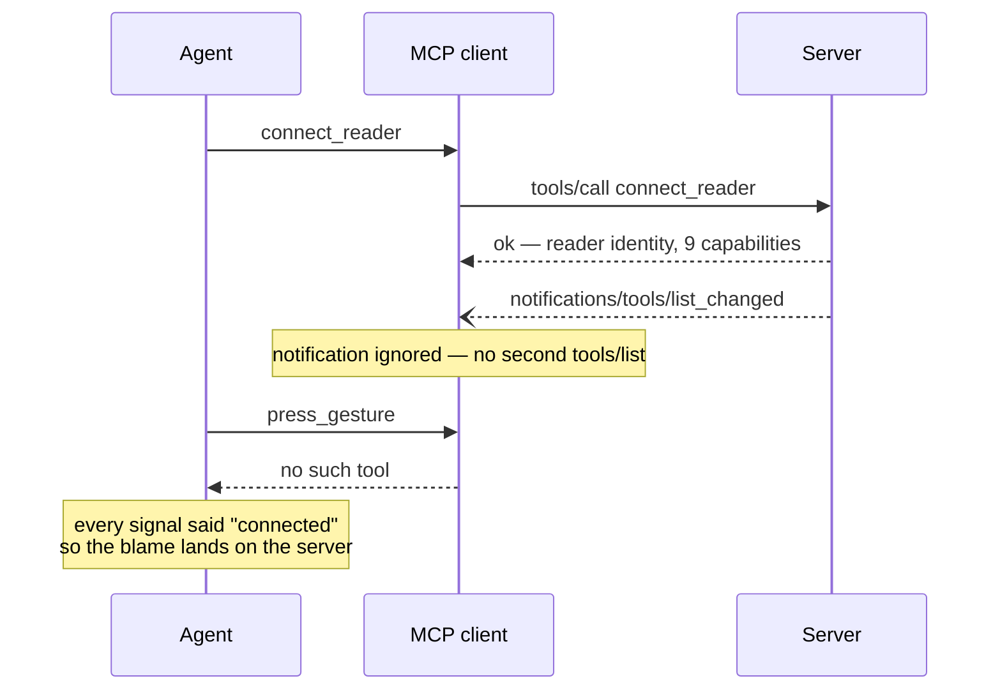

# 0022 — tool discovery an agent can rely on

Status: **drafted 2026-08-01, not agreed**. Board entry **11.6**. This is a
*discovery* spec in both senses: its subject is how an agent discovers the tool
surface, and its own job is to argue options rather than arrive holding a
decision. It revisits something [0013](0013-mcp-server.md) decided on purpose,
so the burden here is to show what changed — not to relitigate.

## What happened

Measured on 2026-08-01, while running 11.5's live checklist in Claude Code —
the server's primary target client.

1. `connect_reader` was called. It **succeeded**, returning the reader identity
   and the full capability list: `speech`, `braille`, `gestures`, `typing`,
   `focus`, `state`, `config`, `interact`, `log`.
2. The server emitted `tools/list_changed`, as 0013 designed.
3. The client never re-listed. Every capability-gated tool — `announce`,
   `press_gesture`, `get_log`, all of them — stayed invisible for the rest of
   the session.
4. A direct call by name returned "No such tool available". Across a turn
   boundary too, so it was not a mid-turn caching artefact.

The checklist was driven through `scripts/live_test.py` instead, which calls
`tools/list` itself and therefore never meets the problem.

## Why this is an entry and not a footnote

**The failure is silent and misdirects.** `connect_reader` returns success *with
a full capability list*. Every signal the agent has says the session is healthy,
so when the tools are missing the agent concludes the server or the bridge is
broken. It cost this project a live session's worth of confusion, and the agent
in question had read the specs.

**Nothing anywhere says "your client must support `list_changed`".** Not the
README, not `connect_reader`'s description, not the connect result.

**The server cannot detect it.** *(To verify against the Go SDK before this is
agreed.)* The MCP client declares capabilities at `initialize` — roots,
sampling, elicitation — but there is no client capability meaning "I act on
`tools/list_changed`". `tools.listChanged` is something the **server** declares
about itself. So the server cannot branch on client support, and any fix that
depends on knowing is not available.

That last point is the one that makes this structural rather than a bug: **the
usability of the entire gated surface rests on an optional client behaviour the
server cannot observe.**

## What 0013 decided, and what is still right about it

0013 principle 2: *the advertised tool set is a function of the announced
capabilities.* A reader without braille never shows a braille tool; the gate is
keyed on capability strings, never on reader names.

That remains good, and this spec should not throw it away by reflex. It buys:

- an agent sees only tools its reader can actually serve, so it never wastes a
  turn discovering a capability gap by calling into one;
- the gate is exact, because there is exactly one live session (0013's
  one-at-a-time model);
- reader variation stays a capability question, never a protocol fork.

What 0013 did **not** weigh is that the mechanism carrying all of this is
optional at the far end.

## Options

Cheapest first. None is chosen here.

### (a) Say so at the point of failure

`connect_reader`'s result names the tools that should now be present, and
`status` repeats it. The connect result already carries capabilities; this adds
the concrete tool names those capabilities imply, plus a sentence saying that if
they are not visible, the client did not act on `tools/list_changed`.

Fixes nothing. Makes it **diagnosable in one round trip**, by the agent itself,
without a human reading a spec. Costs a field and a paragraph.

### (b) One always-present dispatcher tool

A single ungated tool that forwards to a gated one by name — `reader_call
{ tool, arguments }`.

Works on **any** client, including one with no notification support at all. But
it undercuts gating rather than complementing it: the capability list becomes a
runtime argument value instead of a typed surface, the agent loses per-tool
schemas and descriptions (the thing that makes an MCP tool usable at all), and
every gated tool now has two call paths to keep in step.

### (c) Advertise everything, always; fail the gated ones with "connect first"

Client-independent and simple. Throws away the benefit above: an agent sees
braille tools for a reader that has no braille, and learns the truth only by
calling one.

### (d) Keep the gate, add an opt-out

Default unchanged (gated). A server flag / config key — `--advertise-all`, or
`"toolGating": false` — makes it behave like (c) for the run. The user with a
limited client sets it once; every other user keeps 0013's surface.

Note that (d) only helps if the user **knows** to set it, which is exactly what
(a) tells them. The two are complementary, not alternatives, and (a) is
worthwhile on its own under any of the others.

## The question the spec has to answer

Not "which option", first, but: **is a client that ignores `tools/list_changed`
a client this server supports?**

If yes, gating cannot be the only path to the tool surface, and one of (b)/(c)/(d)
is required. If no, then (a) is the whole fix — the server states the
requirement, says when it is unmet, and is otherwise entitled to assume it.

An honest answer has to account for the fact that the client which failed is the
one most of this server's users will use.

## Open questions

- Verify the client-capability claim above against the Go SDK and the current
  MCP revision. If a client *does* signal notification support, option (a) can
  become an active warning at `initialize`, which is strictly better.
- Does `screenreader://info` (0013's resource) have the same exposure? A client
  that ignores `resources/list_changed` has the same blind spot, and the
  resource is where reader identity lives.
- If (d) is taken: does the flag belong to the server invocation, or should
  `connect_reader` take it as an argument so a single server can serve both
  kinds of client?
- How is any of this tested? A conformance test can assert the connect result
  names the tools; it cannot simulate a client that ignores notifications
  without a deliberately deaf test client.

## Not in scope

Changing the one-session model, the capability vocabulary, or anything about how
`hello` reports capabilities. This entry is about **how the tool list reaches
the agent**, not about what is in it.
