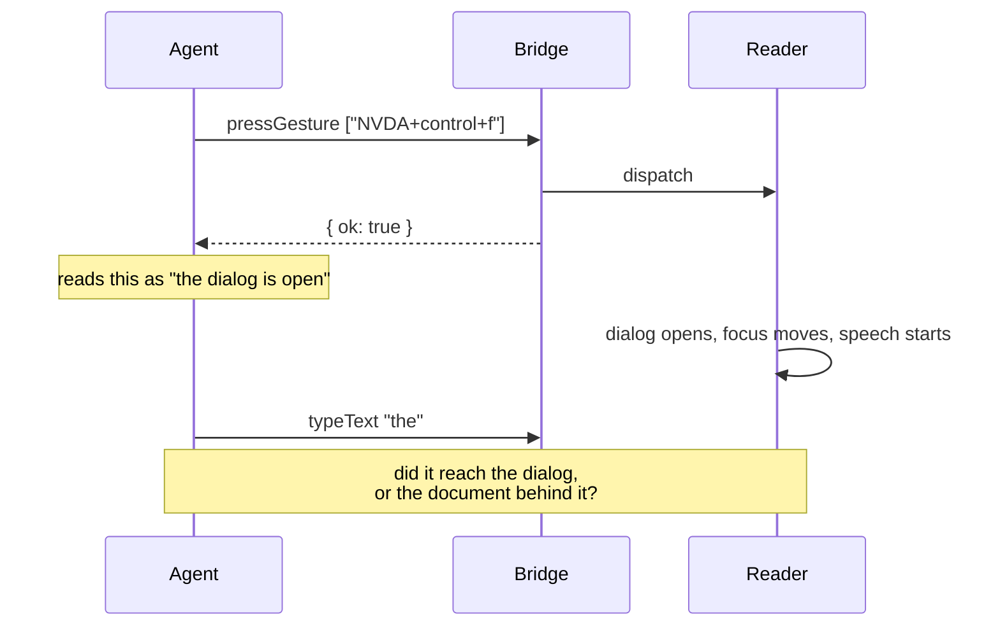
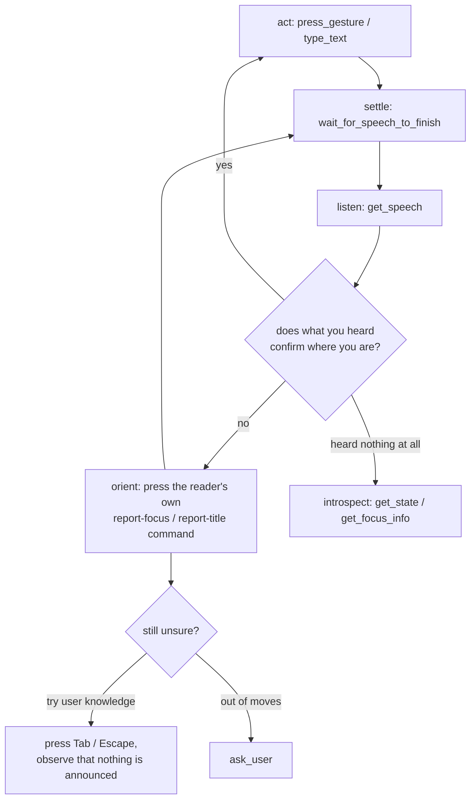

# 0023 — drive it like a user; introspect on purpose

Status: **drafted 2026-08-01, reframed the same day after review, not agreed.**
Board entry **11.7**. Comes out of 11.5's live run, which produced the evidence
below as a side effect of testing something else.

The first draft of this spec was called *dispatch is not effect* and recommended
a new `waitForFocus` command. **The diagnosis survived review; the remedy did
not.** This version keeps the diagnosis intact, records why the remedy was
wrong — it is a useful wrong answer, and the reasoning generalises — and
replaces it with a published doctrine plus four tool descriptions that say the
true thing at the point of failure.

---

## Part 1 — the diagnosis, which is unchanged

`pressGesture` and `typeText` return `{ ok: true }`. An agent reads that as *it
worked*. What it actually means is **the reader accepted the input** — and
[0021](0021-observing-the-log.md) proved those are different moments.

0021's central finding: a command's handler returns before the reader does the
work. Measured on 2026-07-30 —

```
IO - inputCore.executeGesture (18:47:56.033)   <- the handler returns about here
IO - speech.speech.speak      (18:47:56.034)   <- one millisecond later
```

— and the whole `sincePosition` / span-to-next-command design exists because of
it. So `{ ok: true }` **cannot** mean the effect happened. Not "does not
currently", but *cannot*: at the instant the result is written, the dialog has
not opened, the caret has not moved, the character has not been rendered.

The contract is honest about this if read closely — `pressGesture` says
"blocking until each is processed", where processed means dispatched by the
reader. Nothing in the tool description says what an agent should do about the
gap, and the result shape offers no hint that there is one.

### What the evidence looked like

Three separate failures during 11.5's live run, all the same shape.

**The Python console.** `scenario_logerror` pressed `NVDA+control+z`, got
`ok: true`, and typed a line of Python. The console keeps its input across
openings, so the line was appended to leftover text and became invalid Python.
A `SyntaxError` goes to the console's own output, never to the log — so the
symptom was `wait_for_log` timing out twenty seconds later, pointing squarely at
the feature under test.

**The find dialog.** `scenario_finddialog` pressed `NVDA+control+f` and typed a
search term into whatever held focus, with nothing but a human's ear standing
between it and a dialog that never opened.

**The gesture that opened the wrong thing.** An earlier attempt at the console
opened NVDA's dictionary-entries dialog, because the tester had that gesture
remapped. `ok: true` all the same — perfectly true, and about a different
window than the driver believed.

In every case a wrong precondition surfaced as a *later, unrelated* check
failing, and named the wrong component.

**And the workaround is already in the code, spelled in wall-clock.**
`scripts/live_test.py` contains `time.sleep(1.5)` after opening a dialog and
`time.sleep(0.3)`–`time.sleep(0.4)` after typing, chosen by trial. Hand-tuned
sleeps in a test driver are the standard symptom of a missing wait primitive.



### The through-line

This repo keeps meeting one failure mode from different directions:

- 0020/0021 — an empty `getLog` because nothing was logged, versus an empty one
  because the level was never raised. Hence `capturedAtLevel`.
- 0021 — `truncated: true` because records aged out, versus because `maxEntries`
  capped the result. Different bugs: one is fixed by asking again, one is not.
- Here — the input landed where the agent intended, versus it landed somewhere
  else, versus the target does not exist yet. One observable: `ok: true`.

Each time, the fix has been to let the caller tell which situation they are in.
The interesting thing about this instance is that the collapse is on the
**write** side, where the repo has not yet applied the principle.

---

## Part 2 — why `waitForFocus` was the wrong answer

The rejected proposal was:

```
waitForFocus { role?, name?, appModule?, timeout? } → { found, name, role, states, value, appModule }
```

Block until the focus object matches; `found: false` on timeout, not an error.
Four objections, in increasing order of how much they matter.

**It asks the agent for vocabulary a user does not have.** `EDITABLETEXT` and
`appModule: "nvda"` are the reader's internal spelling of its own object model.
A blind user opening the Python console does not know either, and neither should
an agent whose job is to stand in for one. The alternative — training the agent
on each reader's role table — is exactly what
[0005](0005-multi-reader-direction.md) forbids the *server* from doing, and the
prohibition is not less true one layer up.

**Its failure mode is the very collapse this spec exists to condemn.** A wrong
guess at the matcher returns `found: false`. So does a dialog that never opened.
So does a dialog that opened under a role the agent did not predict. Three
situations, one observable — the thing Part 1 spends its length arguing against.
A primitive whose negative answer is ambiguous between *agent error* and *app
behaviour* is not an improvement on a sleep; it is a sleep that sounds
authoritative.

**Focus is not the axis, because focus movement is not what a gesture does.** It
is what *some* gestures do. Report title, read the current line, read the whole
window, say-all, toggle a setting, change the synthesizer rate — none of these
move focus, and they are most of any reader's command surface. Keying the
universal wait on focus means it times out for the majority of the input
vocabulary, and the caller cannot distinguish "nothing happened" from "something
happened that was not focus".

**It does not fix this spec's own first piece of evidence.** In the Python
console failure the console *was* focused and *was* an edit field. `waitForFocus`
would have returned `found: true` and the line would still have been appended to
leftover text. What would have caught it is reading back what the reader said
about the line — a user's move, not a structural one. Likewise the remapped
gesture that opened the dictionary dialog: what caught that, in the end, was a
human's ear on a wrong window title. Speech caught both. Nothing structural
caught either.

### What a user actually does

The console, step by step, as the maintainer described it — this sequence is
now the normative model for how an agent drives a reader:

1. Press `NVDA+control+z`.
2. **Listen to the window title**, announced as the window opens. That is the
   confirmation that the right thing opened, and it is free — the reader
   volunteers it.
3. Press `NVDA+Tab` — report the focused object — because the goal is to type,
   so the question is whether an edit has focus. This is *screen-reader
   operating knowledge*, the kind any competent user has.
4. If it is not an edit, try `Tab`, which is general Windows knowledge, and
   notice that it does nothing here.
5. Still stuck: ask.

Nothing in that sequence names a role string, a window class, or an app module.
**Every step is a gesture, and every answer is speech.** Step 3 is the important
one: "where am I" is not a peek into the object model, it is a *command you send
the reader*, whose answer arrives on the same channel as everything else.

### The primitive the sleeps were approximating already exists

Speech is the observable that is always there: every reader action that does
anything at all produces speech, which is what the reader is for. And the wait
for it is already built — `waitForSpeechToFinish`, with an exact
`synthDoneSpeaking` signal in silent mode and an elapsed-time fallback in live
mode ([wait_for_speech_to_finish.py](../bridges/nvda/addon/globalPlugins/nvdaMcpBridge/domain/controllers/commands/wait_for_speech_to_finish.py)).

`time.sleep(1.5)` in `live_test.py` is not an approximation of `waitForFocus`.
It is an approximation of *that*. No new wire command is required, and this spec
adds none.

---

## Part 3 — the stance

**By default the agent simulates a user. Introspection is a deliberate act for a
different job.**

This is a real distinction with a real consequence, not a style preference. If
the agent orients by reading the reader's object model, it is testing the
platform's accessibility API — UIA, MSAA, IAccessible2. If it orients by
pressing a gesture and hearing the result, it is testing the screen reader and
the application together, which is the product. The two disagree in exactly the
cases that matter: a control correctly exposed to UIA and announced as nothing
at all passes the first check and fails the second, and users live in the
second.

**Introspection is not thereby a mistake — it has its own customer.** Reading
the structure of a live application is how you survey an inaccessible program in
order to make it accessible: find out where a messenger renders incoming
messages, learn what the tree looks like around it, then write the add-on. That
is planned work (see *Future direction* below), and it is a stronger case for
structural reads than orientation ever was. What changes here is only which one
is the default and what each is *for*:

| Job | Question | Tools |
|---|---|---|
| Simulate a user (default) | "Does this work through the ears?" | `press_gesture`, `type_text`, `wait_for_speech_to_finish`, `get_speech`, `ask_user` |
| Assert in a test | "What does this control report about itself?" | `get_focus_info`, `get_state`, `get_config` |
| Survey an application | "What is the structure here, so I can build for it?" | the above, plus the future object-navigation surface |

Nothing is removed. `get_focus_info` keeps its capability, its shape and its
place in the registry; what changes is that its description stops offering
itself as the way to find out where you are.

### The loop the agent should run



---

## Part 4 — what ships

### 1. A published doctrine: `screenreader://guidance`

A new MCP resource, `text/markdown`, holding the guidance above in the form an
agent can act on: the loop, the reasons, and the traps. It is a **resource**
rather than `initialize.instructions` for the reason
[0013](0013-mcp-server.md) already gave for `screenreader://info` — instructions
freeze at handshake time, a resource is read when wanted.

Two properties, both deliberate:

- **Static.** Unlike `screenreader://info`, it describes no session, so it is
  readable *before* connecting — which is when an agent should read it. It also
  cannot be half-true about a session that has since changed.
- **Reader-agnostic.** It says "your reader's report-focus command", never
  `NVDA+Tab`. The server must not learn one reader's key map
  ([0005](0005-multi-reader-direction.md) principle 2); the agent knows NVDA's
  and JAWS's from its training, and `screenreader://info` tells it which one is
  connected. The guidance supplies the *method*; the agent supplies the
  vocabulary.

### 2. Four tool descriptions that say the true thing

- **`press_gesture`** — the result reports **delivery, not consequence**: the
  reader accepted the input and will act on it afterwards, on its own thread.
  Confirm the effect by settling and listening. Not every gesture moves focus.
- **`type_text`** — the same, plus: `typed` is the length of what was **sent**,
  counted on this side, and says nothing about what arrived anywhere. Know where
  focus is before typing; a field that is open is not necessarily empty.
- **`get_focus_info`** — reframed from "use this to check where you are before
  acting" to what it is actually good at: asserting what a control reports about
  itself, and answering when the reader said nothing to listen to. Points at the
  guidance for orientation.
- **`wait_for_speech_to_finish`** — promoted from "use after a long
  announcement" to what it really is: the settle step after **any** action, and
  the reason a sleep is never needed.

### 3. Nothing on the wire

No new command, no new capability, no schema change, no bridge change. That is
the strongest argument for this shape over the first draft: the gap Part 1
identifies is closed by a procedure over primitives that already exist, and the
only thing that was missing was saying so.

### Class/file layout

Per AGENTS.md, "a spec MUST include the class/file layout".

| File | Role | Collaborators |
|---|---|---|
| `server/adapters/mcp/guidance_resource.go` (new) | **adapter** — serves `screenreader://guidance` from a package constant. Holds `GuidanceURI` and the document. | Built by `sdk_server.go`'s `Bind`, beside the info and session-record resources. Depends on nothing — it has no source, which is the point. |
| `server/adapters/mcp/sdk_server.go` | adapter (existing) | One added line in `Bind`. |
| `server/domain/controllers/tools/press_gesture.go` | controller (existing) | `Description()` only. |
| `server/domain/controllers/tools/type_text.go` | controller (existing) | `Description()` only. |
| `server/domain/controllers/tools/get_focus_info.go` | controller (existing) | `Description()` only. |
| `server/domain/controllers/tools/wait_for_speech_to_finish.go` | controller (existing) | `Description()` only. |
| `server/testsupport/mcp.go` | test support (existing) | Adds `ReadResourceText`, because the existing `ReadResource` decodes JSON and this resource is markdown. |
| `server/tests/integration/mcp_guidance_resource_test.go` (new) | **integration scenario** | Asserts the resource exists before any connection, is markdown, and states the delivery-not-consequence rule and the settle step. |

No domain change, no new port, no new entity: a static document served over MCP
is adapter-only work, and giving it a domain port would be inventing a
collaborator for a value that has none.

---

## What is deliberately not built

**`waitForFocus`** — Part 2.

**Returning focus in the gesture/type result.** Wrong by construction: the focus
at handler-return time is *pre*-effect focus. It would report the document you
were in, not the dialog that is about to open, and it would be reliably,
confidently wrong in exactly the case the agent cares about.

**Verified typing (`typeText { verify: true }`).** What a field *should* contain
after typing is not knowable by the bridge — autocomplete extends it, masked
fields hide it, formatted fields rewrite it, and a rich edit may not expose a
value at all. It puts a policy judgement in the component with the least
context.

**A `dispatched: true` field on `pressGesture`'s result.** Saying it in the shape
rather than the prose buys little and costs a breaking change; the description
is where an agent reads it anyway.

## Honest limits

These are not open questions — they are known holes this shape leaves, stated so
nobody rediscovers them as bugs.

- **Silent effects.** Some actions announce nothing, and some answer with an
  earcon rather than words (NVDA's browse/focus toggle — already recorded in
  AGENTS.md's gotchas). There `wait_for_speech_to_finish` settles on silence and
  the agent cannot separate "nothing happened" from "something happened
  quietly". This is the legitimate use for a structural read, and the guidance
  says so in that spot rather than pretending speech covers everything.
- **Braille.** For a deafblind user the observable is the braille line, not
  speech. Making speech *the* settle signal is a stated scope limit; `getBraille`
  exists and a braille-shaped settle step is not designed here.
- **Negative assertions.** "Focus must *not* have moved" and "the reader must
  have said nothing" are real test needs, and a timeout expresses them only by
  costing the full timeout. Out of scope.

## Future direction — structural survey of a live application

Named here because it is the strongest customer for introspection and it changes
how `get_focus_info` should be read, but it is **not this entry**.

The goal: point the agent at a running inaccessible application, have it walk
the window and object structure, work out where content is rendered — where a
messenger draws incoming messages, for instance — and use that to write the
add-on that makes the app usable. That needs a surface this contract does not
have: object navigation (parent/children/siblings from the focus or the
foreground), and a bounded tree dump.

It is a *survey* tool, not an orientation tool, and keeping the two distinct is
why this spec bothers to say what `get_focus_info` is for instead of quietly
leaving its description as it was. Deserves its own spec and its own board
entry.

## Open questions

- **Does the guidance belong anywhere else as well?** The same text would serve
  a human reading the repo. A single source with the README including it, or two
  documents accepting drift?
- **Should `connect_reader`'s result point at the guidance URI?** It is the one
  moment we know the agent is paying attention. Interacts with
  [0022](0022-tool-discovery-an-agent-can-rely-on.md), which is already
  proposing to add text there.
- **Is a resource enough, given 0022?** A client that ignores
  `tools/list_changed` may equally ignore resources. The guidance is static and
  always registered, so it does not depend on a notification — but it does
  depend on the client surfacing resources at all.
- **Should `scripts/live_test.py` lose its sleeps in the same change?** They are
  the concrete evidence in Part 1; leaving them in place after arguing they are a
  symptom is untidy. Against: it is a behavioural change to the live driver,
  verifiable only by a live run, and this entry is otherwise text-only.

## Not in scope

The input vocabulary ([0018](0018-input-vocabulary.md)), the typing primitive's
semantics ([0019](0019-type-primitive.md)), and anything about *how* input is
delivered. This is about what the agent may conclude once it has been, and how
it should find out.
