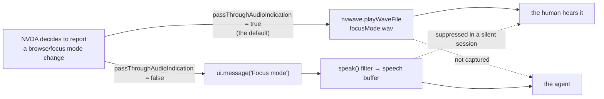

# 0024 — a session the agent can hear

Status: **drafted 2026-08-03, not agreed.** Board entry **11.11**. Comes out of a
live run on 2026-08-03 that failed for a reason neither the agent nor the human
could see, because each of them was missing a different half of what NVDA said.

---

## Part 1 — the evidence

Driving Chrome on a real site, in a **silent** session, the agent pressed
`NVDA+space` intending to leave focus mode and return to browse mode, then
pressed `h` five times to walk the headings of a search-results page. Nothing was
spoken. The agent pressed `h` once more, alone, twelve seconds later. Still
nothing. From the bridge transcript:

```
11:27:48.360 GESTURE h
11:27:48.401 SPEECH 'Skip to content link mesma página'   <- this is control+home
11:27:48.403 GESTURE h
11:27:48.405 GESTURE h
11:27:48.410 GESTURE h
11:27:48.412 GESTURE h
11:28:00.727 GESTURE h        <- alone, and also silent
```

The agent concluded, in writing, that it could not tell *no headings on this
page* from *the keystrokes went somewhere else*, and declined to name a cause.

**The human at the keyboard knew instantly.** He had heard the focus-mode tone
when `NVDA+space` was pressed, and he stopped the session to say so. The page
had reloaded on submitting the search, NVDA had restored browse mode by itself,
and the agent's toggle therefore switched *into* focus mode. All six `h` presses
were typed into the search field.

### The mechanism

[`browseMode.reportPassThrough`](https://github.com/nvaccess/nvda/blob/master/source/browseMode.py)
is an either/or:

```python
if config.conf["virtualBuffers"]["passThroughAudioIndication"]:
    sound = "focusMode.wav" if treeInterceptor.passThrough else "browseMode.wav"
    nvwave.playWaveFile(os.path.join(globalVars.appDir, "waves", sound))
else:
    if treeInterceptor.passThrough:
        ui.message(_("Focus mode"))
    else:
        ui.message(_("Browse mode"))
```

`passThroughAudioIndication` defaults to `true`
([`configSpec.py`](https://github.com/nvaccess/nvda/blob/master/source/config/configSpec.py)),
so on any default install the mode change is a **wave file** and there is
nothing in the speech buffer to capture.

### This was known, twice, and written down

This spec is not reporting a discovery. It is reporting that a documented gap
cost a live session anyway.

[0001](0001-agent-driven-nvda-over-mcp.md) names the exact gesture:

> **State snapshot** (`getState`): queryable NVDA state that an agent asserts on
> but that is *not* carried by speech — because NVDA may answer with an
> earcon/beep instead of words (**e.g. NVDA+space toggles browse/focus mode**;
> `browseMode.reportPassThrough` plays `focusMode.wav`/`browseMode.wav` when
> `passThroughAudioIndication` is on, so there is nothing to match in the speech
> buffer).

`StateResult`'s own docstring names it again — *"Diff two snapshots across a
gesture to assert a toggle (e.g. NVDA+space flipping `browseMode`)"* — and
[0023](0023-drive-it-like-a-user.md) lists it under *Honest limits* as "silent
effects". The remedy in all three places is the same: **call `getState`**.

The remedy is correct and it was not used. That is the thing worth designing
around, because a rule that must be remembered at the one moment you are least
likely to remember it is not a control. `getState` is a *poll* — and after
[11.9](../ROADMAP.md) we know a poll costs a full round trip, ~2.6 s measured and
5–12 s observed, to learn one bit that NVDA computed in microseconds. The
guidance asks the agent to spend its scarcest resource on a bit that NVDA was
already willing to volunteer, in words, for free.

### The part that generalises

**In a silent session the two participants are deaf in complementary ways.**
Suppression happens at the `speak()` filter
([0008](0008-transparent-silent-capture.md)); `nvwave` is downstream of nothing
and runs regardless. So:

| | hears speech | hears wave files / beeps |
|---|---|---|
| the human, silent session | **no** | yes |
| the agent, any session | yes | **no** |

Neither party has the whole picture, and each is confident. That is precisely
how three minutes were spent disagreeing about what `h` did.



---

## Part 2 — the tension this spec must resolve

The obvious response is "normalise NVDA at session start". That instinct is in
direct conflict with [0023](0023-drive-it-like-a-user.md), whose stance is that
**the agent simulates a user**, and whose whole argument is that testing the
platform's model instead of the user's experience is testing the wrong product.

A session that rewrites the reader's configuration makes the agent drive a
configuration **no user actually runs**, and every finding afterwards carries an
asterisk. "It announces correctly" means nothing if it announces correctly only
under settings we imposed.

So this spec's job is **not** a list of settings we like. It is a membership
test sharp enough that the next setting can be judged without re-running this
argument.

### The test

> A session may change a setting only if the change **moves information between
> channels without adding or removing any.**

The justification is that such a change cannot alter *what NVDA decided to
report* — only where the report is delivered. The event, its timing, and its
content are identical; the agent's copy stops being empty. A change that alters
what NVDA would have said is a change to the thing under test, and is refused
however convenient it would be.

### Applying it

| setting | what changes | verdict |
|---|---|---|
| `virtualBuffers.passThroughAudioIndication` → `false` | `focusMode.wav` becomes `ui.message("Focus mode")` | **in** — same event, same instant, same information, different channel |
| `presentation.progressBarUpdates.progressBarOutputMode` `"beep"` → `"both"` | adds spoken percentages, **keeps** the beep | **in** — the human loses nothing; strictly additive |
| `keyboard.speakTypedCharacters` | whether typing is reported at all | **out** — changes what NVDA reports, and is a preference under test |
| `speech.<synth>.symbolLevel` / punctuation | changes the words spoken | **out** |
| `presentation.reportObjectDescriptions` and friends | verbosity — the substance of an announcement | **out** |

Under this test the fix for the live failure is *in*, and most of the tempting
"helpful defaults" are *out*. That asymmetry is the evidence the test is drawn in
the right place: a test that admitted everything convenient would not be a test.

### Per mode

- **Silent** — normalise by default. The human hears no speech in a silent
  session anyway, so moving a signal *into* the speech channel takes nothing
  from them: they keep the wave file, and the agent gains the words. This is the
  case where the split in Part 1 is total, and it is the case automated testing
  runs in.
- **Live** — do not normalise; offer it. Here the change is audible: the human
  would hear "Focus mode" spoken instead of the tone they chose. That is theirs
  to decide, so it is opt-in via a `hello` parameter and off by default.

---

## Part 3 — the three things that ship

### 1. Normalise (channel-shift only)

At `hello`, for the settings admitted by the test, write the speech rendering
through the existing `ConfigAccessor`, which already records the prior value on
first write to each key and restores every touched key at session teardown
([`set_config.py`](../bridges/nvda/addon/globalPlugins/nvdaMcpBridge/domain/controllers/commands/set_config.py)).
No new persistence, no new restore path, nothing written to disk.

### 2. Disclose

Every key the session changed is reported in the `hello` result and written to
the transcript:

```jsonc
"normalized": [
  { "keyPath": "virtualBuffers.passThroughAudioIndication",
    "from": true, "to": false,
    "why": "browse/focus mode changes are a wave file by default" }
]
```

This is not decoration. A finding must be reproducible from the record, and an
agent must never be quietly driving a different NVDA than the user's. If the
list is empty the agent knows it is on the user's own configuration; if it is
not, the asterisk is *written down* rather than implied.

### 3. Report what must not be fixed

Some state is genuinely the user's and the membership test forbids touching it —
but silence caused by it is indistinguishable from "the keystroke did nothing":

- `speechMode` is `"off"` or `"beeps"` — NVDA is not speaking at all.
- `sleepMode` is on for the focused application — NVDA is deliberately quiet
  there.

The answer is not correction. It is **telling the agent at `hello`**, so an
empty speech buffer can be attributed. `getState` already computes both
([`get_state.py`](../bridges/nvda/addon/globalPlugins/nvdaMcpBridge/domain/controllers/commands/get_state.py));
this surfaces them at the one moment the agent is certain to be paying
attention, at the cost of no extra round trip.

### The through-line

This is the repo's recurring defect, met for the fourth time:

- 0020/0021 — an empty `getLog` because nothing was logged, versus because the
  level was never raised. Cured by `capturedAtLevel`.
- 0021 — `truncated` because records aged out, versus because `maxEntries`
  capped the result.
- 0023 — the input landed where intended, versus somewhere else, versus the
  target does not exist yet. One observable: `ok: true`.
- **Here** — the reader said nothing, versus the reader said something in a
  channel this session cannot capture, versus the reader is asleep or muted.

Every time, the cure has been to let the caller tell which situation they are
in, or to state at the outset which situation is possible. Parts 1 and 3 are the
same cure applied to the *capture* side.

---

## Class/file layout

Per AGENTS.md, "a spec MUST include the class/file layout".

| File | Role | Collaborators |
|---|---|---|
| `bridges/.../domain/entities/session_normalization.py` (new) | **entity** — holds the admitted set as data: key path, desired value, and the one-line *why*. Pure; knows nothing of NVDA or config. Exists so the membership test lives in one reviewable list rather than scattered across a handler. | Read by `HelloHandler`. |
| `bridges/.../domain/controllers/commands/hello.py` | controller (existing) | Applies the set through `ctx.adapter_set.config_accessor` when the mode/parameter admits it; collects the prior values into the result; asks the state inspector for `speechMode`/`sleepMode` to report. |
| `bridges/.../domain/ports/config_accessor.py` | port (existing) | Unchanged — `set` already returns the prior value and teardown already restores. |
| `bridges/.../protocol.py` | wire (existing) | `HelloParams` gains `normalize: bool \| None`; `HelloResult` gains `normalized: list[NormalizedKey]` and `readerQuiet: ReaderQuiet \| None`. New dataclasses `NormalizedKey`, `ReaderQuiet`. |
| `bridges/.../domain/ports/transcript.py` + adapter | port/adapter (existing) | One new line per normalised key at session open. |
| `server/domain/controllers/tools/connect_reader.go` | controller (existing) | Surfaces `normalized` and `readerQuiet` in the tool result, and gains the opt-in parameter for live mode. |
| `specs/wire/v1/protocol.md` | contract (existing) | `hello` shape updated in place — `PROTOCOL_VERSION` 1 is pre-release (AGENTS.md), both halves ship from this repo, so this costs a rebuild rather than a migration. |
| `bridges/nvda/tests/unit/domain/entities/test_session_normalization.py` (new) | unit | Asserts the admitted set contains only channel-shift keys — the membership test as an executable assertion, so a future addition has to argue with a test. |
| `bridges/nvda/tests/unit/.../test_hello.py` (existing) | unit | Normalisation applied in silent, skipped in live unless asked; prior values reported; nothing written when the key already has the desired value. |
| `server/tests/integration/mcp_connect_reader_test.go` (existing) | integration | `normalized` and `readerQuiet` reach the agent. |

No new port and no new adapter: writing config already has one, and the
admitted set is a value, not a collaborator.

---

## What is deliberately not built

**A general "apply my settings" parameter.** Letting the agent post arbitrary
config at `hello` is `setConfig` with extra steps, and it defeats the membership
test by moving the judgement to the caller. The admitted set is reviewable in
one file precisely so that adding to it is a code review.

**Capturing wave files and beeps as a channel.** The honest fix for the long
tail — error sounds, add-on beeps, application audio, anything with no speech
rendering. Rejected *here* because the observable would be `660 Hz for 80 ms`,
which is exactly the "vocabulary a user does not have" that 0023 refused for
`waitForFocus`. It needs its own spec and a story for what an agent is supposed
to conclude from a frequency. **Named, not designed.**

**Normalising `speechMode` or `sleepMode`.** Turning speech back on for a user
who muted it, or waking a sleeping app module, changes what NVDA reports. Part 3
reports them instead, and that is the whole point of having a test.

**Doing this in the server.** The server is a reader-agnostic chassis
([0005](0005-multi-reader-direction.md) principle 2) and `passThroughAudioIndication`
is an NVDA spelling. The admitted set belongs to the bridge; the server carries
the disclosure through without understanding it.

## Honest limits

- **The window is not closed, only narrowed.** Between NVDA starting and the
  session's `hello`, and after teardown, the tones are back. Anything the agent
  drives outside a session is still invisible to it.
- **A normalised session is not the user's session.** Disclosure makes it
  honest, not identical. A bug that only reproduces with the wave file enabled —
  a timing interaction with `nvwave`, say — will not reproduce here, and the
  `normalized` list is the only thing that will tell anyone why.
- **`ui.message` is speech, and therefore interruptible.** A mode change
  announced as words can be cut off by the next utterance in a way a wave file
  cannot. The information moves channels; its survival characteristics move with
  it.
- **This does not make live mode hearing.** Live sessions stay deaf to tones by
  default, deliberately, because the alternative is changing what the human
  hears without asking.

## Open questions

- **Should `progressBarOutputMode` be in the first cut at all?** It passes the
  test, but no live run has yet been blocked by it, and every admitted key is a
  small tax on fidelity. Shipping only the key that actually cost a session is
  defensible.
- **Should normalisation be per-key opt-out?** A user debugging the tone
  behaviour itself would want it off. `normalize: false` covers that bluntly;
  per-key control may be more than anyone needs.
- **Does `readerQuiet` belong at `hello` only, or on every result?** Sleep mode
  is per-application, so it can become true *during* a session by switching
  windows — the `hello` answer goes stale exactly when the agent changes app.
  This interacts directly with [0025](0025-one-round-trip-per-intention.md),
  which proposes carrying a state snapshot on every mutating result; if that
  lands, the right answer may be to report it there and not at `hello`.
- **Is "why" prose on the wire justified?** It costs bytes on every connect to
  say something a spec already says. Against dropping it: the transcript is read
  by humans who will not have the spec open.

## Not in scope

The cost of a round trip and how to reduce it
([0025](0025-one-round-trip-per-intention.md)), and how an agent reads a whole
document ([0026](0026-where-am-i-and-what-is-on-the-page.md)). This spec is only
about making the session's *capture* complete enough that those are worth
optimising.
