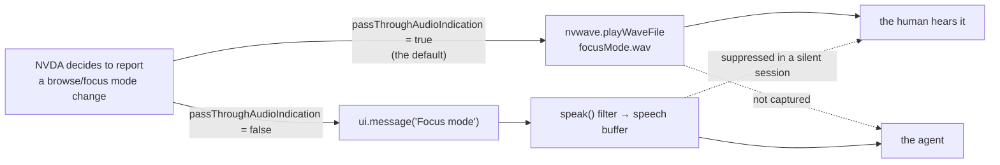

# 0024 — a session the agent can hear

Status: **drafted 2026-08-03; re-cut 2026-08-20 against what
[0025](0025-one-round-trip-per-intention.md) actually shipped; AGREED
2026-08-20**, in one conversation with [0033](0033-a-toggle-with-no-setter.md),
which is what the pairing asked for. Both open questions below are settled in
place.
Board entry **11.11**, to be decided together with **11.17** and
[0033](0033-a-toggle-with-no-setter.md) — same gesture, complementary remedies,
and the board is explicit that they should not be built by two people who have
not read both. Comes out of a live run on 2026-08-03 that failed for a reason
neither the agent nor the human could see, because each of them was missing a
different half of what NVDA said.

---

## Revision 2026-08-20 — what 0025 took off this spec

This spec was drafted on 2026-08-03 and passed over five times. In the meantime
**0025 shipped** (PR #64, 2026-08-18), and its Part 3.3 puts `getState`'s four
fields — `browseMode`, `speechMode`, `sleepMode`, `inputHelp` — on **every**
`pressGesture`/`typeText` result, sampled at the close of the grace window, at no
extra round trip. Honesty about that comes before anything else here, because two
of this spec's three deliverables were arguments about a cost that no longer
exists.

**The 2026-08-03 incident, replayed on today's build, is caught.** The agent
presses `NVDA+space` and the same result tells it `"browseMode": "focus"`. It
would not have pressed `h` six times. That is worth saying plainly rather than
burying: the failure this spec is named after is no longer the failure this spec
prevents.

**So Part 3.3 is withdrawn** — `readerQuiet` at `hello`, reporting the quiet
states that must not be corrected. Its own open question named 0025 as the thing
that might answer it, and 0025 did: `speechMode` and `sleepMode` now arrive
*after* every action rather than once at the handshake, which is the half a
`hello`-only answer could never cover, since sleep mode is per-application and
goes stale the moment the agent changes window. Shipping it anyway would leave
two answers to one question with different staleness — the shape of defect
11.24(a) was, and 11.6 closed by making the reader the single publisher.

**And the cost argument in Part 1 no longer holds as written.** *"`getState` is a
poll, and a poll costs a full round trip to learn one bit"* was true when it was
written. For the gesture that motivated this spec it is now false: the bit rides
back on the call the agent was already making.

### What survives, stated as narrowly as it deserves

Not "the agent cannot know which mode it is in" — it can. What it cannot do is
**observe the moment the mode changed, or a change it did not cause.**

- **A snapshot answers *which*, never *when*.** It says "you are in focus mode
  now". It cannot distinguish *your keystroke put us here* from *we were already
  here before you pressed anything* — one observable, two situations, which is
  the defect this repo has cured four times over (0020/0021, 0023, and again
  in 11.24). Normalised, the change arrives as an utterance in the speech
  stream, in order, with its own `emittedAt` (0028), so "the mode changed
  between these two utterances, 40 ms after that key" is a recoverable fact and
  an assertion-grade observation. A testing tool that can only report the
  current mode can support *"we are in focus mode"* and never *"pressing enter
  put us in focus mode"*, which is the sentence a test is actually trying to
  write.
- **Nothing rides on a call the agent does not make.** The snapshot exists only
  on `pressGesture`/`typeText`. NVDA switches modes **by itself** — a page load
  restoring browse mode, focus landing in an editable field — and those switches
  happen while the agent is reading, waiting, or thinking. That is not a corner
  case: it is the exact mechanism of the 2026-08-03 failure (the *reload* flipped
  the mode; the agent's toggle then flipped it the wrong way) and of
  [0027](0027-the-first-external-run.md) ask 2, where a reporter who had never
  read 0023 blamed the application for automatic switching. Normalisation puts
  every one of those in the transcript as it happens.
- **The membership test is governance, and is untouched by any of this.** It is
  the reusable part: the next tempting setting gets judged without re-running
  this argument. It would be worth writing down even if the first cut admitted
  nothing at all.
- **The transcript is read by humans later.** A `.wav` played into a room leaves
  no record anywhere; words do.

### What that changes about the ship

Two things ship instead of three (Part 3, below), and the admitted set is cut to
**one key** — see the open question this closes at the end. The spec is smaller
than it was drafted, and its warrant is different: not *the agent cannot learn
the mode* but *the agent cannot witness the change*.

---

## Part 1 — the evidence

Driving Chrome on a real site, in a **silent** session, the agent pressed
`NVDA+space` intending to leave focus mode and return to browse mode, then
pressed `h` five times to walk the headings of a search-results page. Nothing was
spoken. The agent pressed `h` once more, alone, twelve seconds later. Still
nothing. From the bridge transcript:

```
11:27:48.360 GESTURE h
11:27:48.401 SPEECH 'Skip to content link mesma página'   <- this is control+home
11:27:48.403 GESTURE h
11:27:48.405 GESTURE h
11:27:48.410 GESTURE h
11:27:48.412 GESTURE h
11:28:00.727 GESTURE h        <- alone, and also silent
```

The agent concluded, in writing, that it could not tell *no headings on this
page* from *the keystrokes went somewhere else*, and declined to name a cause.

**The human at the keyboard knew instantly.** He had heard the focus-mode tone
when `NVDA+space` was pressed, and he stopped the session to say so. The page
had reloaded on submitting the search, NVDA had restored browse mode by itself,
and the agent's toggle therefore switched *into* focus mode. All six `h` presses
were typed into the search field.

### The mechanism

[`browseMode.reportPassThrough`](https://github.com/nvaccess/nvda/blob/master/source/browseMode.py)
is an either/or:

```python
if config.conf["virtualBuffers"]["passThroughAudioIndication"]:
    sound = "focusMode.wav" if treeInterceptor.passThrough else "browseMode.wav"
    nvwave.playWaveFile(os.path.join(globalVars.appDir, "waves", sound))
else:
    if treeInterceptor.passThrough:
        ui.message(_("Focus mode"))
    else:
        ui.message(_("Browse mode"))
```

`passThroughAudioIndication` defaults to `true`
([`configSpec.py`](https://github.com/nvaccess/nvda/blob/master/source/config/configSpec.py)),
so on any default install the mode change is a **wave file** and there is
nothing in the speech buffer to capture.

### This was known, twice, and written down

This spec is not reporting a discovery. It is reporting that a documented gap
cost a live session anyway.

[0001](0001-agent-driven-nvda-over-mcp.md) names the exact gesture:

> **State snapshot** (`getState`): queryable NVDA state that an agent asserts on
> but that is *not* carried by speech — because NVDA may answer with an
> earcon/beep instead of words (**e.g. NVDA+space toggles browse/focus mode**;
> `browseMode.reportPassThrough` plays `focusMode.wav`/`browseMode.wav` when
> `passThroughAudioIndication` is on, so there is nothing to match in the speech
> buffer).

`StateResult`'s own docstring names it again — *"Diff two snapshots across a
gesture to assert a toggle (e.g. NVDA+space flipping `browseMode`)"* — and
[0023](0023-drive-it-like-a-user.md) lists it under *Honest limits* as "silent
effects". The remedy in all three places is the same: **call `getState`**.

The remedy is correct and it was not used. That is the thing worth designing
around, because a rule that must be remembered at the one moment you are least
likely to remember it is not a control. `getState` is a *poll* — and after
[11.9](../ROADMAP.md) we know a poll costs a full round trip, ~2.6 s measured and
5–12 s observed, to learn one bit that NVDA computed in microseconds. The
guidance asks the agent to spend its scarcest resource on a bit that NVDA was
already willing to volunteer, in words, for free.

### The part that generalises

**In a silent session the two participants are deaf in complementary ways.**
Suppression happens at the `speak()` filter
([0008](0008-transparent-silent-capture.md)); `nvwave` is downstream of nothing
and runs regardless. So:

| | hears speech | hears wave files / beeps |
|---|---|---|
| the human, silent session | **no** | yes |
| the agent, any session | yes | **no** |

Neither party has the whole picture, and each is confident. That is precisely
how three minutes were spent disagreeing about what `h` did.



---

## Part 2 — the tension this spec must resolve

The obvious response is "normalise NVDA at session start". That instinct is in
direct conflict with [0023](0023-drive-it-like-a-user.md), whose stance is that
**the agent simulates a user**, and whose whole argument is that testing the
platform's model instead of the user's experience is testing the wrong product.

A session that rewrites the reader's configuration makes the agent drive a
configuration **no user actually runs**, and every finding afterwards carries an
asterisk. "It announces correctly" means nothing if it announces correctly only
under settings we imposed.

So this spec's job is **not** a list of settings we like. It is a membership
test sharp enough that the next setting can be judged without re-running this
argument.

### The test

> A session may change a setting only if the change **moves information between
> channels without adding or removing any.**

The justification is that such a change cannot alter *what NVDA decided to
report* — only where the report is delivered. The event, its timing, and its
content are identical; the agent's copy stops being empty. A change that alters
what NVDA would have said is a change to the thing under test, and is refused
however convenient it would be.

### Applying it

| setting | what changes | verdict |
|---|---|---|
| `virtualBuffers.passThroughAudioIndication` → `false` | `focusMode.wav` becomes `ui.message("Focus mode")` | **in** — same event, same instant, same information, different channel |
| `presentation.progressBarUpdates.progressBarOutputMode` `"beep"` → `"both"` | adds spoken percentages, **keeps** the beep | **in** — the human loses nothing; strictly additive |
| `keyboard.speakTypedCharacters` | whether typing is reported at all | **out** — changes what NVDA reports, and is a preference under test |
| `speech.<synth>.symbolLevel` / punctuation | changes the words spoken | **out** |
| `presentation.reportObjectDescriptions` and friends | verbosity — the substance of an announcement | **out** |

Under this test the fix for the live failure is *in*, and most of the tempting
"helpful defaults" are *out*. That asymmetry is the evidence the test is drawn in
the right place: a test that admitted everything convenient would not be a test.

### Per mode

- **Silent** — normalise by default. The human hears no speech in a silent
  session anyway, so moving a signal *into* the speech channel takes nothing
  from them: they keep the wave file, and the agent gains the words. This is the
  case where the split in Part 1 is total, and it is the case automated testing
  runs in.
- **Live** — do not normalise; offer it. Here the change is audible: the human
  would hear "Focus mode" spoken instead of the tone they chose. That is theirs
  to decide, so it is opt-in via a `hello` parameter and off by default.

---

## Part 3 — the two things that ship

*(Three, as drafted. The third is withdrawn — see the revision of 2026-08-20.)*

### 1. Normalise (channel-shift only)

**The first cut admits exactly one key**: `virtualBuffers.passThroughAudioIndication`.
That closes this spec's own first open question, and the revision of 2026-08-20
sharpens the reason — `progressBarOutputMode` passes the membership test, but no
run has been blocked by it, every admitted key is a small tax on fidelity, and
the entity holds the set as *data*, so the second key is a one-line addition with
a test to argue against rather than a new shape. Ship the key that cost a
session; let the next one be admitted by the run that needs it.

At `hello`, for the settings admitted by the test, write the speech rendering
through the existing `ConfigAccessor`, which already records the prior value on
first write to each key and restores every touched key at session teardown
([`set_config.py`](../bridges/nvda/addon/globalPlugins/nvdaMcpBridge/domain/controllers/commands/set_config.py)).
No new persistence, no new restore path, nothing written to disk.

### 2. Disclose

Every key the session changed is reported in the `hello` result and written to
the transcript:

```jsonc
"normalized": [
  { "keyPath": "virtualBuffers.passThroughAudioIndication",
    "from": true, "to": false,
    "why": "browse/focus mode changes are a wave file by default" }
]
```

This is not decoration. A finding must be reproducible from the record, and an
agent must never be quietly driving a different NVDA than the user's. If the
list is empty the agent knows it is on the user's own configuration; if it is
not, the asterisk is *written down* rather than implied.

### ~~3. Report what must not be fixed~~ — **withdrawn 2026-08-20**

As drafted: some state is genuinely the user's and the membership test forbids
touching it — `speechMode` `"off"` or `"beeps"`, `sleepMode` on for the focused
application — but silence caused by it is indistinguishable from "the keystroke
did nothing", so `hello` would report both as `readerQuiet` and let an empty
speech buffer be attributed.

**0025 Part 3.3 ships exactly these two fields on every mutating result**, which
is strictly better than the handshake answer for the reason this spec's own open
question anticipated: sleep mode is per-application, so a `hello`-only answer
goes stale the moment the agent changes window. Building it now would add a
second, staler publisher of one fact. Withdrawn, and the open question is closed
with it.

### The through-line

This is the repo's recurring defect, met for the fourth time:

- 0020/0021 — an empty `getLog` because nothing was logged, versus because the
  level was never raised. Cured by `capturedAtLevel`.
- 0021 — `truncated` because records aged out, versus because `maxEntries`
  capped the result.
- 0023 — the input landed where intended, versus somewhere else, versus the
  target does not exist yet. One observable: `ok: true`.
- **Here** — the reader said nothing, versus the reader said something in a
  channel this session cannot capture, versus the reader is asleep or muted.

Every time, the cure has been to let the caller tell which situation they are
in, or to state at the outset which situation is possible. This spec is the same
cure applied to the *capture* side — and after the revision of 2026-08-20 it is
the **fourth** line of that list that it answers, not the third: 0025 already
tells the agent which mode it is in, and what remains unanswerable without this
is *when the mode changed, and whether this session caused it*.

---

## Class/file layout

Per AGENTS.md, "a spec MUST include the class/file layout".

| File | Role | Collaborators |
|---|---|---|
| `bridges/.../domain/entities/session_normalization.py` (new) | **entity** — holds the admitted set as data: key path, desired value, and the one-line *why*. Pure; knows nothing of NVDA or config. Exists so the membership test lives in one reviewable list rather than scattered across a handler. | Read by `HelloHandler`. |
| `bridges/.../domain/controllers/commands/hello.py` | controller (existing) | Applies the set through `ctx.adapter_set.config_accessor` when the mode/parameter admits it; collects the prior values into the result; asks the state inspector for `speechMode`/`sleepMode` to report. |
| `bridges/.../domain/ports/config_accessor.py` | port (existing) | Unchanged — `set` already returns the prior value and teardown already restores. |
| `bridges/.../protocol.py` | wire (existing) | `HelloParams` gains `normalize: bool \| None`; `HelloResult` gains `normalized: list[NormalizedKey]`. One new dataclass, `NormalizedKey`. (`ReaderQuiet` is **gone** with Part 3.3 — 0025 ships those two fields on every mutating result.) |
| `bridges/.../domain/ports/transcript.py` + adapter | port/adapter (existing) | One new line per normalised key at session open. |
| `server/domain/controllers/tools/connect_reader.go` | controller (existing) | Surfaces `normalized` in the tool result, and gains the opt-in parameter for live mode. |
| `specs/wire/v1/protocol.md` | contract (existing) | `hello` shape updated in place — `PROTOCOL_VERSION` 1 is pre-release (AGENTS.md), both halves ship from this repo, so this costs a rebuild rather than a migration. |
| `bridges/nvda/tests/unit/domain/entities/test_session_normalization.py` (new) | unit | Asserts the admitted set contains only channel-shift keys — the membership test as an executable assertion, so a future addition has to argue with a test. |
| `bridges/nvda/tests/unit/.../test_hello.py` (existing) | unit | Normalisation applied in silent, skipped in live unless asked; prior values reported; nothing written when the key already has the desired value. **And the observation that motivates the whole spec, as a test**: with the key normalised, a mode change reaches the speech buffer as an utterance — which is what a snapshot cannot be made to do. |
| `server/tests/integration/mcp_connect_reader_test.go` (existing) | integration | `normalized` reaches the agent. |

No new port and no new adapter: writing config already has one, and the
admitted set is a value, not a collaborator.

---

## What is deliberately not built

**A general "apply my settings" parameter.** Letting the agent post arbitrary
config at `hello` is `setConfig` with extra steps, and it defeats the membership
test by moving the judgement to the caller. The admitted set is reviewable in
one file precisely so that adding to it is a code review.

**Capturing wave files and beeps as a channel.** The honest fix for the long
tail — error sounds, add-on beeps, application audio, anything with no speech
rendering. Rejected *here* because the observable would be `660 Hz for 80 ms`,
which is exactly the "vocabulary a user does not have" that 0023 refused for
`waitForFocus`. It needs its own spec and a story for what an agent is supposed
to conclude from a frequency. **Named, not designed.**

**Normalising `speechMode` or `sleepMode`.** Turning speech back on for a user
who muted it, or waking a sleeping app module, changes what NVDA reports. Part 3
reports them instead, and that is the whole point of having a test.

**Doing this in the server.** The server is a reader-agnostic chassis
([0005](0005-multi-reader-direction.md) principle 2) and `passThroughAudioIndication`
is an NVDA spelling. The admitted set belongs to the bridge; the server carries
the disclosure through without understanding it.

## Honest limits

- **The window is not closed, only narrowed.** Between NVDA starting and the
  session's `hello`, and after teardown, the tones are back. Anything the agent
  drives outside a session is still invisible to it.
- **A normalised session is not the user's session.** Disclosure makes it
  honest, not identical. A bug that only reproduces with the wave file enabled —
  a timing interaction with `nvwave`, say — will not reproduce here, and the
  `normalized` list is the only thing that will tell anyone why.
- **`ui.message` is speech, and therefore interruptible.** A mode change
  announced as words can be cut off by the next utterance in a way a wave file
  cannot. The information moves channels; its survival characteristics move with
  it.
- **This does not make live mode hearing.** Live sessions stay deaf to tones by
  default, deliberately, because the alternative is changing what the human
  hears without asking.

## Open questions

Two of the four are **closed by the revision of 2026-08-20**, both by 0025
having shipped:

- ~~**Should `progressBarOutputMode` be in the first cut at all?**~~ **No.** The
  case for admitting an untested second key is weaker now that browse/focus is
  covered after the fact by the snapshot: the first cut admits one key, and the
  entity holds the set as data so the next run that needs one can add it.
- ~~**Does `readerQuiet` belong at `hello` only, or on every result?**~~
  **Neither — it belongs to 0025, which built it.** Part 3.3 withdrawn.

Still open:

- ~~**Should normalisation be per-key opt-out?**~~ **No — settled 2026-08-20.**
  At one admitted key, `normalize: false` *is* per-key control, and the case it
  was drawn for (a user debugging the tone behaviour itself) is exactly what the
  blunt flag serves. Per-key machinery earns its place only when a second key is
  admitted *and* somebody wants one without the other, which is not a case that
  exists. The set is data, so adding it later is small; and a boolean at `hello`
  stays auditable in the transcript at a glance, which a per-key map would not.
- ~~**Is "why" prose on the wire justified?**~~ **Yes, keep it — settled
  2026-08-20.** The cost is once per connect, not once per event, and one
  admitted key is one string. Against that stands this repo's own standard: a
  finding must be reproducible from the record, and a bare `keyPath` requires the
  person reading the transcript months later to have both the reader's config
  schema and this spec open. Two constraints came with the decision, and they are
  what the implementation follows: the string is **fixed data owned by the
  admitted set**, never prose composed at runtime, so it cannot drift from this
  spec; and it is **never translated**, because it describes a wire fact rather
  than addressing the user.

## What shipped, and one thing the draft did not anticipate

`normalize` on `hello` (unset means the mode's default: silent normalises, live
does not), `normalized` on `HelloResult`, and the admitted set as an entity
holding one key. Written through the existing `ConfigAccessor`, so it is a
session-scoped override that teardown drops and nothing reaches the reader's
disk.

**Two spellings changed against this document, and both are recorded rather than
quietly applied.** The disclosure fields are `previous`/`current`, not the
`from`/`to` drawn in Part 3.2: `from` is a Python keyword, and `protocol.py` is
the contract's canonical source, so the wire takes the spelling the source can
express. And a reader that **rejects** the admitted key fails the handshake with
a message naming `normalize: false`, rather than being skipped — a rejection
means this spec's own premise is false for that session, and a session that
proceeded quietly would produce exactly the confident, half-blind evidence the
spec exists to prevent.

## Not in scope

The cost of a round trip and how to reduce it
([0025](0025-one-round-trip-per-intention.md)), and how an agent reads a whole
document ([0026](0026-where-am-i-and-what-is-on-the-page.md)). This spec is only
about making the session's *capture* complete enough that those are worth
optimising.
