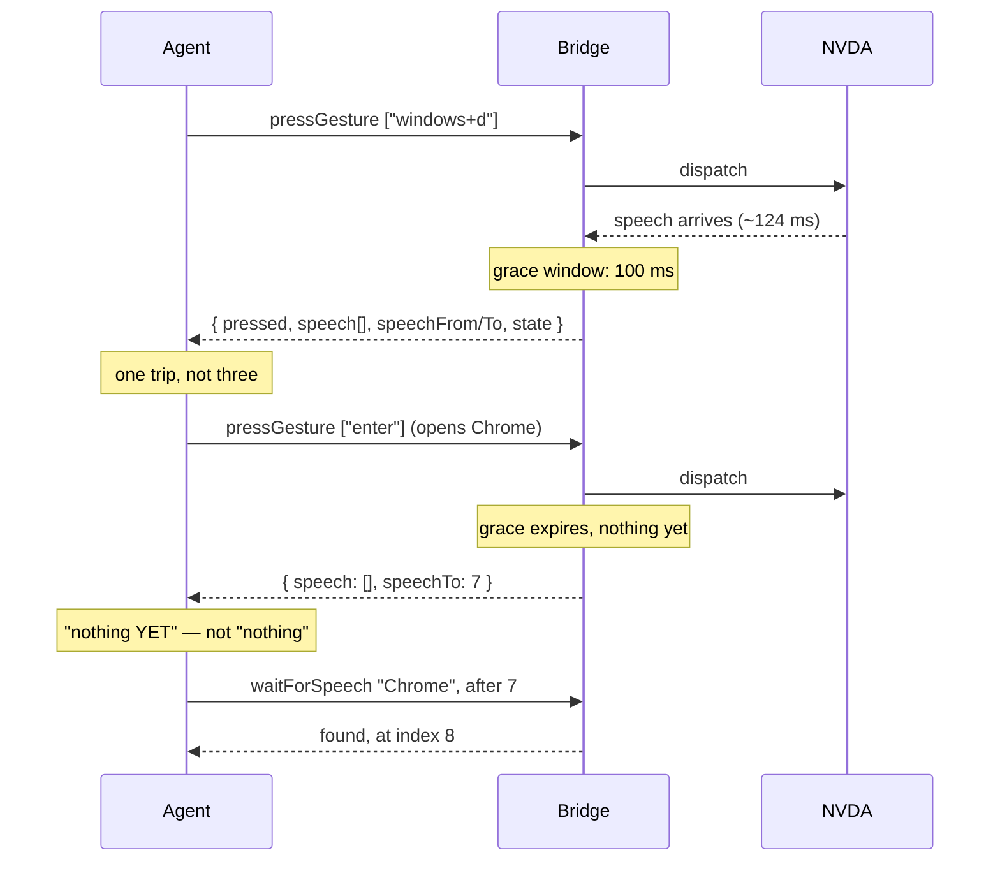

# 0025 — one round trip per intention

Status: **agreed 2026-08-16.** Drafted 2026-08-03. Board entry **11.12**.
Implements the two routes named in [11.9](../ROADMAP.md), whose measurements are
the whole argument for this spec.

All five open questions were settled in the agreeing conversation and are
recorded below as decisions rather than deleted, so the reasoning survives. The
review also raised, and then withdrew, a claimed conflict with
[0023](0023-drive-it-like-a-user.md); that exchange is recorded too, because the
apparent conflict is an easy one to re-derive and the resolution is worth
keeping.

---

## Part 1 — the only number that matters

Measured 2026-08-03, from the bridge transcript and a bracketed control:

| | |
|---|---|
| NVDA finishes producing a keystroke's speech | **~124 ms** (`GESTURE windows+d` 09:04:24.078 → last `SPEECH` 09:04:24.202) |
| one agent tool round trip | **~2.64 s** measured, **5–12 s** observed in a later live run |

So **NVDA is not the slow part, and it is not close.** In the run that produced
these numbers, ~30 calls spent roughly 78 s almost entirely on transport.

[0023](0023-drive-it-like-a-user.md) prescribes the loop the agent should run:
**act → settle → listen**. That is three round trips per intention, ~7.9 s, to
carry ~124 ms of reader work. And [11.9](../ROADMAP.md) established that one of
those three is pure waste:

> a settle timed against a **deliberately quiet** buffer took 8.293 s, and one
> immediately after real speech took 8.297 s — identical, because both returned
> instantly.

`waitForSpeechToFinish` returns `finished: true` off a stale `_last_time` having
observed nothing, because by the time the call arrives the 1 s quiescence window
has *always already expired*. The settle was never being paid; it was also never
doing anything.

### Why the settle was the wrong primitive, not just a mistuned one

`waitForSpeechToFinish` asks **"has speech stopped?"** That question is
unanswerable at the moment it is asked, and the reason is structural rather than
a matter of constants: silence before speech starts and silence after speech
ends are the same observable. Shortening the window makes the wrong answer
arrive sooner. Lengthening it makes the agent wait for a thing that already
happened.

The maintainer's proposal reframes it, and the reframing is the substance of
this spec:

> we can wait for say 100 ms after a gesture is pressed and return what is there
> in terms of speech. If nothing returns, you know you must wait a little and
> query state again, or even query speech again to see whether something else
> came.

That asks **"has speech started?"** — which *is* answerable, at a known instant,
with no claim beyond what was observed. And 100 ms is chosen against the 124 ms
measurement: it is where the common case already is. Against a 2.6 s round trip
it costs **~4 %**, versus the settle's nominal 38 % for an answer that was never
computed.

The two questions are not variations on each other:

| | `waitForSpeechToFinish` | the grace window |
|---|---|---|
| asks | has speech **stopped**? | has speech **started**? |
| empty answer means | *nothing* — the state is unobservable | "nothing had arrived by *T*" — a fact |
| cost | one round trip, ~2.6 s | ~100 ms inside a trip already paid |
| claims completeness | yes, falsely | **never** |

---

## Part 2 — what a result may claim

The grace window only helps if its empty case is honest. So, as a contract rule:

**A result says what had arrived by a stated instant, and where to resume. It
never says that is all there is.**

There is no `complete: true`. An agent that reads an empty speech list learns
*"nothing yet, as of 100 ms after dispatch"*, which is exactly what the
maintainer described doing about it: wait a little and ask again, or orient with
the reader's own report-focus command, or re-query speech. That is
[0023](0023-drive-it-like-a-user.md)'s loop — unchanged, but now entered **only
in the rare case** instead of on every single step.

This is also why this spec adds no `await` / expectation parameter; see *What is
deliberately not built*.



---

## Part 3 — what ships

### 1. A grace window on every mutating call

`pressGesture` and `typeText` take an optional `graceMs` (default **100**, `0`
to opt out) and return the speech that arrived during it.

```jsonc
{
  "pressed": [
    { "gesture": "control+home", "speechFrom": 59, "speechTo": 60 },
    { "gesture": "h",            "speechFrom": 60, "speechTo": 60 },  // silent
    { "gesture": "h",            "speechFrom": 60, "speechTo": 60 }   // silent
  ],
  "speech": [ { "index": 59, "text": "Skip to content link mesma página", "logPosition": 3329 } ],
  "speechFrom": 59,
  "speechTo": 60,
  "state": { "browseMode": "focus", "speechMode": "talk", "sleepMode": false, "inputHelp": false }
}
```

Read that against Part 1 of [0024](0024-a-session-the-agent-can-hear.md): the
five silent `h` presses and `browseMode: "focus"` are both **on the face of the
result**, in the call that made them. The live failure of 2026-08-03 could not
have survived its own first result.

### 2. Per-gesture bookmarks, so batching stops hiding things

A batch today returns `{"pressed": ["h","h","h","h","h"]}` and one blended speech
read; there is no way to tell which key produced what, or that four produced
nothing. The fix is **not** to un-batch — that costs a round trip per key — but
to carry a `speechFrom`/`speechTo` pair per gesture.

This is the same device [0021](0021-observing-the-log.md) already uses:
`SpeechEntry.logPosition` relates two timelines by *position at the moment of
capture* rather than by copying data across. Here the coordinate relates a
gesture to the speech ring. Two integers per gesture, no duplicated text.

The arithmetic, at today's rates:

| | today | with this |
|---|---|---|
| 5 gestures, individually observable | 5 trips ≈ 13 s | 1 trip + 500 ms grace ≈ **3.1 s** |
| 5 gestures, batched | 1 trip ≈ 2.6 s, **not observable** | as above, **and** observable |

Batching and observing currently trade off against each other. This is the
change that makes them compose, and it is the one worth the most.

### 3. A state snapshot on the result — for silent effects only

This spec must answer [0023](0023-drive-it-like-a-user.md) directly, because
0023 lists this under *What is deliberately not built*:

> **Returning focus in the gesture/type result.** Wrong by construction: the
> focus at handler-return time is *pre*-effect focus. It would report the
> document you were in, not the dialog that is about to open, and it would be
> reliably, confidently wrong in exactly the case the agent cares about.

**That objection stands, and this spec does not overturn it.** The snapshot here
is `getState`'s four fields — `browseMode`, `speechMode`, `sleepMode`,
`inputHelp` — and it is *not* `getFocusInfo`. The distinction is the whole
justification:

- **Focus movement is slow, asynchronous, and the thing 0023 is about.** A
  sample at window close is still probably pre-effect. Not returned. Speech
  remains the observable for "did the effect land".
- **A browse/focus toggle is synchronous with the script that performs it** and
  is *already complete* when the grace window closes. It is also the one thing
  the agent cannot hear, per 0024. It is returned.

So the field answers **0024's question** — *did something happen that this
session cannot hear?* — not 0023's. And it is sampled at window close, an
instant the caller knows, rather than at dispatch.

If a session runs with 0024's normalisation, the mode change *also* arrives as
words in the same result, and the two agree. That redundancy is deliberate:
0024 covers the sessions where the agent is listening, this covers the ones
where normalisation was declined.

### 4. `announce` riding along

An `announce` string on `pressGesture`/`typeText`, spoken before dispatch.

The justification is [11.10](../ROADMAP.md) and the live run that produced it.
Narrating each step to a human who is mute in a silent session is what keeps
them safe — and doing it properly **roughly doubled the call count**, which made
the session slower, which is what made narration feel expensive enough to skip.
The thing that protects the human must not be the thing that costs the most.
Riding along makes it free.

### 5. Stop calling the settle

Zero code, available on the current build, and already validated: every read in
the afternoon run of 2026-08-03 skipped `waitForSpeechToFinish` and the speech
was there each time. `waitForSpeechToFinish`'s description should say what it is
now for — long deliberate announcements and say-all — and stop presenting itself
as the step after every action, which is what 0023 promoted it to on the
strength of an assumption that has since been measured false.

That is a **change to 0023's published loop**, and it should be made in 0023's
own guidance resource rather than silently contradicted here.

---

## Class/file layout

Per AGENTS.md, "a spec MUST include the class/file layout".

| File | Role | Collaborators |
|---|---|---|
| `bridges/.../domain/entities/speech_buffer.py` | entity (existing) | Gains a bounded `collect_since(index, grace)` that returns entries arrived by a deadline. Uses the injected `Clock`; adds no new dependency. `SPEECH_FINISHED_SECONDS` and `wait_to_finish` stay for the narrowed use. |
| `bridges/.../domain/controllers/commands/press_gesture.py` | controller (existing) | Reads `next_index` before each gesture, dispatches, then collects across the grace; assembles per-gesture bookmarks; samples the state inspector at window close; speaks `announce` first. |
| `bridges/.../domain/controllers/commands/type_text.py` | controller (existing) | Same, with a single span rather than per-gesture. |
| `bridges/.../protocol.py` | wire (existing) | `PressGestureParams` gains `graceMs`, `announce`; new `GesturePress` (gesture + bookmarks); `GestureResult` gains `pressed: list[GesturePress]`, `speech`, `speechFrom`, `speechTo`, `state`. `TypeParams`/`TypeResult` likewise. |
| `server/domain/controllers/tools/press_gesture.go` | controller (existing) | Params and result pass-through; description rewritten to state the grace, and that an empty list means *not yet*. |
| `server/domain/controllers/tools/type_text.go` | controller (existing) | As above. |
| `server/domain/controllers/tools/wait_for_speech_to_finish.go` | controller (existing) | `Description()` only — narrowed, per Part 3.5. |
| `server/adapters/mcp/guidance_resource.go` | adapter (existing) | 0023's loop updated: the settle is no longer the universal second step. |
| `specs/wire/v1/protocol.md` | contract (existing) | `pressGesture`/`typeText` shapes changed in place. `PROTOCOL_VERSION` 1 is pre-release and both halves ship together (AGENTS.md §), so this is a rebuild, not a migration. |
| `bridges/nvda/tests/unit/.../test_speech_buffer.py` (existing) | unit | `collect_since` returns early when entries arrive, waits out the grace when they do not, and returns an empty list rather than blocking on silence. |
| `bridges/nvda/tests/unit/.../test_press_gesture.py` (existing) | unit | Per-gesture bookmarks; a silent gesture yields an empty span rather than being omitted; `announce` precedes dispatch; state sampled once, at the end. |
| `server/tests/integration/mcp_press_gesture_test.go` (existing) | integration | The collapsed shape reaches the agent, and an empty speech list is representable and distinguishable from an absent field. |

No new port, no new entity, no new adapter: every collaborator already exists
and this is a change of *shape*, which is the reason it is affordable.

### Layout amendments made while implementing (2026-08-18)

Per AGENTS.md, an amendment rides in the PR with a one-line why. Four, all of
them the same shape — the table named the two controllers, and what actually
turned out to be shared was *between* them:

| Added | Why |
|---|---|
| `bridges/.../commands/observation.py` — supporting construct, two pure mappings | Three commands assemble the same two answers (`getSpeech` and both mutating handlers report utterances; `getState` and both report modes). Written out five times, the wallclock formatting or the `BrowseMode` widening gets corrected in four places and missed in the fifth — the exact failure spec 0028 recorded when three `append` implementations each grew one field by hand. `getSpeech` and `getState` now call it too, so there is one mapping rather than a new second one. |
| `server/domain/controllers/tools/observation.go` — the shared result half, plus `DefaultGraceMs` / `DefaultTypeGraceMs` | `press_gesture` and `type_text` publish an identical window, resume coordinate and state snapshot. The two agreeing is the point rather than a coincidence, so the shape is declared once; written twice it would drift the first time one of them gained a field. |
| `ports.Observation` / `GesturePress` / `GestureOutcome` / `TypeOutcome` in `gesture_sender.go` | The table said "params and result pass-through" without naming the domain types that carry them. A port that returned the wire struct would put a generated type in the domain, which spec 0013 forbids. |
| `callTimeoutFor` in `json_lines_client.go` | The grace is spent INSIDE the bridge, so the reply cannot arrive before it elapses. A fixed 15 s call timeout would turn a 20-key batch at 100 ms into a "the bridge did not answer" transport failure — a self-inflicted bug the parameter would have introduced on its first large batch. |

One deliberate departure from the table's wording: **`typed` is the reader's
count, passed through, not recomputed in the server** (the Go tool used to count
runes itself). The side that injected the characters is the one authority on how
many there were, and two independent counts of one string is exactly how they
come to disagree.

### Amendment 2026-08-20 — the announcement is acknowledged (board entry 11.24(b))

Part 3.4 gave `pressGesture`/`typeText` an `announce` that rides along, and gave
the caller nothing back about it. The second external run found that (ask 3, board
entry **11.24(b)**): *an agent narrating to a human it cannot hear is assuming
rather than confirming* — which matters most in exactly the sessions where the
narration is the human's only channel.

**What ships: `announced`, an echo, on both mutating results.**

| | |
|---|---|
| present | the text that was spoken, echoed back |
| absent | you asked for no announcement |

Four decisions worth recording, because each had a plausible alternative:

**An echo rather than a boolean.** The same argument `announce`'s own result was
built on: the reader returns an acknowledgement and nothing else, so the useful
confirmation is that *this exact text* reached it. A `true` would confirm the
mechanism and not the message.

**Omitted rather than empty when nothing was announced.** "You did not narrate"
and "your narration vanished" must stay distinguishable, which they are only
while absence is a real answer — the same rule `state` follows two fields above.

**Whitespace-only is now an error, where it used to be dropped in silence.** The
bridge guards its announcement with `if params.announce.strip()`, so `"   "`
produced no sound and no signal — an agent that *meant* to narrate got the exact
outcome of one that did not. The `announce` tool has always refused it; the two
mutating tools now refuse it identically, and refuse it **before dispatch**, so a
narration that cannot be spoken is never discovered after the machine has already
moved. Empty and absent stay legal and stay silence: that is the wire contract's
own spelling, and an erased parameter cannot tell the two apart anyway.

**Nothing new crosses the wire.** The bridge already acknowledges the whole call,
and the server reached that acknowledgement only by sending the announcement
first; with whitespace refused above it, there is no longer a path where the
bridge speaks less than it was handed. So `protocol.md` is unchanged and this
costs no rebuild of the add-on — the ack is assembled where the request still is.

**What it must never claim.** `protocol.md` §7.1 measured the gap and this
amendment is bounded by it: emission runs **two to three utterances, about five
seconds, ahead of audio**. `announced` says the announcement was *made*. It does
not say it was *heard*, and an agent that narrates and acts in the same breath is
acting ahead of its own narration. Both tool schemas say so in those words, and
so does `screenreader://guidance`, which is where the instruction to narrate
lives.

**Deliberately not built: a way to wait for the listener to catch up.** 11.24(b)
left that open as the alternative remedy. It is not this amendment, and not
because it is unwanted — because the bridge has no view of audio at all. It
captures *before* the synthesizer (§7.1), so "the human has heard it" would need
a new mechanism the bridge does not have today: NVDA's synth index callbacks,
reaching back through a port that currently only speaks. That is its own spec,
its own entity, and its own live measurement. Named, not designed — and the field
here is honest without it, which is why it does not block.

**Layout** (AGENTS.md: a spec names the files before the code exists):

| File | Role | Change |
|---|---|---|
| `server/domain/controllers/tools/observation.go` | supporting construct (existing) | Gains the `Announced` field and `announcement()`, the validator both tools share. It is the shared result half by construction, which is the whole reason the ack could not live in either tool. |
| `server/domain/controllers/tools/press_gesture.go`, `type_text.go` | controllers (existing) | Validate before dispatch, pass the text to `observed`. |
| `server/adapters/mcp/documents/guidance-method.md` | document (existing) | The narration section gains the ack and the five-second warning — the same document that tells an agent to narrate at all. |
| `server/domain/controllers/tools/announced_ack_test.go` (new) | unit | Both tools in one file, because the property is that they answer a narration *identically*. |

No bridge change, no port change, no new entity: the announcement was already
travelling, and what was missing was the answer.

---

## What is deliberately not built

**An `await` / expectation parameter** (`pressGesture { until: "Chrome" }`).
Tempting, because it would collapse the slow case — a browser window opening —
from two trips to one. Rejected because its failure mode is the exact collapse
this repo keeps curing: `satisfied: false` would mean *the effect has not
happened yet*, or *it happened and was worded differently*, or *it is never going
to happen*. One observable, three situations — the objection that sank
`waitForFocus` in 0023, and it does not become sound just because the matcher is
a string instead of a role.

The maintainer's framing is also simply sufficient: *"you know you must wait a
little and query again."* The slow case then costs `pressGesture` +
`waitForSpeech` — **two trips, which is what it costs today**. So this spec makes
the common case 3× faster and leaves the rare case unchanged, rather than making
the rare case faster at the price of an ambiguous result on every call.

**`complete` / `finished` on the result.** Part 2. There is no honest way to
compute it.

**Returning focus information.** 0023, quoted in Part 3.3, and still right.

**Returning braille alongside speech.** Consistent, and probably eventually
correct, but braille has no measured equivalent of the 124 ms figure and this
spec's whole warrant is measurement. Deferred rather than guessed.

## Honest limits

- **Attribution is by dispatch-time coordinate, not causation.** A gesture's
  span says "the ring was here when this key was dispatched" — speech caused by
  gesture *n* can land after gesture *n+1* went out, and will be attributed to
  *n+1*. For a batch this is close enough to be useful and is not exact. The
  reliable reading is the *aggregate* window plus "this key's span was empty",
  which is what caught nothing on 2026-08-03.
- **100 ms is a heuristic, and the 124 ms measurement is a single sample** on one
  machine, one synth, one NVDA version, driving the Windows desktop. A slower
  machine or a heavier page moves it. The default is a starting point that the
  parameter exists to override, not a constant anyone should trust the way
  `SPEECH_FINISHED_SECONDS` was trusted.
- **The grace is real time, and it is per gesture in a batch.** A 20-gesture
  batch spends 2 s in grace. Cheap against 20 round trips; not free.
- **This does not fix slow effects.** Chrome opening, a page loading, a dialog
  appearing — all still cost a second call. By design (above).
- **The measured baseline may not be the real bottleneck.** 2.6 s was measured;
  5–12 s was observed hours later on the same machine. That gap is unexplained,
  and if it lives in the agent's own loop or the MCP layer then a 3× reduction in
  call *count* still leaves 4 s per step. **This spec's benefit is proportional
  to a number nobody has bracketed yet.**

## Open questions — **all settled 2026-08-16**

- **Should the 5–12 s gap be measured before this is built? — No, it is already
  explained.** That is the client model's own turn time between tool calls, and
  it grows with the conversation's context, which is exactly why 2.6 s was
  measured early and 5–12 s observed on the same machine hours later. Nothing in
  the system is faulty. Far from weakening this spec, it **strengthens** it: if
  per-call model turns dominate the cost, then call *count* is the right lever
  and cutting three calls to one cuts the dominant cost threefold.
- **Is `graceMs` per call, per session, or both? — Per call only.** A session
  default is machinery for a case nobody has hit, and it can be added later
  without breaking anything, whereas a knob nobody needed cannot easily be taken
  away.
- **Should `typeText` grace at all? — Default `graceMs` to 0 for `typeText`, 100
  for `pressGesture`.** Different defaults for two tools looks inconsistent, but
  the tools genuinely differ: a gesture produces one announcement worth reading,
  typing with "speak typed characters" on produces one per character worth
  nothing. Consistency here would be consistency in the wrong dimension.
- **Does the state snapshot belong on `typeText` too? — Yes.** Four small fields,
  negligible cost, and an agent pays more for the asymmetry in confusion than the
  bytes cost in transport. Unlike the question above, nothing about typing makes
  the snapshot *misleading* — only rarely interesting — so consistency is the
  right call here.
- **What happens to `getNextSpeechIndex`? — Keep it, and say what it is for.**
  It stops being part of the normal loop, but it remains the only way to mark a
  moment when the agent is **not** the one acting: a human driving while the
  agent watches (entry 11.3's observe-only session, and 11.5's "watch what I do,
  a bug is about to appear"). Its description should say so, rather than leaving
  it looking vestigial.

## Its relationship to 0023 — **not a contradiction**

Worth recording, because the first review of this spec read one where there is
none. This spec does **not** overturn [0023](0023-drive-it-like-a-user.md)'s
loop. Both say the same thing — *act, wait a little, check; if nothing has
arrived yet, wait and check again* — and Part 2 above says so outright. 0023
expressed it through a call that turned out to observe nothing; this expresses it
through a wait that observes. **Same doctrine, working mechanism.**

Two things do change, and both are text rather than logic:

- **The named tool.** The guidance's step 2 currently reads *"Settle.
  `wait_for_speech_to_finish`. This is the one wait that applies after any
  action."* That names a tool which stops being the settle.
- **Where the wait lives** — inside the call, rather than as a call of its own.

The one real friction is verbal. The guidance says **"never sleep instead: a
sleep is never evidence"**, and the grace window is a bounded blind wait. But it
is not what that sentence forbids, which is an agent sleeping *instead of
observing* and then *assuming*. This sleeps, observes, reports exactly what it
saw, and refuses to claim completeness. The prohibition should therefore be
restated in terms of what makes a wait bad rather than the word "sleep":

> a blind wait you treat as evidence is forbidden; a bounded wait followed by an
> honest observation is the mechanism.

That is the same line the repo draws elsewhere between a `delay` (for the
application's known timing) and a settle (for the reader's unknown latency).
**The guidance and 0023 step-2 rewording rides in this entry's implementing PR**,
not as an entry of its own.

## Not in scope

Making the *capture* complete ([0024](0024-a-session-the-agent-can-hear.md)) and
reading a whole document
([0026](0026-where-am-i-and-what-is-on-the-page.md)). This spec changes the cost
of a step; it does not change what a step can see, nor add a way to read more
than one at a time.
