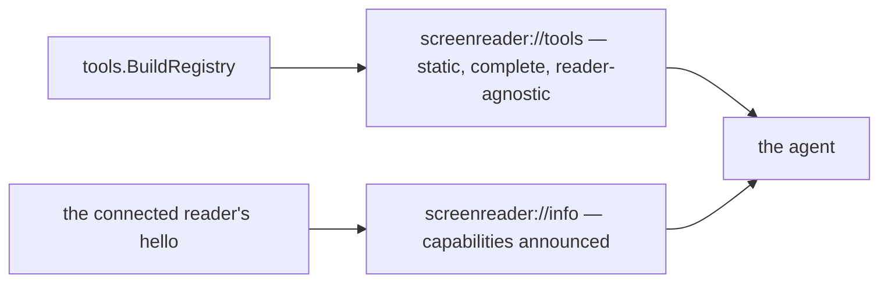

# 0031 — the tools describe themselves

Status: **agreed 2026-08-18.** Board entry **11.22**. Server lane.

Agreed as proposed, with one change and three open questions settled in the same
conversation:

- **One PR, not two.** The staged split in Part 6 was withdrawn — see that part.
- **Capabilities get a one-line meaning, in the domain** (2.5).
- **Round-trip cost stays out** of this document; it is method (Part 7).
- **`screenreader://guidance` points here** (2.6).

The ask is [0030](0030-the-second-external-run.md) ask 1b, in the reporter's own
words: *"a single `screenreader://tools` resource that is a reader-agnostic
cheat-sheet — every tool name, what capability gates it, what it returns. A
document served for reading, per your invariant, not source spelunking."*

---

## Part 1 — the problem: an agent read our source, and was right to

An external agent completed a real task through this MCP on 2026-08-18 and, in
the middle of it, opened the Go source to find out what it could call. It says
why, and the sentence is the entire justification for this spec: *"After
`connect_reader` the gated tools exist and I could call them, but I had no
authoritative list of their names and schemas in front of me — which is precisely
why I opened the Go source, the thing you rightly called me out for."* And then:
*"fix that and I won't."*

Three things about that finding matter more than the inconvenience.

**It is not the redeploy bug.** Entry 11.6 diagnosed a real mechanism by which
this project's own dev loop freezes a client's tool list — `poe redeploy` kills
the stdio server, the client silently respawns it, and capability discovery never
re-runs. That diagnosis is sound and it does **not** explain this run. This agent
connected cleanly, in a different client, with no redeploy anywhere, and still
had nothing in front of it. So there are two separate failures wearing one
symptom, and only one of them has been explained.

**The remedy for it does not depend on any client.** 11.6's options all turn on
what a client does with `tools/list_changed` — a notification we emit and cannot
verify anyone honours. A resource is different: `resources/list` is served on
request, the list is **static**, and nothing about it changes mid-session, so
there is no notification to miss and no cached list that can be wrong. That
independence is why this entry should go before 11.6 rather than after it, and
why agreeing this spec does not commit us to any of 11.6's four options.

**The concrete layer is the one carrying the weight.** 0030 records that
`screenreader://reader-guidance` — the literal, this-machine document — was named
as the single reason the run succeeded, and that `screenreader://guidance`, the
method document, is not mentioned once. This spec adds to the concrete layer.
That is deliberate, and it is the same shape as the finding.

---

## Part 2 — what the document is

### 2.1 Static and complete, and that is the whole point

`screenreader://tools` lists **every tool in the registry**, gated and ungated
alike, whether or not a reader is connected and whether or not the connected
reader could run it. It is readable before `connect_reader`.

The temptation is to filter it to what is currently callable. That must be
refused, because filtering reproduces the exact failure the document exists to
fix: an agent's complaint was *"my initial tool list showed only the four ungated
tools"*, and a session-filtered document would show it the same four. Worse, a
document whose content depends on session state is a document a client may cache
across a state change — which is 11.6's failure mode, re-imported into the one
place we chose specifically because it could not have it.

So the document answers **"what does this server offer, and what does each one
need?"** It does not answer **"what can I call right now?"** That second question
already has an answer, and it belongs somewhere else — see 2.2.

This is the same reasoning that made `screenreader://guidance` static, one step
further along: that document is static because it is read *before* connecting;
this one is static because being complete is *what it is for*.

### 2.2 Reader-agnostic, and how it composes with `screenreader://info`

The registry does not know what reader is connected, and this document must not
learn. It names the **capability** that gates each tool — `speech`, `gestures`,
`state` — and stops there.

The agent already has the other half. `screenreader://info` and `status` report
the capability strings the connected reader announced, from the same vocabulary
(`entities.Capability`, wire contract §4). So:

- **this document**: `get_state` is gated on `state`, takes no parameters,
  returns four named fields;
- **`screenreader://info`**: this reader announced `speech`, `gestures`, `state`.

The agent intersects two facts it can read at any time. Neither document can go
stale, because neither depends on the other's timing. Splitting it this way is
not a limitation we are working around — it is what keeps a reader-agnostic
document honest under spec 0005 principle 2, and it is why adding a reader
changes nothing here.



### 2.3 Markdown, with the schemas as fenced JSON

Every resource this server publishes is `text/markdown`, and the readership is a
model reading prose. This one follows, with each tool's input and output schema
as a fenced `json` block so it can be copied verbatim rather than paraphrased.

Serving JSON instead was considered and rejected: the parts that stop an agent
guessing — *what this tool is for*, *what a successful result does and does not
mean* — are prose, and half the value would be lost to a schema that can only
carry field names and types.

### 2.4 It states the error convention once

The document also states, once and in prose, what a failed call looks like: a
result with `isError` set and a human-readable message, never a JSON-RPC error;
and the two capability failures that are worth telling apart — *no reader is
connected* versus *this reader did not announce that capability* — which are
already distinguished by `CapabilityError` and today can only be discovered by
triggering them.

This is cheap, and it is exactly the class of thing an outsider has to infer and
an insider never notices is missing.

### 2.5 Each capability gets a one-line meaning, and it lives in the domain

The tools are grouped under the capability that gates them, and each group is
introduced by one sentence saying what that capability *is*. Without it the
document tells an agent that `press_gesture` is gated on `gestures` and leaves it
to infer the rest — the same piece-it-together-from-prose the document exists to
end, in miniature.

**The sentence lives on the entity, as `Capability.Meaning() string`**, not in the
embedded markdown. These are wire-contract vocabulary (protocol.md §4), the same
strings a bridge announces in `hello` and `screenreader://info` reports verbatim;
what `speech` means is a fact about the contract, not about how one resource
chooses to present it. A test asserts every declared constant has a non-empty
meaning, so a capability cannot be added without one.

The counter-argument was weighed and is worth recording, because it is 0029's own
amendment: the degraded reader-guidance documents were moved *out* of the domain
precisely because no domain caller rendered their text, and here too only this
resource would render the meanings. What decides it the other way is that
`Persona.Stance()` is the closer precedent — vocabulary the contract defines,
which the domain therefore owns, whoever happens to render it today.

`CapabilityGuidance` is included, and is the one that gates a **resource** rather
than any tool. It therefore introduces no group in this document, and the
completeness test covers it anyway: a constant with no meaning is a gap whether or
not this particular document has a place to print it.

### 2.6 `screenreader://guidance` points here

One sentence in `guidance-preamble.md`. The method document is where an agent is
told to start — it is the one that says *read this BEFORE connecting* — so it is
the natural place to learn that the concrete list exists at all. An agent that
finds this document only after deciding to read Go source has been failed in
exactly the way 0030 describes.

The pointer is asserted by a test, alongside the existing check that every
`screenreader://` URI a tool description names is published.

---

## Part 3 — the missing half: what a tool returns

### 3.1 The interface says nothing about results

`tools.Tool` answers `Name()`, `Capability()`, `Description()`, `InputSchema()`
and `Execute()`. There is no output schema anywhere in the server. Each tool
marshals a **private** result struct — `stateResult`, `pressGestureResult` — whose
field names reach the agent only as JSON that has already been produced by a call
it had to make first.

So the reporter's *"what it returns"* cannot be composed from anything that
exists. This is the one part of 11.22 that is a design decision rather than an
assembly job.

### 3.2 `OutputSchema()` joins the Tool interface, hand-written

Add one method:

```go
// OutputSchema is a hand-written JSON Schema object describing a SUCCESSFUL
// result, always of `"type": "object"`.
OutputSchema() json.RawMessage
```

Every tool must answer it, and the compiler says so — which is the same guard the
registry already relies on: *"adding a tool means adding a line here and a file
beside this one — nothing else, anywhere."* A tool that cannot be added without
describing its result is a tool that cannot ship undescribed.

Three alternatives, and why not:

- **Reflect over the result struct.** It cannot drift, but `Execute` returns
  `any` — there is no type to reflect until a call has already happened. And a
  reflected schema carries no prose: it would say `position: integer` where what
  an agent needs is *the position this speech was captured at, to pass back to
  `get_speech`*.
- **Prose in `Description()`.** Where it exists it is already good, but it is
  unstructured, optional, and nothing notices when a result gains a field.
- **A hand-written table in the document.** The thing the entry names as the
  obvious hazard: a cheat-sheet that disagrees with the code is worse than none.

Hand-writing is also the decision this project has already made once, for the
same reason, in `tool.go`: *"hand-written schemas — which are agent-facing text we
would be hand-tuning regardless, and which are most of what a tool file actually
says."* Symmetry here is not tidiness; an output schema is agent-facing text with
exactly the same properties as the input schema beside it.

All 23 result types are already Go structs, so `"type": "object"` holds
everywhere with no exceptions to carve out.

### 3.3 The same method feeds the SDK declaration

`declare()` in `adapters/mcp/tool_binding.go` gains one line, setting
`sdk.Tool.OutputSchema`. So the document and the client's tool list are composed
from **the same method**, and cannot disagree about a result shape — there is
still no second place a tool is described.

It is also a free partial hedge against 11.6 in both directions. A client with a
stale tool list gets the truth from the document; a client whose list is fresh
now gets output schemas it never had. Neither is the fix for 11.6, and neither
prejudges it.

### 3.4 Safe on the binding path this server uses

Checked against go-sdk v1.6.1. `(*mcp.Server).AddTool` — the non-generic path
this server uses, and the one the erased-params decision chose deliberately —
validates `OutputSchema` only for `"type": "object"` at registration time. It
does **not** validate results against it; that policing lives in `toolForErr`, on
the generic path we do not use.

Two consequences to record rather than discover later:

- Declaring output schemas does not turn every tool result into a runtime
  contract the SDK enforces. Conformance stays ours.
- It stays ours, so it needs a test. `NewServer` already validates every input
  schema at startup precisely because the SDK **panics** mid-session on a bad
  one; `validateSchema` is extended to cover the output schema by the same
  argument, and a unit test asserts each tool's declared schema against its
  actual result struct.

---

## Part 4 — drift is the only real hazard

The entry names it: *"a hand-written cheat-sheet that disagrees with the registry
is worse than none."* Three measures, in order of how much they buy.

1. **Composition.** Every per-tool line is generated from the registry at read
   time, the way `guidanceDocument()` composes persona profiles. A tool cannot be
   missing from the document, and no line about a tool exists to be edited.
2. **The frame names no tool.** The embedded prose is a preamble and the error
   convention — nothing tool-specific. A test asserts the frame contains no tool
   name from `BuildRegistry()`, which is what stops the next helpful edit from
   putting a copy of the truth where nothing checks it.
3. **The composed document is checked against the registry.** An integration test
   reads the resource and asserts: every registry tool appears exactly once; the
   capability named for each matches `Registry.Catalog()`; every fenced schema
   parses and equals the tool's own; and the document names no tool the registry
   does not have.

Measure 3 is close to tautological given measure 1, and that is intentional — it
is the guard that survives someone deciding, reasonably, to hand-tune one entry.

---

## Part 5 — class and file layout

### 5.1 Domain — the tool contract

- **`server/domain/controllers/tools/tool.go`** *(modified)* — the `Tool`
  interface gains `OutputSchema() json.RawMessage`. Interface, so no test file
  beside it, per AGENTS.md.
- **`server/domain/controllers/tools/*.go`** *(23 files, modified)* — each tool
  implements `OutputSchema()`, beside its existing `InputSchema()`. No other
  change; the private result structs stay private and stay the source the schema
  is written from.
- **`server/domain/entities/capability.go`** *(modified)* — entity. Gains
  `Capability.Meaning() string`, the contract's own one-line gloss for each
  declared capability (2.5). Read by the tools resource; owned here because the
  vocabulary is the contract's, not the resource's.

### 5.2 Adapter — the resource

- **`server/adapters/mcp/tools_resource.go`** *(new)* — adapter. Registers
  `screenreader://tools` and composes the document. Holds the `*tools.Registry`
  the `Server` **already has**; it does not call `BuildRegistry()` itself, so the
  document describes the registry this server is actually running. Built by
  `sdk_server.go`'s `Bind`, beside the other four resources. Modelled on
  `guidance_resource.go`, and static like it, so it takes no session source.
- **`server/adapters/mcp/documents/tools-frame.md`** *(new)* — the embedded
  preamble and error convention. A `.md` file, not a string literal, per AGENTS.md
  rule 9 and for the reason `guidance-preamble.md` gives.
- **`server/adapters/mcp/tool_binding.go`** *(modified)* — `declare()` sets
  `OutputSchema`; `validateSchema()` checks it is an object schema.
- **`server/adapters/mcp/sdk_server.go`** *(modified)* — one `addToolsResource()`
  call in `Bind`.
- **`server/adapters/mcp/documents/guidance-preamble.md`** *(modified)* — one
  sentence pointing at `screenreader://tools` (2.6).

No new port. The adapter reads a domain value it is already given, which is what
`guidance_resource.go` does with `entities.AllPersonas()`; a port would exist only
to be implemented once, by the thing on the other side of the same package
boundary.

### 5.3 Tests

- **`server/adapters/mcp/tool_binding_test.go`** *(modified)* — `declare` carries
  the output schema; `validateSchema` rejects a non-object one.
- **`server/domain/controllers/tools/registry_test.go`** *(modified)* — every
  tool's output schema parses and is `"type": "object"`, matching the existing
  input-schema assertions.
- **`server/domain/entities/capability_test.go`** *(modified)* — every declared
  capability has a non-empty `Meaning()`, `CapabilityGuidance` included (2.5).
- **`server/domain/controllers/tools/output_schema_test.go`** *(new)* — each
  tool's declared output schema names exactly the fields its result struct
  marshals. This is the test that makes hand-writing safe.
- **`server/tests/integration/mcp_tools_resource_test.go`** *(new)* — the resource
  is published; it is readable with no reader connected; it lists every tool with
  the right gate and its meaning; the frame names no tool; the schemas round-trip.
- **`server/tests/integration/mcp_guidance_resource_test.go`** *(modified)* — the
  guidance document points at `screenreader://tools` (2.6).

---

## Part 6 — one PR, and why the short-PR rule yields here

**Decided in the spec conversation, 2026-08-18: this ships as a single PR.** The
spec first proposed two — the document, then the result schemas — and that split
was withdrawn.

AGENTS.md asks for short PRs (one component, its ports, its tests), and 0029 is
the standing precedent for halves that each stand up alone. Both still hold in
general. Three things make this the exception rather than a relaxation of them:

- **The ask is one ask.** 0030 asks for names, gates *and* returns in one
  sentence. A document that ships without returns is a cheat-sheet that stops
  exactly where the agent's question was, which invites the source-reading it was
  written to prevent — so the first PR would be answering the finding only
  partly, while looking like it had answered it.
- **The second half would rewrite the first.** `OutputSchema()` changes what the
  composing function emits and what the integration test asserts. Splitting means
  writing that composition and that test twice, and reviewing a document nobody
  intends to keep in the form it was reviewed.
- **The bulk is compiler-forced and mechanical.** 23 tools gain one method each
  because the interface will not compile otherwise. That is a long diff, not a
  wide one — there is no second design in it to review separately, which is what
  the short-PR rule exists to protect.

0029's split was different in kind: its halves were **mechanism** and **document**,
and the split *was* the design. Here the split would be halfway through one
document.

Suggested commit order within the PR, so the diff reads in the order the spec
argues: the entity's `Meaning()`; the `Tool` interface plus the 23 schemas; the
binding and startup validation; the resource and its frame; the guidance pointer;
the tests last only where they are not written first.

---

## Part 7 — the questions settled in the spec conversation

Three were open when the spec was proposed. All were settled on 2026-08-18, as
recommended. Recorded here rather than deleted, because the reasoning is what a
later reader will want when one of them is reopened.

1. **Capability meanings: yes, and in the domain.** Decided as 2.5, with the
   counter-argument (0029's amendment) recorded there rather than dropped.
2. **Round-trip cost per tool: no, not here.** 11.9 measured that a poll is a full
   round trip and 11.12 shipped the routes that avoid one, so an agent choosing
   between `get_state` and an `observation` piggyback is making a cost decision
   with no cost in front of it. That is a real gap and it is **method** — it says
   *how to drive*, not *what exists* — so it belongs in
   `screenreader://guidance`, whose entire subject is method. Putting it here
   would make the reference document argue for a technique, which is the boundary
   between the two documents that Part 2 depends on.
3. **A pointer from `screenreader://guidance`: yes.** Decided as 2.6.

---

## What is deliberately not built

- **No session filtering, and no "currently callable" marker.** 2.1 and 2.2.
- **No per-tool resource.** `screenreader://tools/get_state` would multiply the
  resource list by 23 to save an agent a scroll, and 0029 already refused the same
  shape for personas.
- **No generated-from-source documentation pipeline.** The schemas are written by
  hand for the reason 3.2 gives; a generator would produce the field names and
  drop the sentences that make them useful.
- **No change to `tools/list_changed`, capability gating, or the backstop.** Every
  option in 11.6 stays open, and this spec picks none of them.

---

## Honest limits

- **A client that never lists resources is equally blind.** This publishes the
  information; it cannot make anyone read it. What it does change is that the list
  is static and always available, so unlike the tool list there is no moment at
  which it is silently wrong. Whether the tool list itself should stop changing is
  11.6's question, unchanged by this.
- **It describes success, not failure.** The output schemas cover successful
  results. Error results carry prose, and the document says what an error looks
  like (2.4) without enumerating per-tool failure modes — those are the tool
  descriptions' job, and several already do it well.
- **A hand-written output schema can still be wrong**, in the narrow window where
  a result struct changes and the test in 5.3 is not extended with it. That test
  is what makes the window narrow; nothing makes it zero short of generation,
  which 3.2 rejects on separate grounds.
- **This does not make the tool list appear.** The agent that filed this still
  sees four tools in its client's list until 11.6 is decided. It just no longer
  has to read Go to know what the other nineteen are.

---

## Not in scope

- **11.6** — whether the tool list should stop changing, or announce itself at the
  point of failure. See Part 1.
- **11.23** — session-liveness visibility (0030 ask 2).
- **11.24** — the gesture-notation mismatch and the `announced` ack (0030 ask 3).
  Note the adjacency: 11.24(a) is a defect in a tool **description**, which this
  document will publish verbatim. Publishing it does not fix it, and fixing it is
  that entry's job.
