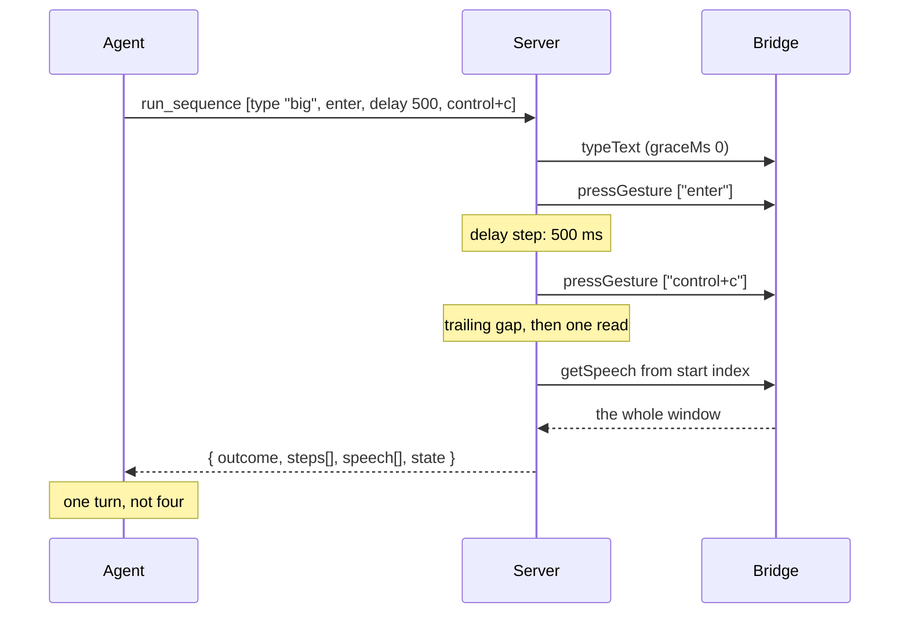

# 0036 — one call, several intentions

Status: **agreed 2026-08-22.** Board entry **11.16**. Comes out of the first
external run ([0027](0027-the-first-external-run.md), asks 3, 3b and 5), all
three of which still read **unmet**.

This spec builds `run_sequence`: one tool that carries several intentions in a
single call, so a plan runs where the latency is 0.2 ms instead of where it is
5–10 s.

---

## Part 1 — the ask, and why 0025 did not close it

The external report:

> *"Every command cost me two round trips (`type_text`, then `press_gesture
> ["enter"]`) at ~5–10 s each. That's not just slow — it made one scenario
> untestable."*

**The measured cost is not ours, and this spec must not be written as a latency
optimisation** or it will be judged against the wrong number. Entry 11.4 measured
the bridge at **0.2–0.5 ms**. The 5–10 s is the client model's turn time. What
this removes is *model round trips*.

Board entry 11.16 was marked "absorbed by 11.12" on 2026-08-16 and the marking
was **withdrawn the same day**, on reading [0025](0025-one-round-trip-per-intention.md)
in full. That episode is worth keeping, because the mistake is the instructive
kind: 0025 solves a *larger* problem, and because it is larger it looks like it
must cover this too.

It does not. 0025 ships a grace window that collapses *act → settle → listen*
from three round trips into one. That makes **each intention cheap**; it does not
let **two intentions travel together**. `typeText` then `pressGesture ["enter"]`
is still two calls, because they are two intentions.

### The scenario that is not slow but impossible

One case in that run was **untestable**, and it is the reason this entry
outranks its own throughput argument. The `big` command has a **1.5 s finish
delay**. Typing it and submitting it costs two agent turns before *stop* can be
sent, so it always completed before it could be interrupted, and the run had to
substitute a different command to test stopping at all.

As a plan, it is expressible:

```jsonc
{ "steps": [
    { "type_text": "big" },
    { "press_gesture": "enter" },
    { "delay": 500 },
    { "press_gesture": "control+c" }
] }
```

Every hop is 0.2 ms, so the stop lands ~500 ms in, comfortably inside 1.5 s.
**A class of behaviour that could not be tested at all becomes testable** — that
is the claim this spec should be judged on, not the throughput.

Ask 5 (`type_text replace: true`) disposes of itself the same way: select-all,
delete, type is a three-step plan. 0027 said it "has no home… because no
sequence primitive is being built". Now there is one, so it needs no flag of its
own — a second way to do one thing is a cost, not a convenience.

---

## Part 2 — the shape

### The step vocabulary is closed, not a tool passthrough

A step names one of **six** kinds. It is deliberately *not* a generic
`{tool, params}` passthrough over the registry, for three reasons: a passthrough
would let `connect_reader`, `disconnect_reader` or `ask_user` be nested inside a
plan, where none of them has a meaning; it cannot be described, and the
description is where this server's usability actually lives; and the up-front
validation below has to know what a step *means* in order to reject a bad plan.

| Step | What it is for |
|---|---|
| `press_gesture` | A key press. Same opaque gesture id as the tool. |
| `type_text` | Literal Unicode text at the focused control. |
| `delay` | **The application's known timing** — "this dialog takes half a second". |
| `settle` | **The reader's unknown latency** — a long deliberate announcement or a say-all. |
| `wait_for_speech` | Block until an utterance matches, then continue. This is act-on-trigger. |
| `read` | Orient: where did this land? |

The `delay`/`settle` distinction is not cosmetic and **the descriptions must say
which is which**. The published guidance says *never sleep instead*; a sequence
that can only sleep is a machine for mass-producing the exact failure
[0023](0023-drive-it-like-a-user.md) exists to prevent.

### `wait_for_speech` is act-on-trigger, and costs no new concept

The report's stretch ask — *"when speech matches X, immediately press Y,
evaluated bridge-side where the latency isn't"* — is just a plan whose middle
step blocks on speech; the next step fires ~0.2 ms later.

0025 considered an act-on-trigger shape and **rejected it**, as an `until:`
parameter on `pressGesture`, because `satisfied: false` would conflate *not yet*,
*worded differently*, and *never*. That argument is sound against that shape and
does not reach this one. `wait_for_speech` already exists, its `found: false` is
already an accepted non-error outcome, and it already claims nothing about
completeness. Nothing is pushed, so [0021](0021-observing-the-log.md)'s
pull-not-push decision stands untouched.

Its `found: false` therefore aborts the remaining steps but is **not a failure**,
and the result must say so distinctly — see `outcome` below.

### Why `settle` survives 0025's argument against it

This is the one place where two agreed decisions appear to collide, and the
reconciliation is the substance of this section.

11.16 (2026-08-15) requires a settle step. 0025 (2026-08-16) says **stop calling
the settle**, because `waitForSpeechToFinish` asks *"has speech stopped?"*, which
is unanswerable at the moment it is asked: silence before speech starts and
silence after speech ends are the same observable.

**0025's objection has two halves and only one survives inside a plan.**

- The **cost** half — a settle burns a full ~2.6 s round trip for an answer that
  was never computed — **evaporates**. 0025's own table prices it at "one round
  trip". Inside a plan the hop is 0.2 ms. That price is not paid here.
- The **epistemic** half — it cannot claim completeness — **stands**, and is
  binding on the step's description and on what its result may say.

0025 did not delete the tool. It narrowed it to *"long deliberate announcements
and say-all"* and told it to stop presenting itself as the step after every
action. That narrow purpose is exactly what a plan sometimes needs. So: `settle`
stays, described as 0025 redescribed it, and **the grace window, not the settle,
is the default glue between steps.**

### What comes back: one window, with bookmarks

The result is the shape 0025 already ships for a multi-gesture `press_gesture`,
one level up: **per-step bookmarks plus one merged speech list**, spanning
sequence start to the grace period after the last step.

```jsonc
{
  "outcome": "completed",
  "steps": [
    { "step": 1, "kind": "press_gesture", "gesture": "windows+r", "speechFrom": 40, "speechTo": 41 },
    { "step": 2, "kind": "type_text",     "typed": 3,             "speechFrom": 41, "speechTo": 41 },
    { "step": 3, "kind": "press_gesture", "gesture": "enter",     "speechFrom": 41, "speechTo": 43 }
  ],
  "speech": [ { "index": 40, "text": "Run dialog", "logPosition": 8814 }, "…" ],
  "speechFrom": 40,
  "speechTo": 43,
  "state": { "browseMode": "focus", "speechMode": "talk", "sleepMode": false, "inputHelp": false },
  "announced": true
}
```

**A step whose `speechFrom` equals its `speechTo` was silent**, and is present
rather than omitted — which is 0025's *"batching stops hiding things"* applied to
mixed step kinds. Step 2 above typed three characters and said nothing.

Part 2 of 0025 binds here unchanged, as a contract rule:

> **A result says what had arrived by a stated instant, and where to resume. It
> never says that is all there is.**

There is no `complete: true`. An empty `speech` means *nothing had arrived by
that instant* — a fact — and never *nothing happened*.

`state` rides along for the same reason it does on every mutating call
(0025 §3): it reports the modes you cannot hear.

### `outcome` is three-valued, not a boolean

| `outcome` | Meaning |
|---|---|
| `completed` | Every step ran. |
| `trigger_not_found` | A `wait_for_speech` step timed out. Remaining steps were **not** run. **This is not an error.** `failed_step` names which. |
| `failed` | A step failed. Remaining steps were not run. `failed_step` and a message say which and why. |

Conflating the middle row into either neighbour is the failure 0025 named when
it rejected `until:`. *The trigger never fired* and *a step broke* call for
different next moves by the agent, so they are different answers.

### Gating is a check, not a filter — and has been since 0022

`Capability()` returns one capability per tool, and a plan spans several. That
looks like it needs an "any of" gate. **It does not**, and the reason is already
in the tree. From [`tool_catalog.go`](../server/domain/entities/tool_catalog.go):

> *"Spec [0022](0022-tool-discovery-an-agent-can-rely-on.md) (agreed 2026-08-19,
> option (c)) took visibility away from it: every tool is advertised from startup
> now, so `All()` is the whole publication answer and no capability set goes in.
> What survives is the TABLE — which capability gates which tool — because that
> is still true, still published in `screenreader://tools`, and still what
> ToolContext enforces per call."*

So capability stopped being an agent-facing filter and became a **per-call
check**. `run_sequence` is therefore advertised like everything else, and:

- **The whole plan is validated before the first keystroke is delivered**, against
  the capabilities this session announced. A plan is refused entire, not
  discovered broken halfway through with the reader left mid-edit.
- A rejected plan returns the existing `CapabilityError`, which already carries
  the tool, the missing capability and the connected reader's name — extended
  here to name **which step**.

One residual, and it is about the published document rather than the gate:
`ToolGate.Capability` is one value, and `run_sequence` honestly has none.
Declaring one would be a lie; declaring it empty means *"exists before a session
does"*, which is what the four discovery tools mean. `screenreader://tools`
therefore needs a third, honest rendering — **gated by its steps** — which is a
rendering change, not entity surgery.

### The `read` step orients; it does not re-read speech

11.16 put a **trailing read step** in scope on 2026-08-15 so that one call could
be the whole act/settle/listen loop. **0025 was agreed the next day**, and it
subsumed half of that. The board entry predicted exactly this — *"a sequence
after 11.12, whose grace window changes what a sequence step should return and
would otherwise be designed against twice"* — so this is the revision it asked
for, not a reversal.

- A trailing read of **speech** is now **redundant**. The merged window already
  spans sequence start to grace-after-last; a `get_speech` from the start index
  returns exactly the same set.
- A trailing read of **orientation** is **not**. Focus is not speech and is not
  on the result. *Where did I land?* is how 0023's loop ends, and nothing else in
  a plan answers it.

So `read` takes a `what` list — `["focus"]` by default, `["focus","braille"]` or
`["braille"]` when asked — rather than there being one step kind per getter. That
keeps the vocabulary at six, states the intent as *orient me* rather than *call
this getter*, and makes braille one enum value instead of a seventh step kind.
Each element gates independently, which the up-front validation already handles
with no special casing.

`state` is deliberately **not** in that list: it is on the result already.

Wanting to observe *longer* after the last action is not a read step either —
that is a trailing `settle`, `delay` or `wait_for_speech`, which extends the
window by construction.

---

## Part 3 — what ships

### 1. `run_sequence`

```jsonc
{
  "steps":  [ /* 1..32 steps, see below */ ],
  "gap_ms": 100,        // pause after each step, including the last
  "announce": "opening a terminal"   // optional, spoken before step 1
}
```

`gap_ms` defaults to **100**, matching 0025's grace on `press_gesture`, and is
the sequence's single timing knob. Anything longer or deliberate is a `delay`
step, so there are not two parameters doing one job. `0` opts out.

**It is deliberately not overridable per step**, and the cost of that is
accepted rather than overlooked: `type_text`'s own grace default is `0`, not
`100`, because typing emits one worthless utterance per character, so a typing
step inside a plan sits through a gap it has no use for. That is at most a
handful of milliseconds per typing step, spent inside a call that exists to
save whole model turns. Two knobs that both mean "wait here" is the more
expensive mistake, because it is the kind that drifts.

`announce` rides along exactly as it does on the mutating tools (0025 §4) and
comes back as `announced`, which confirms it was **said** and never that it was
heard. A plan is the case where this matters most: it is the one call that can
occupy the reader for several seconds, and per [0032](0032-a-bound-on-the-silence.md)
and [0035](0035-attendance-is-declared-not-derived.md) there may be a human at
the machine hearing nothing.

**Validation happens first, and a refused plan does not announce.** The
principle is sharper than the ordering: *if the agent tried to do something it
cannot, the agent is told why — not the human.* A capability refusal is a
message about the agent's own mistake, and `announce` is the channel to the
person at the machine. Speaking a refusal down it would interrupt someone to
report a thing that never happened and that they can do nothing about.

The same principle settles the case one step further in, which is otherwise easy
to get wrong: **a plan that fails midway does not announce the failure either.**
The human has by then heard the agent's own announcement and something
half-happened, so there is a real situation to explain — but explaining it is the
agent's job, in its own words, with the `announce` tool it already has, once it
has read `outcome` and `failed_step`. A canned apology spoken by the server would
be the server narrating on the agent's behalf, which is exactly the ownership
0025 §4 gave to the agent.

### 2. Composition is over the bridge's existing commands

**Clarification of the 2026-08-15 decision, not an amendment.** "Server-side
composition over the existing tools" means no new wire command, no bridge change,
no add-on rebuild and no v1 amendment — and that holds. It does **not** mean
`run_sequence` invokes its sibling `Tool.Execute` methods.

It cannot: each tool spends its own grace window and returns its own speech list,
and the result above is **one** window. `run_sequence` therefore drives the same
ports the tools drive, with `graceMs` **0** on each step, and takes one final
speech read after the trailing gap. Per-step bookmarks come from the index each
step was dispatched at.

That last read is what makes the window gapless. Relying on per-step windows
alone would leave speech that arrived *between* one step's window closing and the
next step's dispatch belonging to neither — returned by nothing, and invisible.

### 3. Bounds

A plan is bounded so a malformed one cannot hang the session: **at most 32
steps** and a **30 s total budget**, after which the sequence stops and reports
`failed` with the step it reached. `settle` and `wait_for_speech` are the only
unbounded-looking steps and both already carry their own timeout; the budget is
the backstop for their sum, not a substitute for them.

Worth noting because it is not obvious: the bridge's 120 s inactivity watchdog is
**not** at risk. Each step is a real command on the wire, so each resets it.



---

## Class/file layout

Per AGENTS.md, "a spec MUST include the class/file layout".

| File | Role | Collaborators |
|---|---|---|
| `server/domain/entities/sequence_plan.go` | **entity (new)** | The parsed plan: ordered `SequenceStep`s (its own DTO, so it lives in this file per AGENTS.md), each knowing the `Capability` it needs. `Validate(entities.Set) error` is the whole up-front gate. Pure — no IO, no ports, no clock. |
| `server/domain/controllers/tools/run_sequence.go` | **controller (new)** | The tool. Name, description, input/output schema, `Execute`. Parses params into a `SequencePlan`, validates it against `ToolContext`'s announced capabilities, then walks the steps through `ctx.Gestures()`, `ctx.Text()`, `ctx.Speech()`, `ctx.Focus()`, `ctx.Braille()` and `ctx.Clock()`. Holds every decision; owns nothing. |
| `server/domain/controllers/tools/observation.go` | adapter-free shared shape (existing) | Reused for the merged window, the resume coordinate and the state snapshot, so `run_sequence` and the mutating tools publish the same shape by construction rather than by agreement. |
| `server/domain/controllers/tools/registry.go` | controller (existing) | One line. The registry is the single tool list, so this is the only place it is mentioned. |
| `server/domain/controllers/tools/tool.go` | interface (existing) | `CapabilityError` gains an optional `Step` so a refused plan says which step, not merely which capability. |
| `server/domain/entities/tool_catalog.go` | entity (existing) | A third gating value for *gated by its steps*, so the published table can be honest about a tool that has no single capability. |
| `server/adapters/mcp/tools_resource.go` | adapter (existing) | Renders that third value into `screenreader://tools`. |
| `server/adapters/mcp/documents/guidance.md` | document (existing) | 0023's loop gains the plan: when several intentions are known in advance, one call carries them. A `.md` file, not a string literal, per AGENTS.md invariant 9 — so the binary must be rebuilt for an edit to reach an agent. |
| `server/domain/entities/sequence_plan_test.go` | unit (new) | Validation: a plan naming an unannounced capability is refused whole and names the step; bounds; every step kind maps to the right capability. |
| `server/domain/controllers/tools/run_sequence_test.go` | unit (new) | Abort-on-first-failure with per-step results; `trigger_not_found` distinct from `failed`; a silent step is present with an empty span; the window is gapless; `announce` precedes step 1. |
| `server/domain/controllers/tools/output_schema_test.go` | unit (existing) | Picks the new tool up automatically — that is what it is for. |
| `server/tests/integration/mcp_run_sequence_test.go` | integration (new) | The whole server against the Go fake bridge: a mixed plan over a real transport, and a refused plan that delivers **no** keystroke. |

**No new port and no new adapter.** Every collaborator this needs already exists,
which is the whole reason a sequence is affordable server-side.

### Amendments to the 2026-08-15 decisions

Per AGENTS.md, an amendment is proposed explicitly and updated in the same PR.
Two, both caused by 0025 landing the day after those decisions:

| Decision | Amendment | Why |
|---|---|---|
| "A trailing read step is in scope, so one call can be the whole act/settle/listen loop" | Narrowed to an **orientation** read (`focus`, optionally `braille`); the speech half is dropped | 0025 put speech on every mutating result. The merged window already spans the whole plan, so a trailing speech read returns an identical set. The board entry anticipated this revision by name. |
| "no capability of its own" (implying an advertisement question) | Restated: **advertised always, checked per call, plan validated up front** | 0022 removed the visibility gate entirely on 2026-08-19. There is no "any of" gate to build because there is no filter left to teach. |

---

## What is deliberately not built

- **Branching, conditionals or loops.** A plan is a straight line. `wait_for_speech`
  is the only thing resembling a condition and it can only stop the plan, never
  choose between two. Anything more is a scripting language, and the agent
  already is one.
- **A generic `{tool, params}` passthrough.** See Part 2.
- **`type_text replace: true`.** Subsumed; see Part 1.
- **Rollback.** Keystrokes cannot be un-pressed. Abort-on-first-failure stops the
  plan; it does not undo what already landed, and the per-step results exist
  precisely so the agent can see how far it got.
- **Parallel steps.** One reader, one focus.

---

## Honest limits

- **A plan is a bet placed before the first keystroke.** Its steps cannot react
  to what the reader says, except by stopping. If the second step depends on what
  the first produced, that is two calls and should be — this tool makes the
  known-in-advance case cheap, not the exploratory one.
- **It shifts a failure mode.** Four separate calls fail one at a time, in front
  of the agent. A plan fails in the middle, and the reader is left wherever step
  N left it. That is why abort-on-first-failure, per-step results and up-front
  validation are all mandatory rather than nice: they are what make the wreckage
  legible.
- **The window is honest but not complete**, exactly as 0025's is. A slow effect
  still needs a second call, which is the same cost as today rather than a new
  one.
- **The 0.2 ms figure is the server↔bridge hop, not the reader.** A plan whose
  steps make NVDA do real work takes as long as that work takes.

---

## Open questions — **all three settled 2026-08-22**

1. **The total budget.** Settled: **32 steps and 30 s**. See Part 3.3.
2. **Should `gap_ms` be overridable per step?** Settled: **no**. The `type_text`
   counter-case is real and is accepted as a cost, in the wording of Part 3.1 —
   a few wasted milliseconds inside a call that saves whole model turns, against
   two parameters that both mean "wait here" and would drift.
3. **Does a refused plan announce?** Settled: **no**, and on a principle rather
   than an ordering — *if the agent tried to do something it cannot, the agent is
   told why, not the human.* Recorded in Part 3.1, where it also disposes of the
   mid-plan failure case: the server never speaks on the agent's behalf.

---

## Not in scope

Making the capture complete ([0024](0024-a-session-the-agent-can-hear.md)) and
reading a whole document ([0026](0026-where-am-i-and-what-is-on-the-page.md)).
This spec changes how many intentions fit in one call; it does not change what
any one of them can see.
