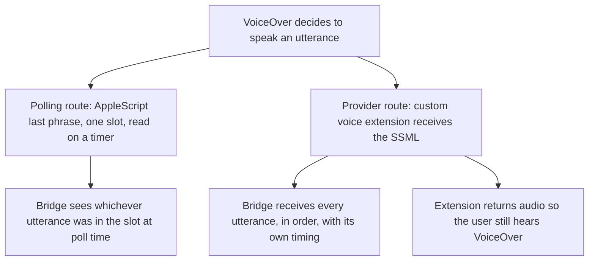

# Spec 0041 — can VoiceOver be made to say what it said?

**Status:** research spike specification. Drafted 2026-08-27, awaiting review.
**This is not an implementation contract**, and it adds no production class. It
specifies an *experiment*: the questions a macOS machine must answer before a
VoiceOver bridge can be designed, the probe that answers each one, and what
counts as a pass. Its output is a Findings section appended to this file, after
which the direction RFC — the VoiceOver analogue of
[spec 0005](0005-multi-reader-direction.md) — can be written against
measurements instead of against Apple's documentation.

## Why this inverts "spec before code"

The workflow is spec first, always. This entry inverts it deliberately, and the
reason should survive review, because an exception is the kind of thing cited
later to skip the rule for worse causes.

Every implementation spec this repo has written was written against a reader
whose source we could read. The `../nvda` checkout is a stated prerequisite in
`CONTRIBUTING.md` precisely so an agent confirms a signature instead of recalling
one. **VoiceOver has no source to read, no plugin API, and no published
extension point for speech.** What it has is an AppleScript dictionary nobody has
transcribed to the open web, and a synthesis API whose behaviour under VoiceOver
is documented one sentence at a time in WWDC slides.

So the ordinary risk profile is reversed. Writing the bridge spec first would
commit a port list, a capability set and a decomposition to assumptions about a
system we cannot inspect from here — and the expensive failure is not a wrong
class name, it is **a bridge built on a capture route that cannot honour the wire
contract it advertises.** That is discovered at the live checklist, after the
ports are cast.

The spike is therefore scoped to be *disposable*: it answers questions and is
deleted. It is versioned anyway, under `spikes/voiceover-capture/`, for the
reason the 2026-08-22 fixture incident established — evidence that cannot be
re-run is weaker than it looks, and a measurement quoted from a scratch
directory is not one anyone else can check.

## What is already known, and how

Established on 2026-08-27, from Windows, by reading the state of the art's
source rather than its documentation.

**Guidepup is the reference implementation for VoiceOver automation, and it
polls.** Its speech read-back is one AppleScript statement:

```applescript
tell application "VoiceOver" to return content of last phrase
```

One string, the *last* one — no buffer, no index, no sequence. What its API
calls `spokenPhraseLog()` is not VoiceOver's log: `VoiceOverClient.ts`
accumulates it **client-side**, polling `last phrase` after each command it
issues, comparing against the previous value, counting stable reads, and sizing
the next delay from `approxWords / APPROX_WORDS_PER_SECOND`. It estimates when
speech settled.

Measured against this repo's contract, that route structurally cannot deliver:

| Our primitive | Why polling cannot honour it |
|---|---|
| `getSpeech(from, to)` | There are no indices. There is one slot. |
| `waitForSpeechToFinish` | "Finished" is a word-count guess, not an event. |
| Timestamps (spec 0028) | The timestamp would be the poll's, not the utterance's. |
| `getEvents` ordering (spec 0040) | Utterances between polls leave no trace to order. |
| Two identical consecutive utterances | Indistinguishable from one, by construction. |

**A better route exists and is not exotic.** Apple's speech synthesis provider
(WWDC23) lets an `AVSpeechSynthesisProviderAudioUnit`, hosted in an app
extension, register voices system-wide — VoiceOver included, which is how
eSpeak-NG and RHVoice ship on macOS. The extension receives **each utterance as
SSML** before rendering audio. That is a per-utterance, ordered, text-faithful
feed: the macOS analogue of spec 0005's JAWS spy-SAPI row, and it yields silent
capture for free by returning silence.

**It is also a synth swap, which is the thing we designed away from.**
[Spec 0008](0008-transparent-silent-capture.md) intercepts *before* the synth
specifically so NVDA's real synthesizer stays loaded and a crashed harness
cannot strand a blind user mute — hard invariant 3. Here the swap **is** the
mechanism: VoiceOver must be pointed at our voice. Every safety question in
group C below exists because of that inversion.

**Enablement is manual, and it moved.** VoiceOver Utility → General → "Allow
VoiceOver to be controlled with AppleScript", backed by
`/private/var/db/Accessibility/.VoiceOverAppleScriptEnabled` and the
`SCREnableAppleScript` key. In Sequoia (15) that plist moved to a sandboxed
Group Container path, which silently broke every CI image that configured the
old one.



## The questions, the probes, and what counts as a pass

Each question is a probe with a stated pass condition, so the Mac session
reports a result rather than an impression. Answers are recorded in Findings
below, with the OS version they were measured on.

### Group E — the environment, recorded before anything is judged

Free to run, and E2 alone may answer several questions in the other groups.

- **E1. What machine is this?** `sw_vers`, the model identifier, and the
  VoiceOver version. *Pass:* recorded verbatim. Everything else in this file is
  true only of the version named here — the Intel line stops at macOS 26, so this
  machine's OS will not advance past whatever E1 reports.
- **E2. What does VoiceOver's AppleScript dictionary actually contain?**
  `sdef /System/Library/CoreServices/VoiceOver.app`, committed to the spike
  directory. *Pass:* the dictionary is in the repo. It is the reference we do not
  otherwise have, and it settles in one shot whether there is an `output` command
  for `announce`, any braille noun, any settable property behind `state` or
  `config`, and what `vo cursor` exposes beyond `text under cursor`.
- **E3. Where does AppleScript enablement live on this version?** *Pass:* the
  path and key are recorded, and toggling the VoiceOver Utility checkbox is
  observed to change them.

### Group A — does a third-party provider see VoiceOver's speech at all?

The route's premise. If A1 fails, the rest of this file is moot and the fallback
in group D becomes the design.

- **A1. Does VoiceOver speak through a custom provider voice?** Build Apple's
  sample provider, register a voice, select it in VoiceOver Utility → Speech.
  *Pass:* VoiceOver audibly speaks through it.
- **A2. Is the feed complete, ordered, and faithful?** Log every
  `synthesizeSpeechRequest` SSML to a file; navigate 10 known items. *Pass:* one
  entry per utterance, in navigation order, and the role and state words a
  screen-reader user hears — "button", "heading level 2", "selected" — present as
  text, rather than having been consumed by VoiceOver before synthesis.
  **This is the question the whole route exists to answer.**
- **A3. Is interruption observable?** Press a key mid-utterance. *Pass:*
  `cancelSpeechRequest()` fires and is distinguishable from a completed
  utterance. This is what makes `waitForSpeechToFinish` an event rather than a
  guess, and what would tell an agent its keystroke landed while the reader was
  still talking.
- **A4. Are two identical consecutive utterances two events?** Speak the same
  item twice. *Pass:* two requests arrive. Polling can never pass this; if the
  provider does, the fidelity gap is demonstrated rather than argued.

### Group C — safety and installability, before anything long-running

Deliberately ordered ahead of group B. C2 governs whether this route may be run
on the maintainer's machine at all.

- **C2. What does VoiceOver do when the provider fails?** Kill the extension
  mid-utterance. *The pass condition is knowledge, not a particular outcome:*
  record whether VoiceOver falls back to a system voice or goes silent. **If it
  goes silent, the swap is permissible only behind a supervisor that restores the
  previous voice in a `finally`** — the macOS rendering of hard invariant 3, and a
  hard precondition on any bridge using this route.
- **C3. Can the voice be restored programmatically?** Is VoiceOver's voice
  settable from AppleScript or `defaults`, or only by hand in VoiceOver Utility?
  *Pass:* a command that sets it, or a recorded "no" — which would mean the
  restore path needs a human, and the route's ergonomics change substantially.
- **C1. What signing does registration require?** *Pass:* recorded as
  free/self-signed, Developer ID, or notarization. This decides whether the thing
  is distributable to anyone but us, and it belongs in the direction RFC rather
  than in a surprise at packaging time.
- **C4. Does audio pass-through work?** Re-synthesize the SSML with
  `AVSpeechSynthesizer` on a system voice and return those buffers. *Pass:* the
  user hears intelligible speech, there is no re-entrancy (our provider is not
  asked to synthesize its own output), and the added latency is measured. Silent
  mode is the easy half — returning silence is free. **Live mode is the half that
  has to work**, because a bridge that can only capture by muting the user is a
  bridge that cannot be left installed.

### Group B — can the capture leave the extension?

The quiet risk. An app extension is sandboxed, and a capture the bridge cannot
read is not a capture.

- **B1. Can the extension open a local socket to the bridge?** *Pass:* a
  connection succeeds, or the sandbox denial is recorded from the log.
- **B2. If not, does an App Group container file work?** The extension appends;
  the Python bridge — an ordinary unsandboxed process with no entitlement — tails
  it. *Pass:* the bridge reads what the extension wrote.
- **B3. What is the handoff inside the extension?** A design note, not a probe:
  the render block is realtime audio and must not do IO, so the SSML is handed to
  a non-realtime thread. Recorded here so it is not later discovered as a glitch.

### Group D — what the fallback actually costs

Measured even if group A passes, so the direction RFC compares two known numbers
rather than one number and one assumption.

- **D1. How lossy is polling, really?** Poll `content of last phrase` while
  navigating 30 items, with the group A provider log running as ground truth.
  *Pass:* a count — utterances the poll missed, duplicated or coalesced, out of
  the total the provider saw. If that number is small, a polling v1 is honest and
  ships far sooner; if it is large, this file has paid for itself.

## Execution order, and the standing safety rule

E → A → C2 → C (rest) → B → D. Environment first because it is free and may
short-circuit later questions; A1 next because it is the premise; **C2 before any
extended run**, because it is the question of whether a crash leaves the
maintainer mute.

The spike drives the maintainer's own screen reader and changes his voice
setting. Therefore, without exception: the previous voice is recorded before the
first swap and restored in a `finally`; the swap is announced before it happens,
not after; and no probe is left running unattended. This is the rule `poe live`
is quarantined behind, and it is not relaxed because the code is throwaway.

## What this spike does not decide

It does not choose the bridge's ports, its capability set, or its decomposition.
It does not settle whether `focus` is answered from VoiceOver's cursor or from
the accessibility tree — a real design question, since those are two different
views and only usually the same answer. It does not touch the wire contract.
Those belong to the direction RFC and the implementation spec that follows it,
both written from the Findings below.

**No class/file layout is given, and that is not an omission.** The workflow
requires one of every spec that adds production classes, as the review gate on
the decomposition. This spec adds none: its entire output is measurements and a
directory that is deleted afterwards. The layout requirement lands in full on the
implementation spec, which is where there will be something to review.

## Decisions this work trips

Recorded so they are proposed explicitly rather than drifting, per hard
invariant 6. None is settled here.

1. **Spec 0005's split trigger** fires on "work on a second reader's bridge
   starting in earnest", which is this. But its stated *reasoning* was that a
   second bridge could not import `nvda_mcp_wire` — C#/COM for JAWS, Kotlin for
   TalkBack. A Python VoiceOver bridge can. The premise does not hold, so the
   trigger wants re-arguing rather than firing.
2. **The `nvda_mcp_wire` rename**, deferred by 0005 until the repo name settled.
   The repo is now `screen-readers-mcp`, and the name becomes actively misleading
   the moment a VoiceOver bridge imports it.
3. **Board placement.** Lane 1 is the NVDA bridge and lane 2 the server; a
   VoiceOver bridge is neither, and whether it is a third lane or a new milestone
   is a structural decision the board reserves. The next free board number is
   11.34; **this spec claims number 0041 and no board number.**

## Findings

*Empty. Filled by the Mac session, one subsection per group, each answer naming
the macOS version from E1.*
