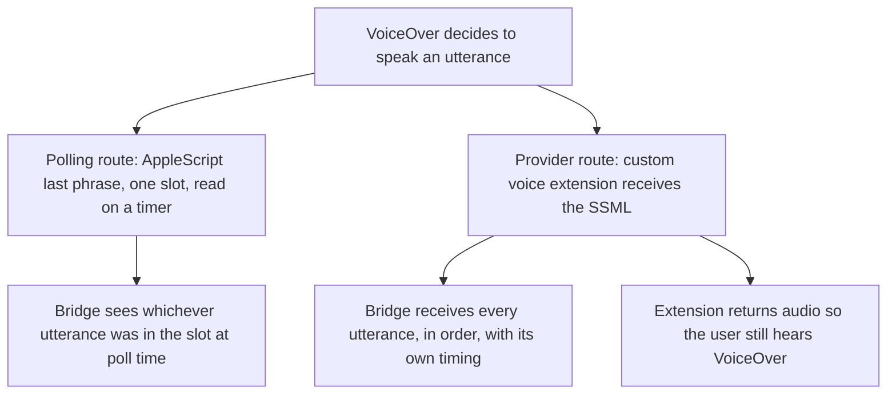

# Spec 0041 — can VoiceOver be made to say what it said?

**Status:** research spike specification. Drafted 2026-08-27; **partially
executed 2026-08-28** on the macOS host — groups E, B and C1 are answered in
Findings below, A1 is answered as far as it can be without VoiceOver itself,
and A2–A4, C2, C4 and D1 have not run. The probes that remain all need the
maintainer to point VoiceOver at the spike's voice, which C4 must precede.
**This is not an implementation contract**, and it adds no production class. It
specifies an *experiment*: the questions a macOS machine must answer before a
VoiceOver bridge can be designed, the probe that answers each one, and what
counts as a pass. Its output is a Findings section appended to this file, after
which the direction RFC — the VoiceOver analogue of
[spec 0005](0005-multi-reader-direction.md) — can be written against
measurements instead of against Apple's documentation.

## Why this inverts "spec before code"

The workflow is spec first, always. This entry inverts it deliberately, and the
reason should survive review, because an exception is the kind of thing cited
later to skip the rule for worse causes.

Every implementation spec this repo has written was written against a reader
whose source we could read. The `../nvda` checkout is a stated prerequisite in
`CONTRIBUTING.md` precisely so an agent confirms a signature instead of recalling
one. **VoiceOver has no source to read, no plugin API, and no published
extension point for speech.** What it has is an AppleScript dictionary nobody has
transcribed to the open web, and a synthesis API whose behaviour under VoiceOver
is documented one sentence at a time in WWDC slides.

So the ordinary risk profile is reversed. Writing the bridge spec first would
commit a port list, a capability set and a decomposition to assumptions about a
system we cannot inspect from here — and the expensive failure is not a wrong
class name, it is **a bridge built on a capture route that cannot honour the wire
contract it advertises.** That is discovered at the live checklist, after the
ports are cast.

The spike is therefore scoped to be *disposable*: it answers questions and is
deleted. It is versioned anyway, under `spikes/voiceover-capture/`, for the
reason the 2026-08-22 fixture incident established — evidence that cannot be
re-run is weaker than it looks, and a measurement quoted from a scratch
directory is not one anyone else can check.

## What is already known, and how

Established on 2026-08-27, from Windows, by reading the state of the art's
source rather than its documentation.

**Guidepup is the reference implementation for VoiceOver automation, and it
polls.** Its speech read-back is one AppleScript statement:

```applescript
tell application "VoiceOver" to return content of last phrase
```

One string, the *last* one — no buffer, no index, no sequence. What its API
calls `spokenPhraseLog()` is not VoiceOver's log: `VoiceOverClient.ts`
accumulates it **client-side**, polling `last phrase` after each command it
issues, comparing against the previous value, counting stable reads, and sizing
the next delay from `approxWords / APPROX_WORDS_PER_SECOND`. It estimates when
speech settled.

Measured against this repo's contract, that route structurally cannot deliver:

| Our primitive | Why polling cannot honour it |
|---|---|
| `getSpeech(from, to)` | There are no indices. There is one slot. |
| `waitForSpeechToFinish` | "Finished" is a word-count guess, not an event. |
| Timestamps (spec 0028) | The timestamp would be the poll's, not the utterance's. |
| `getEvents` ordering (spec 0040) | Utterances between polls leave no trace to order. |
| Two identical consecutive utterances | Indistinguishable from one, by construction. |

**A better route exists and is not exotic.** Apple's speech synthesis provider
(WWDC23) lets an `AVSpeechSynthesisProviderAudioUnit`, hosted in an app
extension, register voices system-wide — VoiceOver included, which is how
eSpeak-NG and RHVoice ship on macOS. The extension receives **each utterance as
SSML** before rendering audio. That is a per-utterance, ordered, text-faithful
feed: the macOS analogue of spec 0005's JAWS spy-SAPI row, and it yields silent
capture for free by returning silence.

**It is also a synth swap, which is the thing we designed away from.**
[Spec 0008](0008-transparent-silent-capture.md) intercepts *before* the synth
specifically so NVDA's real synthesizer stays loaded and a crashed harness
cannot strand a blind user mute — hard invariant 3. Here the swap **is** the
mechanism: VoiceOver must be pointed at our voice. Every safety question in
group C below exists because of that inversion.

**Enablement is manual, and it moved.** VoiceOver Utility → General → "Allow
VoiceOver to be controlled with AppleScript", backed by
`/private/var/db/Accessibility/.VoiceOverAppleScriptEnabled` and the
`SCREnableAppleScript` key. In Sequoia (15) that plist moved to a sandboxed
Group Container path, which silently broke every CI image that configured the
old one.



## The questions, the probes, and what counts as a pass

Each question is a probe with a stated pass condition, so the Mac session
reports a result rather than an impression. Answers are recorded in Findings
below, with the OS version they were measured on.

### Group E — the environment, recorded before anything is judged

Free to run, and E2 alone may answer several questions in the other groups.

- **E1. What machine is this?** `sw_vers`, the model identifier, and the
  VoiceOver version. *Pass:* recorded verbatim. Everything else in this file is
  true only of the version named here — the Intel line stops at macOS 26, so this
  machine's OS will not advance past whatever E1 reports.
- **E2. What does VoiceOver's AppleScript dictionary actually contain?**
  `sdef /System/Library/CoreServices/VoiceOver.app`, committed to the spike
  directory. *Pass:* the dictionary is in the repo. It is the reference we do not
  otherwise have, and it settles in one shot whether there is an `output` command
  for `announce`, any braille noun, any settable property behind `state` or
  `config`, and what `vo cursor` exposes beyond `text under cursor`.
- **E3. Where does AppleScript enablement live on this version?** *Pass:* the
  path and key are recorded, and toggling the VoiceOver Utility checkbox is
  observed to change them.

### Group A — does a third-party provider see VoiceOver's speech at all?

The route's premise. If A1 fails, the rest of this file is moot and the fallback
in group D becomes the design.

- **A1. Does VoiceOver speak through a custom provider voice?** Build Apple's
  sample provider, register a voice, select it in VoiceOver Utility → Speech.
  *Pass:* VoiceOver audibly speaks through it.
- **A2. Is the feed complete, ordered, and faithful?** Log every
  `synthesizeSpeechRequest` SSML to a file; navigate 10 known items. *Pass:* one
  entry per utterance, in navigation order, and the role and state words a
  screen-reader user hears — "button", "heading level 2", "selected" — present as
  text, rather than having been consumed by VoiceOver before synthesis.
  **This is the question the whole route exists to answer.**
- **A3. Is interruption observable?** Press a key mid-utterance. *Pass:*
  `cancelSpeechRequest()` fires and is distinguishable from a completed
  utterance. This is what makes `waitForSpeechToFinish` an event rather than a
  guess, and what would tell an agent its keystroke landed while the reader was
  still talking.
- **A4. Are two identical consecutive utterances two events?** Speak the same
  item twice. *Pass:* two requests arrive. Polling can never pass this; if the
  provider does, the fidelity gap is demonstrated rather than argued.

### Group C — safety and installability, before anything long-running

Deliberately ordered ahead of group B. C2 governs whether this route may be run
on the maintainer's machine at all.

- **C2. What does VoiceOver do when the provider fails?** Kill the extension
  mid-utterance. *The pass condition is knowledge, not a particular outcome:*
  record whether VoiceOver falls back to a system voice or goes silent. **If it
  goes silent, the swap is permissible only behind a supervisor that restores the
  previous voice in a `finally`** — the macOS rendering of hard invariant 3, and a
  hard precondition on any bridge using this route.
- **C3. Can the voice be restored programmatically?** Is VoiceOver's voice
  settable from AppleScript or `defaults`, or only by hand in VoiceOver Utility?
  *Pass:* a command that sets it, or a recorded "no" — which would mean the
  restore path needs a human, and the route's ergonomics change substantially.
- **C1. What signing does registration require?** *Pass:* recorded as
  free/self-signed, Developer ID, or notarization. This decides whether the thing
  is distributable to anyone but us, and it belongs in the direction RFC rather
  than in a surprise at packaging time.
- **C4. Does audio pass-through work?** Re-synthesize the SSML with
  `AVSpeechSynthesizer` on a system voice and return those buffers. *Pass:* the
  user hears intelligible speech, there is no re-entrancy (our provider is not
  asked to synthesize its own output), and the added latency is measured. Silent
  mode is the easy half — returning silence is free. **Live mode is the half that
  has to work**, because a bridge that can only capture by muting the user is a
  bridge that cannot be left installed.

### Group B — can the capture leave the extension?

The quiet risk. An app extension is sandboxed, and a capture the bridge cannot
read is not a capture.

- **B1. Can the extension open a local socket to the bridge?** *Pass:* a
  connection succeeds, or the sandbox denial is recorded from the log.
- **B2. If not, does an App Group container file work?** The extension appends;
  the Python bridge — an ordinary unsandboxed process with no entitlement — tails
  it. *Pass:* the bridge reads what the extension wrote.
- **B3. What is the handoff inside the extension?** A design note, not a probe:
  the render block is realtime audio and must not do IO, so the SSML is handed to
  a non-realtime thread. Recorded here so it is not later discovered as a glitch.

### Group D — what the fallback actually costs

Measured even if group A passes, so the direction RFC compares two known numbers
rather than one number and one assumption.

- **D1. How lossy is polling, really?** Poll `content of last phrase` while
  navigating 30 items, with the group A provider log running as ground truth.
  *Pass:* a count — utterances the poll missed, duplicated or coalesced, out of
  the total the provider saw. If that number is small, a polling v1 is honest and
  ships far sooner; if it is large, this file has paid for itself.

## Execution order, and the standing safety rule

E → A → C2 → C (rest) → B → D. Environment first because it is free and may
short-circuit later questions; A1 next because it is the premise; **C2 before any
extended run**, because it is the question of whether a crash leaves the
maintainer mute.

The spike drives the maintainer's own screen reader and changes his voice
setting. Therefore, without exception: the previous voice is recorded before the
first swap and restored in a `finally`; the swap is announced before it happens,
not after; and no probe is left running unattended. This is the rule `poe live`
is quarantined behind, and it is not relaxed because the code is throwaway.

## What this spike does not decide

It does not choose the bridge's ports, its capability set, or its decomposition.
It does not settle whether `focus` is answered from VoiceOver's cursor or from
the accessibility tree — a real design question, since those are two different
views and only usually the same answer. It does not touch the wire contract.
Those belong to the direction RFC and the implementation spec that follows it,
both written from the Findings below.

**No class/file layout is given, and that is not an omission.** The workflow
requires one of every spec that adds production classes, as the review gate on
the decomposition. This spec adds none: its entire output is measurements and a
directory that is deleted afterwards. The layout requirement lands in full on the
implementation spec, which is where there will be something to review.

## Decisions this work trips

Recorded so they are proposed explicitly rather than drifting, per hard
invariant 6. None is settled here.

1. **Spec 0005's split trigger** fires on "work on a second reader's bridge
   starting in earnest", which is this. But its stated *reasoning* was that a
   second bridge could not import `nvda_mcp_wire` — C#/COM for JAWS, Kotlin for
   TalkBack. A Python VoiceOver bridge can. The premise does not hold, so the
   trigger wants re-arguing rather than firing.
2. **The `nvda_mcp_wire` rename**, deferred by 0005 until the repo name settled.
   The repo is now `screen-readers-mcp`, and the name becomes actively misleading
   the moment a VoiceOver bridge imports it.
3. **Board placement.** Lane 1 is the NVDA bridge and lane 2 the server; a
   VoiceOver bridge is neither, and whether it is a third lane or a new milestone
   is a structural decision the board reserves. The next free board number is
   11.34; **this spec claims number 0041 and no board number.**

## Findings

Measured on **macOS 15.0 (Sequoia), build 24A335**, on 2026-08-28. Every answer
below is true of that version and that machine; where a result is known to be
version-sensitive it says so. Probes that have not run yet say so explicitly
rather than being omitted, so the gaps are visible.

The instrument is `spikes/voiceover-capture/`: the dictionary dump, and a
speech-synthesis provider (`provider/`) built by a 120-line shell script with no
Xcode project, so every bundle key and signing decision is readable in the diff.

### Group E — the environment

**E1 — what machine is this? (pass)**

| | |
|---|---|
| OS | macOS 15.0 (Sequoia), build 24A335 |
| Model | MacBookPro15,4 |
| CPU | Intel Core i5-8257U, `x86_64` |
| VoiceOver | version 10, bundle version 958.0.3 |
| Toolchain | Xcode 16.0 (16A242d), Swift 6.0, macOS 15.0 SDK |

The Intel line stops at macOS 26, so this machine will not advance far past what
is recorded here. Two consequences already showed up in the logs below: Apple's
own `WardaSynthesizer_arm64.appex` fails to launch on this host every cycle, and
that failure is *not* ours even though it appears in the same log lines.

**E2 — what is in VoiceOver's AppleScript dictionary? (pass)**

Committed verbatim as `spikes/voiceover-capture/VoiceOver.sdef` (288 lines, one
suite, 8 classes, 11 commands, 8 enumerations). It is the reference this repo
otherwise does not have, and it settles several questions in one shot.

What it *has*:

- **`output`** (`VOASoutp`) — make VoiceOver speak arbitrary text, or one of five
  *outputables*: mouse summary, workspace overview, window overview, web
  overview, **announcement history**. Optional `with alphabetic spelling` /
  `phonetic spelling`. So an `announce` primitive exists, and is not a keystroke.
- **`perform command`** (`VOASperC`), whose direct parameter is documented as
  *"The English name of the VoiceOver command to perform"* — a command route that
  is neither keystroke injection nor a fixed enumeration.
- **`vo cursor`** — `bounds`, `text under cursor` (read-only), `magnification`
  (read/write), plus `move` (by direction, containment, or to one of eight
  places), `select`, `perform action`, and `grab screenshot`, which returns a
  path to a PNG.
- **`keyboard cursor`** — `bounds` and `text under cursor`, separate from the VO
  cursor. This is the distinction spec 0041 said it would not settle, visible in
  the dictionary: these are two cursors, and `focus` must choose.
- **`last phrase`** — `content` (read-only text), plus `save` and
  `copy to pasteboard`.
- Mouse control (`click`, `press`, `release`, `position`), menus
  (`open`, `close menu`), and `quit`.

What it does **not** have, which matters more:

- **No index, no timestamp, no history, no sequence on `last phrase`.** One
  read-only string. The polling route's central limitation is visible in the
  dictionary itself, before a single measurement.
- **No braille content anywhere.** `braille window` exposes exactly one
  property — `enabled` (read/write) — and so does `caption window`. Both can be
  shown or hidden and neither can be read. A VoiceOver bridge therefore has no
  AppleScript route to braille at all, which is a capability question for the
  direction RFC rather than an implementation detail.
- **No speech settings of any kind** — no voice, rate, pitch, punctuation or
  verbosity; no `state` or `config` noun. See C3.

**E3 — where does AppleScript enablement live on Sequoia? (pass)**

Both locations are written, and both were touched at the same moment the
maintainer ticked the VoiceOver Utility checkbox (17:56 local), which is the
toggle observation the probe asked for:

- `~/Library/Group Containers/group.com.apple.VoiceOver/Library/Preferences/com.apple.VoiceOver4/default.plist`,
  key `SCREnableAppleScript` = `true`.
- `/private/var/db/Accessibility/.VoiceOverAppleScriptEnabled` — still present on
  15.0, owned by `root:wheel`, mode `444`, containing the single byte `a`.

So the Sequoia move is an *addition*, not a replacement: a checker that reads
only the old path still sees the right answer on this version, which is exactly
why the CI breakage this file mentions was silent.

The round trip works. `tell application "VoiceOver" to return content of last phrase`
returned a full sentence, and `text under cursor of vo cursor` returned the
focused item.

**Locale is a first-class hazard here.** Both strings came back in Brazilian
Portuguese, because that is the machine's VoiceOver language — for example the
last phrase was *"Você está em um item do tipo coleção…"*. This is the macOS
instance of the rule `scripts/live_pages/README.md` already states: expected
strings are machine-specific, so a VoiceOver bridge's tests compare structure,
never text.

### Group A — does a third-party provider see VoiceOver's speech?

**A1 — is a custom provider voice registrable and published? (pass, in the part
that does not need VoiceOver)**

A speech synthesis provider was built from scratch — no Apple sample, no Xcode
project — and the bundle shape was taken from Apple's own providers on this
machine (`SiriAUSP.appex`, `MauiAUSP.appex`, read with `plutil`) rather than from
documentation. That shape is: package type `XPC!`, extension point
`com.apple.AudioUnit-Speech`, one `AudioComponents` entry of type `ausp` tagged
`Speech Synthesizer`, and `NSExtensionPrincipalClass` naming an
`AUAudioUnitFactory`.

The voice is now published system-wide: it appears in
`AVSpeechSynthesisVoice.speechVoices()` (191 voices, up from 190) and in
`say -v '?'`, and the extension's own log confirms the system reads our voice
list.

**Three traps, each of which failed silently, and each of which is a design
constraint rather than a build detail:**

1. **A speech provider must be sandboxed.** An unsandboxed extension is not
   rejected with an error to the caller; `pluginkit -a` returns success and
   nothing appears. The reason is only in `pkd`'s log:
   *"Ignoring mis-configured plugin …: plug-ins must be sandboxed"*.
2. **A speech provider must NOT hold a network entitlement.** With
   `com.apple.security.network.client` present, the extension registered, was
   launched, and its audio unit was constructed — and the system still never
   asked it for its voices, logging
   *"Skipping network entitled extension"* from `AXTTSCommon`. Removing that one
   entitlement was the entire difference between 190 voices and 191. **This
   answers B1 before B1 was reached, and it answers it structurally:** a provider
   that talks to the network is not a provider macOS will use. The privacy logic
   is obvious in hindsight — a voice provider sees everything the user reads.
3. **`AudioComponentBundle` breaks it.** Declaring that key (which asks clients
   to dlopen the unit *in their own process*) stopped the voice working
   altogether — not even enumeration survived. Consistent with library
   validation: the clients are Apple-signed, our framework is ad-hoc signed. The
   flag `--in-process` reproduces the failure on demand.

The system also **rewrites the voice identifier**. The unit declares
`org.screen-readers-mcp.spike.capture`; what is published is
`org.screen-readers-mcp.spike.capture.voice.org.screen-readers-mcp.spike.capture`
— the extension's bundle id, then ours. Anything that resolves a provider voice
must match by suffix, never by the identifier it declared.

**A1 proper — does VOICEOVER speak through it? (PASS)** The maintainer selected
"Capture Spike" in VoiceOver Utility on 2026-08-28 and VoiceOver spoke through
it. From that moment the extension received every utterance as SSML, before any
audio existed. The premise of the entire route is confirmed on macOS 15.0.

Worth recording that two ordinary clients still cannot use the voice —
`say -v "Capture Spike"` and a small `AVSpeechSynthesizer` program both fail with
`CoreSynthesizer` logging *"Utterance encountered error, next fallback state:
retrySameVoice / retryFallbackVoice"*, and fall back silently. **VoiceOver uses a
path those clients do not.** For a VoiceOver bridge that is sufficient; for
anything wanting to test the provider without the reader, it is a trap, because
the failure is silent and looks like the voice does not work at all.

**A2 — is the feed complete, ordered and faithful? (PASS, and richer than
hoped)** A real navigation session produced 62 utterances. The role and state
words a screen-reader user hears are present *as text* — "botão", "área de
rolagem", "tabela", "(1 de 31)", "selecionado" — and so is the full hint text.
Nothing was consumed by VoiceOver before synthesis.

It also carries what VoiceOver *means to do with its voice*:

```
<speak><prosody rate="160.00002%"><prosody pitch="-40.0%">Data de Modificação</prosody></prosody></speak>
```

The outer `rate` is the user's speech rate; the inner `pitch` is VoiceOver
lowering its voice for a column header. `<break time="250ms"/>` and
`<break time="60ms"/>` mark its pauses. That is *prosodic meaning* — information
a polling read of `last phrase` discards entirely, because it is not in the
words.

**One absence matters for design: there is no `xml:lang`.** VoiceOver's SSML does
not say what language it is speaking. Anything re-synthesizing or routing by
language must get that from elsewhere; taking "unknown" as licence to pick a
default is how this spike read Portuguese aloud in Arabic for several minutes.

**A3 — is interruption observable? (PASS)** `cancelSpeechRequest()` fires and is
cleanly distinguishable from completion. In practice VoiceOver cancels before
*every* new utterance, so cancellation is the normal path rather than the
exception — which is itself the design note: a bridge must not treat "cancelled"
as "something went wrong".

**A4 — are two identical consecutive utterances two events? (PASS)** Of 62
utterances, 36 were distinct and **six were byte-identical to the one
immediately before**. Each arrived as its own numbered event. Polling cannot
distinguish those six from silence, by construction; the provider does it
without effort.

**Sequence numbers are per PROCESS, not per session.** The counter restarts
whenever the extension is relaunched — which the system does freely. A bridge
must number utterances on its own side, or accept that its ordering resets under
it without warning.

### Group B — can the capture leave the extension?

**B1 — can the extension open a local socket? (answered, and the answer is
worse than "no")** Not merely denied: *asking* disqualifies the extension, per
trap 2 above. A VoiceOver bridge on this route cannot use TCP or a network
socket between extension and bridge, at all.

**B2 — does a file handoff work? (pass, and no App Group is needed)** The
sandboxed extension appends JSON lines to
`~/Library/Containers/org.screen-readers-mcp.spike.capture.voice/Data/voiceover-capture-spike.jsonl`,
mode `644`, owned by the user — and an ordinary unsandboxed process reads it with
no entitlement. The App Group container was requested in the entitlements and
turned out to be unnecessary for this direction.

The remaining unknown is the *reverse* direction and the tail latency, neither of
which has been measured.

**B3 — the realtime handoff (design note, honoured).** The render block clears
its buffer and touches one lock-protected integer; every log write happens on the
`synthesizeSpeechRequest` thread instead. No IO and no allocation on the audio
thread.

### Group C — safety and installability

**C1 — what signing does registration require? (pass: none, for local use)** The
extension is **ad-hoc signed** (`codesign --sign -`), has **no Developer ID, no
notarization, no provisioning profile and no Team ID**, and its containing app
lives in a build directory inside this repo rather than in `/Applications`. It
registers and publishes a system-wide voice. Registration needs `lsregister -f`
on the app followed by `pluginkit -a` on the extension; `lsregister` alone was
not enough. What this does *not* tell us is what distribution to anyone else
would cost, which stays an open question for the direction RFC.

**C2 — what does VoiceOver do when the provider fails? (PASS, and the answer is
the safe one)** Answered by accident, several times over, by killing the
extension process while VoiceOver was using the voice: **VoiceOver falls back to
a working voice. It does not go silent.** The macOS analogue of hard invariant 3
holds without the bridge doing anything, which makes this route considerably less
dangerous than the spec assumed when it insisted C4 come first.

**But recovery is not automatic, and this is an operational cost with no NVDA
equivalent.** After the provider dies, VoiceOver cannot resolve the voice again:
it logs *"Babelfish falling back to defaults due to missing identifier"* on every
utterance and the voice disappears from its list, while the rest of the system
still lists it happily (`say -v '?'` and `AVSpeechSynthesisVoice.speechVoices()`
both show it). Only **restarting VoiceOver** restores it. So:

- Updating the provider means restarting the screen reader.
- A provider crash costs the user their chosen voice until they restart it.
- A bridge cannot repair this from outside; nothing short of a reader restart
  re-binds the voice.

**C3 — can the voice be restored programmatically? (pass, by a route the
dictionary does not show)** The AppleScript *dictionary* exposes no speech
settings at all (E2), which is where this answer stood at first. The command
table does: `open next speech attribute guide` /
`open previous speech attribute guide` choose which speech attribute is being
adjusted, and `select next option down` / `up in speech attribute guide` change
its value. That is the voice rotor, reachable through `perform command`, so the
voice can be set and restored without a human — subject to the large caveat that
**issuing those particular commands is what killed the scripting channel**, under
"the input half" below. The preferences plist still carries no voice key while
the voice is at its default, so the stored key's name remains unknown.

**C4 — does audio pass-through work? (pass, outside the extension; unproven
inside it)** The unit no longer renders silence. Each utterance's SSML is
re-spoken with an ordinary Apple voice and those samples are returned, so
capturing does not cost the user their speech. Silence is still available, but it
is now **opt-in** behind a marker file rather than the default — the default
cannot be the setting that mutes a screen reader.

Measured by driving the re-synthesis directly, three consecutive utterances in
pt-BR on macOS 15.0:

| | |
|---|---|
| Re-spoken with | `com.apple.eloquence.pt-BR.Reed`, chosen automatically |
| Added latency, first sample | 0.218 s, 0.216 s, 0.220 s |
| Wall time for ~2 s of speech | 0.28 s, 0.30 s, 0.26 s |
| Audio | 22050 Hz mono float32, peak ≈ 0.57, no clipping, audibly intelligible |
| Realtime contention drops | 0 |

Two details are load-bearing rather than incidental. The re-synthesis voice is
chosen by **excluding any voice whose identifier ends in ours**, so re-entrancy
is impossible by construction rather than by naming an Apple voice that may not
exist on another machine. And the language comes from the SSML's `xml:lang`, not
from what our voice declares: VoiceOver speaks the user's language, so trusting
our own declaration would have re-spoken Portuguese with an English voice.

`AVSpeechSynthesizer` does work inside the sandboxed extension — proven by
VoiceOver speaking through it for an hour. But making it sound *right* took six
rounds against a live reader, and what those rounds found is the most transferable
part of this whole spike, because none of it is guessable from the documentation.

**The host does not pull audio in realtime. It renders the utterance offline, as
fast as it can ask.**

This is the finding. Everything else below is a consequence of it, and it was
found only by measuring rather than reasoning — three plausible explanations were
wrong first.

The render block is handed a request for exactly *n* samples and must return
exactly *n*. Its only other channel is an `OSStatus`, and a non-zero one means the
utterance failed, not "ask again shortly". **There is no "not ready yet".** So
when the audio does not exist, the choices are to return silence or to wait — and
returning silence does not drop those blocks, it *bakes them into the utterance*.
A listener hears a sentence with holes punched through it and a clean tail, since
by the time the end is requested the audio exists. The maintainer's description,
before any of this was understood, was "from *rolagem* until before *seta para
cima* it glitched" — which is that shape exactly.

The measurement that settled it, on an eleven-second help message:

| | |
|---|---|
| Frames produced by the synthesizer | 242,688 (11.01 s) |
| Frames delivered to the host | 242,688 |
| Frames dropped, frames left over | 0, 0 |
| Production rate | **24.4× realtime** |
| Render calls that came up short | **923** |

Production and delivery balance perfectly, so nothing is being lost — and 923
short answers anyway. Both can only be true if the host asks faster than any
producer could answer. **A head start cannot fix that, at any size**, which is
why three rounds of larger buffers did not help.

Two fixes follow, and the second is only legitimate *because* of the finding:

1. **Wait for the whole utterance before answering.** At 24× realtime, eleven
   seconds of speech is 0.45 s of work. Underruns went from 923 to **0**, and the
   maintainer's verdict went from "glitched a lot" to "no glitch". Cost: ~0.42 s
   before long sentences, which he judged acceptable.
2. **Or wait inside the render block.** Normally forbidden — a render block runs
   on the audio thread against a deadline, and blocking it stalls everything the
   machine plays. But *this host has no deadline*, so waiting is safe, and it
   starts playback as soon as the first samples exist instead of after the whole
   sentence. It must stay bounded, so that a host which does pull in realtime
   degrades to the old behaviour rather than stalling.

**The other findings from those rounds, each of which cost a live round to
learn:**

- **The extension starts in the background CPU band.** `runningboardd` parks it
  at `PRIO_DARWIN_BG`, and a dispatch queue's QoS does not undo it — it is
  process-wide. Re-synthesis ran at ~1× realtime under it and **24×** after
  `setpriority(PRIO_DARWIN_PROCESS, 0, 0)`. A provider that does real work must
  leave that band explicitly.
- **Do not reuse one `AVSpeechSynthesizer` across utterances.** VoiceOver cancels
  before every utterance, so a shared instance is asked to stop and then
  immediately to write again; that combination stalled for ~10 seconds at a time.
  One synthesizer per utterance, with the outgoing one stopped off to the side.
- **Completion needs a backstop.** `write(_:toBufferCallback:)` signals the end
  with a zero-length buffer; when that does not arrive, the unit never reports
  the utterance complete and the host pulls silence from a ring that will never
  fill. The synthesizer's delegate says the same thing by a second route.
- **Speech does not end at a zero crossing.** Utterances that simply stop —
  including every cancellation, which is *every* utterance here — click audibly.
  A ~6 ms ramp at each boundary removes it. In an attended session this is a
  defect, not a polish item.
- **The output format is settled by the host**, at `allocateRenderResources`, and
  is not necessarily what the unit declared. Converting to the wrong one is heard
  as glitching and wrong pitch rather than reported as an error. Measured here:
  22050 Hz, mono, non-interleaved, 256 frames maximum per render call.

**A correction that belongs in the record.** Partway through, this session argued
that audio quality was a comfort property rather than a correctness one, on the
grounds that a testing session runs silent. The maintainer rejected that: the
design commits to **silent and non-silent modes, in attended and unattended
scenarios**, and in an attended session a person is listening while an agent
drives. The voice *is* the product there. Every audio fix above exists because
that push-back was right.

### Group D — what the fallback costs

**D1 — not yet run.** It needs the provider feed as ground truth, so it follows
A2. What the dictionary already tells us (E2) is that the polling route's ceiling
is lower than the guidepup implementation suggests: one read-only string, and no
braille at all.

### Beyond the spec's questions — the input half

Not asked for by this file, which is about *capture*, and added on 2026-08-28 at
the maintainer's request: an agent that can drive VoiceOver stops needing a human
for several of the remaining probes. The instrument is
`spikes/voiceover-capture/drive.sh`.

**VoiceOver dispatches commands by English NAME, and the vocabulary is a table
inside the framework.**
`/System/Library/PrivateFrameworks/ScreenReader.framework/Versions/A/Resources/SCRStringsToCommandsMap.scrconfig`
is an XML plist of **415 entries** on macOS 15.0, mapping a phrase to an internal
selector — `"describe item in voiceover cursor"` to
`SCRApplication.focusedElementOverview`, and so on. It is undocumented, and it is
the closest thing VoiceOver has to the bridge's gesture port.

It is a better primitive than key injection: the reader does its own dispatch, so
nothing races with whatever else holds the keyboard, and **an unknown command
fails cleanly** — `Command does not exist (6)` — which is the property this repo
already wants from `Request.cmd`.

**The two halves of input cost different permissions, and that is a design
lever.**

| Capability | Permission needed |
|---|---|
| `perform command`, `output`, reading `last phrase` | AppleEvents access to VoiceOver |
| Typing text, pressing keys anywhere | **Accessibility** (`kTCCServiceAccessibility`) |

Windows has no equivalent gate, so the NVDA bridge has no analogue: **a VoiceOver
bridge that never types need not ask for Accessibility at all.** Without it,
`System Events` refuses with *"osascript não tem permissão para acionar teclas
(1002)"*.

One wrinkle specific to remote work, recorded because it is baffling the first
time: **when the request comes from an SSH session, macOS attributes it to
`/usr/libexec/sshd-keygen-wrapper`**, not to the app that made it. The consent
dialog names something that looks unrelated to what you were doing, and granting
it grants every SSH session on the machine.

With Accessibility granted, typing works — and **the target application rewrites
what was typed**. Two lines sent to TextEdit came back autocapitalized. "Send
this keystroke" is not "this text arrives", and a harness comparing typed input
against observed output has to expect the app's own substitutions.

**The read-back channel is fragile, and that matters more than any of the
above.** After `open next speech attribute guide` was issued six times in a row,
every VoiceOver-specific call began failing — `last phrase`, `text under cursor`,
`output` and `perform command` alike, with `-1728` / `-1708` — while
`tell application "VoiceOver" to return name` still answered, `SCREnableAppleScript`
was still `true`, and the process was still running. **VoiceOver's scripting
object model died without VoiceOver dying**, silently, with nothing failing until
the next call. Escape did not recover it; quitting and restarting VoiceOver
recovered it completely.

A bridge on this route must treat "the reader answers its own name but not its
own state" as a distinct, detectable condition and report it — rather than
returning an empty read-back, which is what a naive implementation would do.

**`last phrase` is not one phrase.** After the restart it returned the whole
startup announcement and the focused item as a single string — *"VoiceOver
ativado. Cortina de tela ativada Finder Sem Título janela visualização por lista
tabela Linha 49 de 52 Xcode Aplicativo…"*. It is the last output *request*, which
may carry an entire sequence. Richer than "one word", and still one slot.

**D1, in miniature, measured by accident, and worth more than a careful run would
have been.** Three consecutive `move right` commands, each followed by polling
`last phrase` until it changed:

| Move | Result |
|---|---|
| 1 | changed after **308 ms**, on the first poll |
| 2 | **never changed** — 201 polls over 22.9 s |
| 3 | AppleEvent timeout (`-1712`) after 124 s, blocked behind a system dialog |

Move 2 is probe A4 on the real system: the new utterance was *identical* to the
previous one, and polling cannot tell that from silence. The `walk` output shows
it plainly — four moves produced two distinct strings. A polling bridge either
misses repeats or invents them.

**VoiceOver crashes on this machine as a matter of course.** Five crash reports
in `~/Library/Logs/DiagnosticReports/` on 2026-08-28 alone (08:10, 08:31, 08:39,
13:00, 17:54), all *before* this spike started, and the maintainer confirms it is
routine. VoiceOver restarted under us at least once during these probes. So
"the reader restarts underneath the bridge" is not an edge case to handle
eventually on macOS; it is the normal weather, and it is a sharper requirement
than anything NVDA imposed.

### What changed about the plan

Two orderings in this spec did not survive contact, and both are recorded here
rather than quietly fixed:

1. **Group B moved to the front.** It was written as "the quiet risk", to be
   answered after the feed was proven. In practice the sandbox is a precondition
   for the extension existing at all, and the network entitlement question
   decides whether the extension can be *used* — so B1 and B2 were answered
   before A1 finished.
2. **C4 now precedes C2.** The spec put C2 first because it is the safety
   question; on a machine whose owner depends on VoiceOver, the safe order is to
   make the voice audible *before* selecting it, not to select it and observe
   what silence does.

