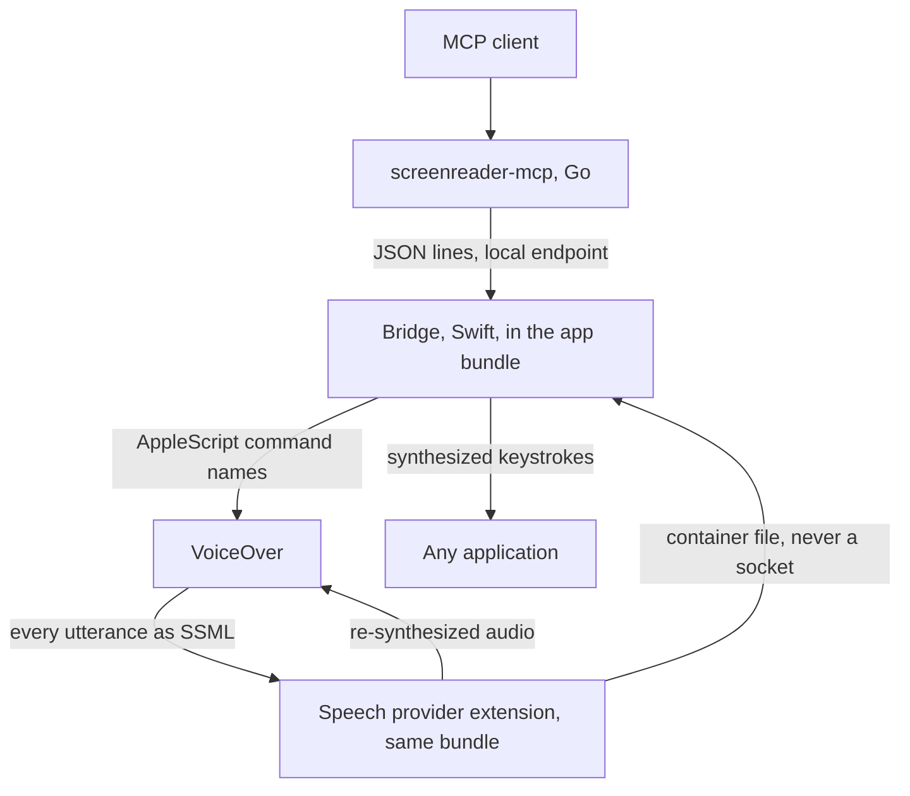

# Spec 0043 — the VoiceOver bridge is one Swift bundle

**Status:** direction RFC, drafted 2026-08-28 from the measurements in
[spec 0041](0041-can-voiceover-say-what-it-said.md), awaiting review. This is the
VoiceOver analogue of [spec 0005](0005-multi-reader-direction.md): it settles
*shape and language*, not classes. **No class/file layout is given, and that is
not an omission** — this spec adds no production class. The layout requirement
lands in full on the implementation spec that follows it, which is where there
will be something to review.

It is written against a working prototype rather than against Apple's
documentation. Every claim below traces to a measurement in spec 0041's Findings,
taken on macOS 15.0 (24A335) with a live VoiceOver on 2026-08-28.

## The decision

**One Swift bundle, containing everything the reader edge needs.** A single
distributable `.app` that holds:

1. **The speech provider** — an `.appex` hosting an `AVSpeechSynthesisProviderAudioUnit`. This is the capture: VoiceOver hands it every utterance as SSML before any audio exists.
2. **The bridge** — the process that speaks the wire contract to `screenreader-mcp`, owns the local endpoint, and drives VoiceOver.
3. **The input path** — AppleScript for VoiceOver's own commands, and synthesized keystrokes for everything else.
4. **The control dialog** — the macOS counterpart of [spec 0011](0011-bridge-control-ui.md).
5. **Permission acquisition** — the bundle asks, as itself, for what it needs.

The Go server connects to the Swift bridge exactly as it connects to the Python
one: JSON lines over a local endpoint, `hello` comparing `PROTOCOL_VERSION`. The
server core stays reader-agnostic, per spec 0005.

## Why Swift, and why the bridge follows the provider

**The provider cannot be Go or Python**, and this is a constraint rather than a
preference. It ships as a macOS app-extension bundle, which Go cannot produce.
It hosts a render callback the system calls for audio, in which allocation and
blocking are normally forbidden — no garbage-collected runtime belongs there. So
the capture half is Swift, C/C++ or Rust.

Given that, **the bridge follows the provider into Swift** for a reason that is
about deployment rather than taste: the provider must live inside an app bundle
to be installable at all, and that bundle is then the natural home for everything
else the reader edge needs — the endpoint, the dialog, the permission prompts.
Splitting the bridge into a second language would mean shipping two artifacts
where macOS wants one, and would put a process boundary between the extension's
capture file and the thing that reads it, for no gain.

The wire contract gains a second hand-written binding, in Swift, alongside the
generated Go one. That is the cost, and it is the cost spec 0005 anticipated when
it said what is shared between implementations is *the contract, not code*.

## Three places macOS differs from what the NVDA specs assume

These are corrections, raised explicitly rather than discovered during
implementation.

**1. There are no named pipes.** [Spec 0010](0010-named-pipe-transport.md) is
Windows-shaped: `\\.\pipe\nvdaMcpBridge` has no macOS equivalent. The macOS
counterpart of "a local endpoint that is not the network" is a **Unix domain
socket** — a filesystem path with filesystem permissions, which is the property
spec 0010 actually wanted. **Recommended default: a Unix domain socket**, with
**loopback TCP on `127.0.0.1` as the alternative**, chosen in the control dialog,
mirroring the Windows split rather than copying its mechanism.

**2. The extension cannot use the network, at all.** Measured: an extension
holding `com.apple.security.network.client` is silently skipped by macOS — the
voice never appears, and the only evidence is `Skipping network entitled
extension` in the system log. So the extension→bridge handoff is **a file in the
extension's own container**, which an ordinary unsandboxed process reads with no
entitlement. This is not a fallback; it is the only door. The bridge, which is
not sandboxed, is free to use whichever endpoint the dialog selects.

**3. Permissions are a first-class feature, not a setup note.** The bundle needs,
and should ask for, in this order:

| Capability | Permission | When |
|---|---|---|
| Read `last phrase`, drive VoiceOver commands, `output` | Automation (AppleEvents) for VoiceOver | on first connect |
| Type text, press keys in other apps | **Accessibility** | only if the session asks to type |
| Publish the capture voice | none | — |

**Accessibility should be requested lazily**, because a bridge that never types
never needs it, and it is the widest grant of the three. This is a macOS-only
design lever with no NVDA analogue: Windows has no such gate.

Also worth stating in the dialog: on macOS the user must **enable AppleScript
control of VoiceOver by hand** (VoiceOver Utility → General), and no API can do
it for them. On Sequoia the setting is written to both
`~/Library/Group Containers/group.com.apple.VoiceOver/…/default.plist`
(`SCREnableAppleScript`) and the legacy
`/private/var/db/Accessibility/.VoiceOverAppleScriptEnabled`.

## What the dialog must carry

Everything [spec 0011](0011-bridge-control-ui.md) gives the NVDA bridge —
endpoint selection, connection state, the session's activity — plus three things
that exist only here:

- **Whether AppleScript control of VoiceOver is enabled**, with instructions,
  since the bridge cannot enable it and cannot work without it.
- **Which permissions are granted**, and a way to trigger the requests.
- **Whether the capture voice is selected in VoiceOver**, which the bridge can
  detect (utterances arriving) and cannot set without driving the reader.

## The costs this route carries, stated up front

Not objections — they are true, they are measured, and an implementation spec
must answer them rather than discover them.

- **Updating the provider costs a VoiceOver restart.** Killing the extension
  makes VoiceOver fall back to a working voice — it does not go mute, which is
  the safe half — but VoiceOver then cannot resolve the voice again until it
  restarts, logging `Babelfish falling back to defaults due to missing
  identifier` meanwhile. Every update, for every user.
- **Capture costs latency.** The host renders utterances *offline*, faster than
  realtime, and the render block has no way to say "not ready" — so audio must
  exist before it is asked for. Measured: about 0.17 s before speech in the
  best configuration found, 0.42 s in the simplest correct one. The maintainer
  judged both acceptable while listening.
- **VoiceOver's AppleScript surface can die while VoiceOver lives.** Every
  reader-specific call fails while the app still answers its own name. Only a
  reader restart recovers it. The bridge must detect this and report it, rather
  than returning empty read-backs.
- **VoiceOver crashes routinely.** Five crash reports on the maintainer's machine
  on 2026-08-28 alone, before any of this work started. "The reader restarts
  underneath the bridge" is normal weather on macOS, not an edge case.

## What this spec does not decide

- **The class/file layout**, which belongs to the implementation spec.
- **Distribution.** Registration needs no Developer ID, no notarization and no
  Team ID for local use; what shipping to other people costs was not measured.
- **Whether `focus` answers from VoiceOver's cursor or the accessibility tree.**
  The dictionary exposes both a `vo cursor` and a separate `keyboard cursor`,
  each with its own `text under cursor`. They are two views and only usually
  agree.
- **Braille.** VoiceOver's AppleScript exposes no braille content at all — the
  braille window has exactly one property, `enabled`. Whether a VoiceOver bridge
  advertises a braille capability at all is an open question.

## Decisions this trips, still open

Carried forward from spec 0041 and unchanged by this RFC:

1. **Spec 0005's split trigger** fires on "a second reader's bridge starting in
   earnest". Its stated reasoning was that a second bridge could not import
   `nvda_mcp_wire`; a Swift bridge indeed cannot, so the trigger's premise now
   holds where spec 0041 doubted it. It still wants arguing rather than firing by
   default.
2. **The `nvda_mcp_wire` rename**, deferred by 0005 until the repo name settled.
   The repo is `screen-readers-mcp`, and a Swift binding of a module named
   `nvda_mcp_wire` is actively misleading.
3. **Board placement.** Lane 1 is the NVDA bridge, lane 2 the server; this is
   neither. This spec claims number 0043 and **no board number**, for the same
   reason 0041 claimed none: taking one would decide the lane question by
   accident.
