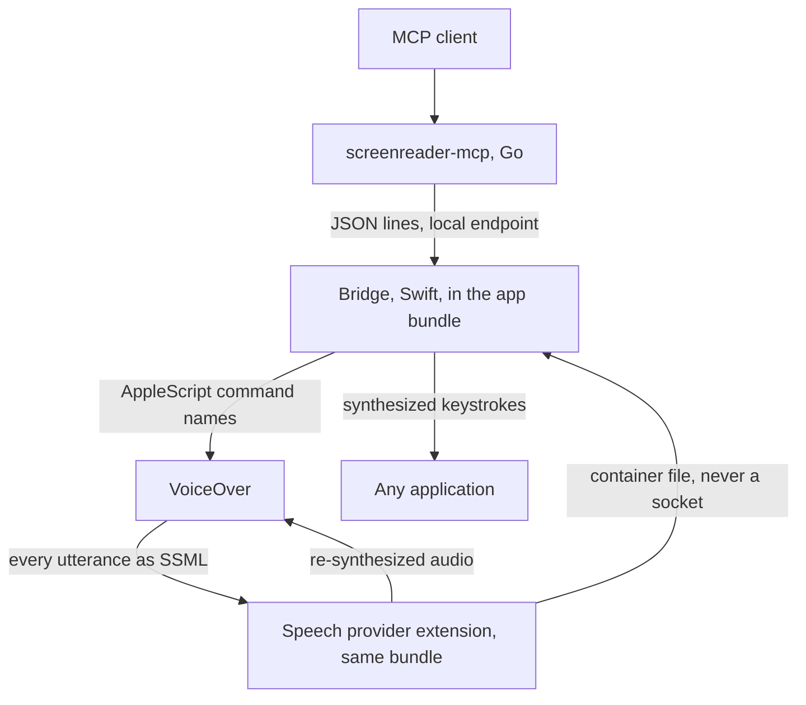

# Spec 0043 — the VoiceOver bridge is one Swift bundle

**Status:** direction RFC, drafted 2026-08-28 from the measurements in
[spec 0041](0041-can-voiceover-say-what-it-said.md), **agreed in conversation
2026-08-29**. Swift for both halves is Decided; so are the two decisions this
spec carried forward as open, both answered below. This is the
VoiceOver analogue of [spec 0005](0005-multi-reader-direction.md): it settles
*shape and language*, not classes. **No class/file layout is given, and that is
not an omission** — this spec adds no production class. The layout requirement
lands in full on the implementation spec that follows it, which is where there
will be something to review.

It is written against a working prototype rather than against Apple's
documentation. Every claim below traces to a measurement in spec 0041's Findings,
taken on macOS 15.0 (24A335) with a live VoiceOver on 2026-08-28.

## The decision

**One Swift bundle, containing everything the reader edge needs.** A single
distributable `.app` that holds:

1. **The speech provider** — an `.appex` hosting an `AVSpeechSynthesisProviderAudioUnit`. This is the capture: VoiceOver hands it every utterance as SSML before any audio exists.
2. **The bridge** — the process that speaks the wire contract to `screenreader-mcp`, owns the local endpoint, and drives VoiceOver.
3. **The input path** — AppleScript for VoiceOver's own commands, and synthesized keystrokes for everything else.
4. **The control dialog** — the macOS counterpart of [spec 0011](0011-bridge-control-ui.md).
5. **Permission acquisition** — the bundle asks, as itself, for what it needs.

The Go server connects to the Swift bridge exactly as it connects to the Python
one: JSON lines over a local endpoint, `hello` comparing `PROTOCOL_VERSION`. The
server core stays reader-agnostic, per spec 0005.

## Why Swift, and why the bridge follows the provider

**The provider cannot be Go or Python**, and this is a constraint rather than a
preference. It ships as a macOS app-extension bundle, which Go cannot produce.
It hosts a render callback the system calls for audio, in which allocation and
blocking are normally forbidden — no garbage-collected runtime belongs there. So
the capture half is Swift, C/C++ or Rust.

Given that, **the bridge follows the provider into Swift** for a reason that is
about deployment rather than taste: the provider must live inside an app bundle
to be installable at all, and that bundle is then the natural home for everything
else the reader edge needs — the endpoint, the dialog, the permission prompts.
Splitting the bridge into a second language would mean shipping two artifacts
where macOS wants one, and would put a process boundary between the extension's
capture file and the thing that reads it, for no gain.

The wire contract gains a second hand-written binding, in Swift, alongside the
generated Go one. That is the cost, and it is the cost spec 0005 anticipated when
it said what is shared between implementations is *the contract, not code*.

## Three places macOS differs from what the NVDA specs assume

These are corrections, raised explicitly rather than discovered during
implementation.

**1. There are no named pipes.** [Spec 0010](0010-named-pipe-transport.md) is
Windows-shaped: `\\.\pipe\nvdaMcpBridge` has no macOS equivalent. The macOS
counterpart of "a local endpoint that is not the network" is a **Unix domain
socket** — a filesystem path with filesystem permissions, which is the property
spec 0010 actually wanted. **Recommended default: a Unix domain socket**, with
**loopback TCP on `127.0.0.1` as the alternative**, chosen in the control dialog,
mirroring the Windows split rather than copying its mechanism.

**Amended 2026-08-29, and the amendment is the better shape.** This is *not* a
third transport. The server keeps exactly two — the **local endpoint** and
loopback TCP — and the local one **resolves per platform**: a named pipe on
Windows, a Unix domain socket on POSIX. A caller asks for the local endpoint and
the leaf decides what that means, which is what spec 0010 was asking for all
along; "pipe" was only ever how Windows spells it. Three consequences, all
Decided in conversation on 2026-08-29:

- **The kind is renamed `local`.** `pipe` is false on half the hosts once this
  lands. `pipe:` stays a parsed alias, because it appears in the shipped
  defaults, in `--reader` help text, in `specs/wire/v1/protocol.md` and in
  config files people already have.
- **The address is a bare NAME in everything we ship**, so
  `server/config/defaults.json` stays host-independent: one entry per reader,
  resolved to `\\.\pipe\<name>` on Windows and to a socket path on POSIX.
  **An absolute path is accepted as an override**, and that costs nothing —
  what would fork the config per host is a path in the *defaults*, not a path
  being expressible at all. So the derived location is pre-configured and
  someone who wants a different one can still say so.
- **The default socket is `$XDG_RUNTIME_DIR/screenreader-mcp/<name>.sock` when
  that is set, otherwise `~/.screenreader-mcp/<name>.sock`**, directory mode
  `0700` — which is where the filesystem-permission property actually comes
  from. `sun_path` is **104 bytes** on macOS and `$TMPDIR` alone spends 49 of
  them, so a `$TMPDIR`-based path was rejected as too tight to be safe on a
  machine we have not seen; the length is checked at endpoint *construction*
  anyway, matching the existing rule that a bad endpoint is reported when the
  configuration is read rather than when an agent asks to connect.

**None of the socket half reaches the NVDA bridge**, and it is worth saying so
plainly rather than leaving it inferred. That bridge is Windows: its local
endpoint resolves to a named pipe exactly as it always has, and no socket path
is ever computed for it. The single thing that changes for the NVDA reader is
the *spelling* in the configuration — `local:nvdaMcpBridge` where it used to say
`pipe:nvdaMcpBridge`, resolving to the same `\\.\pipe\nvdaMcpBridge` — which is
why `pipe:` is kept as an alias rather than removed.

Windows keeps named pipes even though Windows 10 1803+ has `AF_UNIX`: the
shipped add-on listens on a pipe, and changing that breaks every installed copy
for no gain. **If that is ever revisited it is a new decision**, and this
paragraph is where it would be recorded. The server work is `ROADMAP.md` entry
**11.35**.

**2. The extension cannot use the network, at all.** Measured: an extension
holding `com.apple.security.network.client` is silently skipped by macOS — the
voice never appears, and the only evidence is `Skipping network entitled
extension` in the system log. So the extension→bridge handoff is **a file in the
extension's own container**, which an ordinary unsandboxed process reads with no
entitlement. This is not a fallback; it is the only door. The bridge, which is
not sandboxed, is free to use whichever endpoint the dialog selects.

**3. Permissions are a first-class feature, not a setup note.** The bundle needs,
and should ask for, in this order:

| Capability | Permission | When |
|---|---|---|
| Read `last phrase`, drive VoiceOver commands, `output` | Automation (AppleEvents) for VoiceOver | on first connect |
| Type text, press keys in other apps | **Accessibility** | only if the session asks to type |
| Publish the capture voice | none | — |

**Accessibility should be requested lazily**, because a bridge that never types
never needs it, and it is the widest grant of the three. This is a macOS-only
design lever with no NVDA analogue: Windows has no such gate.

Also worth stating in the dialog: on macOS the user must **enable AppleScript
control of VoiceOver by hand** (VoiceOver Utility → General), and no API can do
it for them. On Sequoia the setting is written to both
`~/Library/Group Containers/group.com.apple.VoiceOver/…/default.plist`
(`SCREnableAppleScript`) and the legacy
`/private/var/db/Accessibility/.VoiceOverAppleScriptEnabled`.

## What the dialog must carry

Everything [spec 0011](0011-bridge-control-ui.md) gives the NVDA bridge —
endpoint selection, connection state, the session's activity — plus three things
that exist only here:

- **Whether AppleScript control of VoiceOver is enabled**, with instructions,
  since the bridge cannot enable it and cannot work without it.
- **Which permissions are granted**, and a way to trigger the requests.
- **Whether the capture voice is selected in VoiceOver**, which the bridge can
  detect (utterances arriving) and cannot set without driving the reader.

## The costs this route carries, stated up front

Not objections — they are true, they are measured, and an implementation spec
must answer them rather than discover them.

- **Updating the provider costs a VoiceOver restart.** Killing the extension
  makes VoiceOver fall back to a working voice — it does not go mute, which is
  the safe half — but VoiceOver then cannot resolve the voice again until it
  restarts, logging `Babelfish falling back to defaults due to missing
  identifier` meanwhile. Every update, for every user.
- **Capture costs latency.** The host renders utterances *offline*, faster than
  realtime, and the render block has no way to say "not ready" — so audio must
  exist before it is asked for. Measured: about 0.17 s before speech in the
  best configuration found, 0.42 s in the simplest correct one. The maintainer
  judged both acceptable while listening.
- **VoiceOver's AppleScript surface can die while VoiceOver lives.** Every
  reader-specific call fails while the app still answers its own name. Only a
  reader restart recovers it. The bridge must detect this and report it, rather
  than returning empty read-backs.
- **VoiceOver crashes routinely.** Five crash reports on the maintainer's machine
  on 2026-08-28 alone, before any of this work started. "The reader restarts
  underneath the bridge" is normal weather on macOS, not an edge case.

## The prototype is kept

Spec 0041 describes its spike as disposable, and most of it is: the AppleScript
driver, the probe tool and the measurements have done their job once they are
written down. **The speech provider is the exception, and it is deliberately
preserved** at `spikes/voiceover-capture/provider/`.

It is not a sketch. It is a working `AVSpeechSynthesisProviderAudioUnit` that
VoiceOver has spoken through for an hour, carrying six fixes that each cost a
live round against a real reader to find — the offline-render wait, the
`PRIO_DARWIN_BG` escape, one synthesizer per utterance, the completion backstop,
the boundary ramps, and the host-settled output format. None of that is
recoverable from documentation, and re-deriving it would cost another evening of
the maintainer's screen reader.

**The implementation spec promotes it to `bridges/voiceover/`** — with the
`[tool.screen-readers-mcp.bridge]` declaration that spec 0042 requires, so the
doctor and `poe bridges` see it — rather than starting from an empty directory.
Until then it stays where it is: `bridges/` is scanned by the tooling, and a
directory there without a declaration is reported as a bridge nobody declared.

## What this spec does not decide

- **The class/file layout**, which belongs to the implementation spec.
- **Distribution.** Registration needs no Developer ID, no notarization and no
  Team ID for local use; what shipping to other people costs was not measured.
- **Whether `focus` answers from VoiceOver's cursor or the accessibility tree.**
  The dictionary exposes both a `vo cursor` and a separate `keyboard cursor`,
  each with its own `text under cursor`. They are two views and only usually
  agree.
- **Braille.** VoiceOver's AppleScript exposes no braille content at all — the
  braille window has exactly one property, `enabled`. Whether a VoiceOver bridge
  advertises a braille capability at all is an open question.

## Decisions this trips — all three now taken

Carried forward from spec 0041. Two were open when this RFC was drafted; both
were answered in conversation on 2026-08-29, and the answers are recorded here
rather than in the session that took them.

1. **Spec 0005's split trigger — DECLINED on 2026-08-29. The repo stays a
   monorepo.** The trigger fires on "a second reader's bridge starting in
   earnest", and its stated reasoning was that a second bridge could not import
   `screenreader_wire`. A Swift bridge indeed cannot, so **the premise holds
   where spec 0041 doubted it** — and the conclusion still does not follow. The
   premise argued against *sharing code*, which is already the case: the Swift
   binding is separate code whether the repo splits or not, exactly as spec 0005
   said when it ruled that what is shared between implementations is the
   contract. Against that nothing, splitting costs real things that all span the
   halves today — the `conformance` gate runs the real Go binary against the
   real Python bridge and will want to run against the real Swift one; the drift
   gate compares each binding against one schema; `scripts/doctor.py` and
   `poe bridges` read every bridge's declaration. Each would need a cross-repo
   answer, for one maintainer on one machine. **Revisit if a second maintainer
   or a second host appears** — that, not a second bridge, is what would make
   the coordination cost worth paying.
2. **The `nvda_mcp_wire` rename — DECIDED on 2026-08-29: `screenreader_wire`.**
   Deferred by 0005 until the repo name settled; the repo is
   `screen-readers-mcp`, and a Swift binding of a module named `nvda_mcp_wire`
   is actively misleading. The distribution becomes `screenreader-wire` and the
   import becomes `screenreader_wire.protocol`, so both halves still address the
   contract through a module named `protocol`.
   **`screenreader` rather than `screen_readers`** because it is the identifier
   the product surface already uses: the binary is `screenreader-mcp` and every
   MCP resource is `screenreader://guidance`, `screenreader://tools`,
   `screenreader://reader-guidance`. The repo and Go module are plural, so the
   two conventions were already inconsistent and one of them had to be picked.
   **What ruled out the shorter names** is hard invariant 1: this module is
   copied verbatim into the add-on and runs inside NVDA's interpreter, sharing
   `sys.modules` with every other add-on. `wire` and `protocol` are collision
   bait there, and a collision inside NVDA is not a name clash, it is somebody's
   screen reader.
   It must land **before** lane 3's 13.3 writes the Swift binding, or the rename
   is paid for twice. `ROADMAP.md` entry **11.36**.
3. **Board placement — DECIDED on 2026-08-28: lane 3.** Lane 1 is the NVDA
   bridge, lane 2 the server, and the macOS bridge is neither, so it gets its own
   lane running parallel to both. `ROADMAP.md` carries the rule. This spec still
   claims **no board number**: the lane exists, and its first entry belongs to
   the implementation spec rather than to this RFC.
